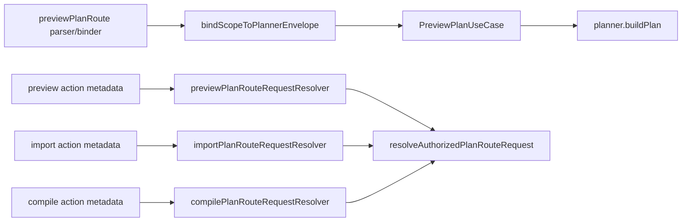

# Closeout: TF-A1-C15/C16 plan-route seam hardening

## Think-First Analysis

### Problem summary

The protected `plan-*` route family still had two maturity gaps after
`TF-A1-C14`:

- preview observability enrichment existed in both a transport-side binder and
  the preview application service, so one telemetry policy had two potential
  owners
- the shared plan-route authorization resolver hardcoded `run:start`, so route
  wrappers did not declare their own authorization metadata explicitly

Neither gap was a user-facing outage, but both were architectural defects. They
left hidden coupling inside the route family exactly where the branch had been
trying to make ownership explicit.

### Root cause

The plan-route branch correctly converged on one remote-facade recipe, but the
last seam-level policies were not moved to their final owners:

- preview transport enrichment was extracted into
  `planPreviewEnvelopeBinder.ts`, but the real request flow still let
  `PreviewPlanUseCase` rebuild the same observability shape
- the shared authorization helper standardized the execution recipe, but it
  also captured the route action itself instead of taking that metadata from
  each wrapper

### Governing constraints

- `AGENTS.md`: inventory-first execution, no hidden debt, no stub policy, and
  validation-backed completion
- `docs/guides/ai-work-protocol.md`: think-first analysis, pre-implementation
  brief, and governed closeout before claiming completion
- `docs/adr/ADR-0012-plan-integrity-ownership.md`: execution and plan-boundary
  authority must stay explicit and auditable
- `docs/adr/ADR-0034-bounded-context-boundaries-and-communication-rules.md`:
  helpers must not hide cross-boundary meaning or ownership
- `docs/planning/reviews/architecture-and-governance/20260419-plan-route-boundary-remediation-review.md`:
  this route family should end with one owner per enrichment seam and explicit
  route-owned policy metadata

### Selected correction

- Make the preview request-binding boundary the only owner of preview
  observability enrichment. The application use case should consume the
  finished observability shape and stop rebuilding it.
- Make each plan-route wrapper pass its own authorization action metadata into
  the shared resolver. The shared resolver should keep the recipe, not the
  route policy.

### Target state

## Pre-Implementation Brief

- Mode: Full
- Scope:
  - `apps/api/src/application/services/PreviewPlanUseCase.ts`
  - `apps/api/src/entrypoints/http/planPreviewEnvelopeBinder.ts`
  - `apps/api/src/entrypoints/http/previewPlanRouteRequestBinder.ts`
  - `apps/api/src/entrypoints/http/planRouteRequestResolver.ts`
  - `apps/api/src/entrypoints/http/previewPlanRouteRequestResolver.ts`
  - `apps/api/src/entrypoints/http/importPlanRouteRequestResolver.ts`
  - `apps/api/src/entrypoints/http/compilePlanRouteRequestResolver.ts`
  - focused entrypoint tests for preview and plan-route authorization
  - `docs/planning/state/agent-lane-a.yaml`
  - `docs/planning/reviews/review-status-board.md`
  - `docs/planning/reviews/architecture-and-governance/20260419-plan-route-boundary-remediation-review.md`
  - this closeout
- Expected outcome:
  - preview observability enrichment has one owner in the real request flow
  - `PreviewPlanUseCase` no longer reconstructs preview provenance/runtime
    observability metadata
  - preview, import, and compile declare authorization metadata explicitly
  - the shared resolver remains reusable without silently owning route policy
- Risks and mitigations:
  - Risk: moving preview enrichment breaks planner input shape for existing
    preview paths.
    Mitigation: keep route-level outcome tests green and assert the enriched
    observability payload that reaches `planner.buildPlan`.
  - Risk: generic resolver signature changes break route wrappers or tests.
    Mitigation: update the shared resolver tests first-class and keep wrapper
    usage explicit in the same slice.
  - Risk: docs drift if the residual review still describes the gaps as open.
    Mitigation: update lane, review, closeout, generated workboard, and docs
    index surfaces in the same slice.
- Out of scope:
  - changing the `run:start` authorization requirement itself
  - refactoring compile catalog/profile duplication
  - plan lifecycle or storage-schema changes
- Validation plan:
  - `pnpm exec eslint --max-warnings 0 apps/api/src/application/services/PreviewPlanUseCase.ts apps/api/src/entrypoints/http/planPreviewEnvelopeBinder.ts apps/api/src/entrypoints/http/previewPlanRouteRequestBinder.ts apps/api/src/entrypoints/http/planRouteRequestResolver.ts apps/api/src/entrypoints/http/planRouteAuthorization.constants.ts apps/api/src/entrypoints/http/previewPlanRouteRequestResolver.ts apps/api/src/entrypoints/http/importPlanRouteRequestResolver.ts apps/api/src/entrypoints/http/compilePlanRouteRequestResolver.ts apps/api/test/entrypoints/http/previewPlanRoute.outcomes.test.ts apps/api/test/entrypoints/http/planRouteRequestResolver.test.ts`
  - `pnpm --filter dvt-api typecheck`
  - `pnpm --filter dvt-api test -- test/entrypoints/http/previewPlanRoute.outcomes.test.ts test/entrypoints/http/planRouteRequestResolver.test.ts test/entrypoints/http/previewPlanRoute.auth.test.ts test/entrypoints/http/importPlanRoute.test.ts test/entrypoints/http/compilePlanRoute.test.ts`
  - `pnpm docs:workboard:generate`
  - `pnpm docs:sync`
  - `pnpm exec markdownlint-cli2 docs/planning/reviews/architecture-and-governance/20260419-plan-route-boundary-remediation-review.md docs/planning/reviews/review-status-board.md docs/planning/closeouts/20260420-tf-a1-c15-c16-plan-route-seam-hardening-closeout.md --ignore-path .markdownlintignore --config .markdownlint-cli2.jsonc`
  - `pnpm verify:prepush`
- Test coverage plan:
  - preview route keeps forwarding scope tags plus transformation provenance and
    runtime observability to the planner
  - shared plan-route resolver authorizes the explicit action passed by the
    wrapper instead of an internal default
  - preview/import/compile route behavior remains unchanged from the caller
    perspective
- Libraries evaluated:
  - None evaluated. This is a seam-ownership correction inside the governed
    API boundary.

## Implementation Summary

- Routed the real preview request path through `planPreviewEnvelopeBinder`
  inside `previewPlanRouteRequestBinder`, so preview scope tags plus
  transformation runtime and provenance metadata are assembled once at the
  request-binding seam.
- Simplified `PreviewPlanUseCase` so it forwards the prepared observability
  payload into the canonical planner envelope instead of rebuilding preview
  enrichment a second time.
- Added `planRouteAuthorization.constants.ts` and changed the shared
  `resolveAuthorizedPlanRouteRequest` helper to accept explicit action metadata
  from each route wrapper.
- Updated preview/import/compile request resolvers to pass their authorization
  metadata explicitly, and hardened route tests so the shared resolver must
  authorize the action supplied by the wrapper.
- Updated the architecture review, API component page, lane state, and review
  board so living docs no longer describe these two defects as open.

## Validation Run

- `pnpm exec eslint --max-warnings 0 apps/api/src/application/services/PreviewPlanUseCase.ts apps/api/src/entrypoints/http/planPreviewEnvelopeBinder.ts apps/api/src/entrypoints/http/previewPlanRouteRequestBinder.ts apps/api/src/entrypoints/http/planRouteRequestResolver.ts apps/api/src/entrypoints/http/planRouteAuthorization.constants.ts apps/api/src/entrypoints/http/previewPlanRouteRequestResolver.ts apps/api/src/entrypoints/http/importPlanRouteRequestResolver.ts apps/api/src/entrypoints/http/compilePlanRouteRequestResolver.ts apps/api/test/entrypoints/http/previewPlanRoute.outcomes.test.ts apps/api/test/entrypoints/http/planRouteRequestResolver.test.ts`
  - Passed.
- `pnpm --filter dvt-api typecheck`
  - Passed.
- `pnpm --filter dvt-api test -- test/entrypoints/http/previewPlanRoute.outcomes.test.ts test/entrypoints/http/planRouteRequestResolver.test.ts test/entrypoints/http/previewPlanRoute.auth.test.ts test/entrypoints/http/importPlanRoute.test.ts test/entrypoints/http/compilePlanRoute.test.ts`
  - Passed.
- `pnpm docs:workboard:generate`
  - Passed.
- `pnpm docs:sync`
  - Passed.
- `pnpm exec markdownlint-cli2 docs/architecture/components/api/index.md docs/planning/reviews/architecture-and-governance/20260419-plan-route-boundary-remediation-review.md docs/planning/reviews/review-status-board.md docs/planning/closeouts/20260420-tf-a1-c15-c16-plan-route-seam-hardening-closeout.md docs/planning/closeouts/20260420-tf-a1-c17-plan-route-request-resolution-recipe-closeout.md docs/planning/state/open-task-route.md docs/planning/state/execution-workboard.md docs/planning/state/agent-lane-a.md --ignore-path .markdownlintignore --config .markdownlint-cli2.jsonc`
  - Passed.
- `pnpm verify:prepush`
  - Passed.

## No-Debt / No-Stub Evidence

- No rule was disabled or relaxed.
- No hook was bypassed.
- No stub, placeholder, or fake success path was introduced.
- The authorization requirement remains `run:start`; this slice only moved the
  metadata to the correct owner.
