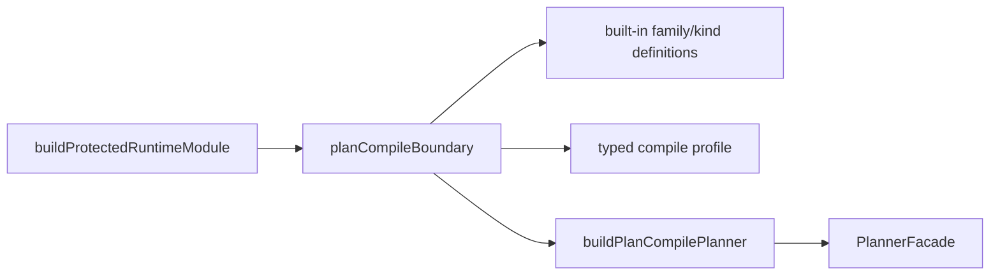

# Closeout: TF-A1-C18 plan-compile boundary ownership convergence

## Think-First Analysis

### Problem summary

The `plan compile` boundary already has the right conceptual seams:

- built-in family and kind catalog
- typed compile profile policy
- planner-construction recipe

But the executable ownership is still split across three modules:

- `planCompileCatalog.ts`
- `planCompileProfileSpec.ts`
- `planCompilePlannerProfile.ts`

That split no longer buys real separation. One file mostly re-exports alias
lists into a profile object, and the composition root still depends on the
planner builder as the effective owner of the full boundary.

### Root cause

The branch first needed to establish the compile-only vocabulary, normalize the
route boundary, and separate preview/import/compile concerns.

That left a lower-order maturity gap in the composition layer itself:

- catalog facts live in one module
- policy aliases live in a second
- the planner builder stitches both together in a third

This is conceptually understandable, but in practice it creates three
maintenance surfaces for one bounded concern and leaves one alias-only module as
an unnecessary drift point.

### Governing constraints

- `AGENTS.md`: inventory-first execution, no hidden debt, no retro-compatibility
  shim by default, and validation-backed completion
- `docs/guides/ai-work-protocol.md`: think-first analysis, pre-implementation
  brief, and governed closeout before declaring the slice complete
- `docs/architecture/reference-architecture.md`: composition concerns should
  remain explicit and infrastructure-replaceable without convenience rewiring
- `docs/adr/ADR-0034-bounded-context-boundaries-and-communication-rules.md`:
  boundaries should keep one clear owner and avoid convenience-layer drift
- `docs/adr/ADR-0035-planner-public-contract-evolution-protocol.md`: compile
  policy must remain typed, fail-closed, and traceable to the governed planner
  contract surface
- `docs/guides/plan-compile-target-architecture-technical-manual-20260417.md`:
  the composition root owns compile profile and catalog truth
- `docs/planning/reviews/architecture-and-governance/20260419-plan-route-boundary-remediation-review.md`:
  the next worthwhile maturity step is to converge compile-boundary ownership
  rather than keep thin wrapper seams

### Selected correction

Create one root-owned `plan compile` boundary module in `apps/api` that owns:

- the built-in family and kind definitions
- the typed compile profile
- the resolved-catalog construction
- the planner-builder recipe

The slice should preserve the conceptual distinction between catalog and
profile, but remove the file-level indirection that currently spreads one
composition concern across three modules.

### Target state

## Pre-Implementation Brief

- Mode: Full
- Scope:
  - `apps/api/src/modules/planCompileBoundary.ts`
  - `apps/api/src/modules/buildProtectedRuntimeModule.ts`
  - `apps/api/test/modules.test.ts`
  - `apps/api/test/application/services/CompilePlanUseCase.test.ts`
  - `docs/architecture/components/api/index.md`
  - `docs/planning/state/agent-lane-a.yaml`
  - `docs/planning/reviews/review-status-board.md`
  - `docs/planning/reviews/architecture-and-governance/20260419-plan-route-boundary-remediation-review.md`
  - this closeout
- Expected outcome:
  - compile catalog, profile, and planner-building policy have one code owner
  - redundant alias modules disappear without compatibility exports
  - tests continue proving the compile boundary stays fail-closed
- Risks and mitigations:
  - Risk: collapsing files also collapses the conceptual distinction between
    catalog and profile.
    Mitigation: keep distinct types and helper functions inside the single
    boundary module.
  - Risk: documentation still points to deleted module paths.
    Mitigation: update living review and API docs in the same slice.
  - Risk: tests only prove import rewiring and miss policy regressions.
    Mitigation: keep the existing negative-path planner tests and update them to
    use the new boundary owner directly.
- Out of scope:
  - changing compile request or response contracts
  - changing planner behavior semantics
  - adding plugin-pack runtime loading
  - broader workspace-graph or preview lifecycle work
- Validation plan:
  - `pnpm exec eslint --max-warnings 0 apps/api/src/modules/planCompileBoundary.ts apps/api/src/modules/buildProtectedRuntimeModule.ts apps/api/test/modules.test.ts apps/api/test/application/services/CompilePlanUseCase.test.ts`
  - `pnpm --filter dvt-api typecheck`
  - `pnpm --filter dvt-api test -- test/modules.test.ts test/application/services/CompilePlanUseCase.test.ts`
  - `pnpm docs:workboard:generate`
  - `pnpm docs:sync`
  - `pnpm exec markdownlint-cli2 docs/architecture/components/api/index.md docs/planning/reviews/architecture-and-governance/20260419-plan-route-boundary-remediation-review.md docs/planning/reviews/review-status-board.md docs/planning/closeouts/20260420-tf-a1-c18-plan-compile-boundary-ownership-convergence-closeout.md --ignore-path .markdownlintignore --config .markdownlint-cli2.jsonc`
  - `pnpm verify:prepush`
- Test coverage plan:
  - compile planner still rejects kinds outside the boundary profile
  - compile planner still accepts the governed spark family path
  - boundary overrides still fail closed when a kind falls outside allowed
    families
- Libraries evaluated:
  - None evaluated. This is a local composition-boundary convergence slice.

## Implementation Summary

- Added `apps/api/src/modules/planCompileBoundary.ts` as the single executable
  owner for the built-in compile catalog, the typed compile profile, catalog
  resolution, and planner construction.
- Rewired `buildProtectedRuntimeModule` and the module tests to consume the new
  boundary owner directly.
- Removed `planCompileCatalog.ts`, `planCompileProfileSpec.ts`, and
  `planCompilePlannerProfile.ts` instead of leaving compatibility re-exports.
- Corrected the stale `/plans/preview` auth coverage in `apps/api/test/app.test.ts`
  so the full-package suite exercises missing-token behavior with a body that
  actually satisfies the current preview contract.
- Updated the active review, review board, API component page, and lane state
  so living docs describe the converged ownership model instead of the deleted
  module split.

## Validation Run

- `pnpm exec eslint --max-warnings 0 apps/api/src/modules/planCompileBoundary.ts apps/api/src/modules/buildProtectedRuntimeModule.ts apps/api/test/modules.test.ts apps/api/test/application/services/CompilePlanUseCase.test.ts`
  - Passed.
- `pnpm --filter dvt-api typecheck`
  - Passed.
- `pnpm --filter dvt-api test -- test/modules.test.ts test/application/services/CompilePlanUseCase.test.ts`
  - Passed.
- `pnpm --filter dvt-api lint`
  - Failed because `dvt-api` does not define a `lint` script in `package.json`.
- `pnpm exec eslint --max-warnings 0 apps/api/src/modules/planCompileBoundary.ts apps/api/src/modules/buildProtectedRuntimeModule.ts apps/api/test/modules.test.ts apps/api/test/application/services/CompilePlanUseCase.test.ts apps/api/test/app.test.ts`
  - Passed.
- `pnpm --filter dvt-api test`
  - Passed after updating the stale preview missing-token test payload to use a
    valid preview request body.
- `pnpm docs:status:generate`
  - Passed.
- `pnpm docs:workboard:generate`
  - Passed.
- `pnpm docs:sync`
  - Passed.
- `pnpm exec markdownlint-cli2 docs/architecture/components/api/index.md docs/planning/reviews/architecture-and-governance/20260419-plan-route-boundary-remediation-review.md docs/planning/reviews/review-status-board.md docs/planning/closeouts/20260420-tf-a1-c18-plan-compile-boundary-ownership-convergence-closeout.md docs/planning/state/open-task-route.md docs/planning/state/execution-workboard.md docs/planning/state/agent-lane-a.md docs/planning/status/generated-code-state.md --ignore-path .markdownlintignore --config .markdownlint-cli2.jsonc`
  - Passed.
- `pnpm verify:prepush`
  - Passed.

## No-Debt / No-Stub Evidence

- No rule was disabled or relaxed.
- No hook was bypassed.
- No compatibility shim or back-compat alias was left behind for the deleted
  compile-boundary modules.
- No stub, placeholder, or fake success path was introduced.
