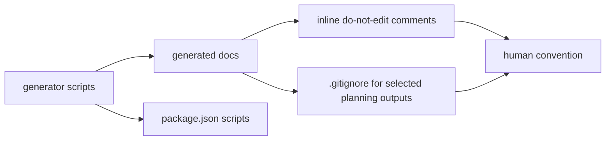
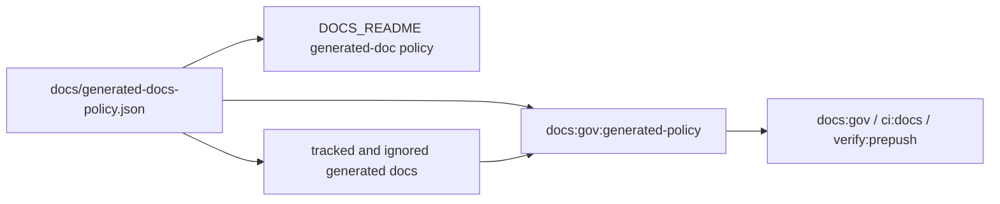

# Closeout: RC-C2 wave 3C generated-doc single-writer policy

## Think-First

### Problem summary

`CDG-W3-1` made the docs manifest deterministic, and `CDG-W3-2` made changed
docs fail closed for naming and metadata policy. The remaining Wave 3 docs
governance gap is ownership clarity for generated docs: contributors can see
individual generated-file comments, but there is no single enforced registry
that says which source files own each generated artifact class, which command
regenerates it, whether it is tracked or ignored, and whether manual edits are
allowed.

### Root cause

Generated documentation ownership currently lives in several places:

- inline comments inside generated Markdown
- `.gitignore` entries for ignored planning views
- `package.json` scripts
- generator-specific checks such as `docs:planning:generated:check`
- human-readable guidance in `docs/DOCS_README.md`

Those surfaces are useful, but they are not one machine-checkable policy. That
means a new generated doc can be added without declaring its source of truth,
tracking posture, or manual-edit policy.

### Constraints and invariants

- `AGENTS.md` requires canonical governance sources, validation evidence, no
  hidden debt, and `pnpm verify:prepush` before presenting the slice as ready.
- `docs/guides/ai-work-protocol.md` requires think-first and
  pre-implementation material before governance tooling changes land.
- `docs/planning/proposals/mandatory/governance-and-docs/ci-delivery-governance-consolidated-action-plan-20260331.md`
  defines `CDG-W3-3` as the single-writer discipline slice for generated docs.
- Planning-derived views under `docs/planning/**/index.md` and
  `docs/planning/state/*.md` are intentionally ignored local/CI artifacts.
- Some generated artifacts are intentionally tracked, including
  `docs/.manifest.json` and generated planning status reports.
- This slice must not convert unrelated historical docs warnings into blocking
  failures.

### Current State

### Target State

### Options considered

- Keep guidance only in `docs/DOCS_README.md`.
- Parse every generated Markdown comment and infer ownership from command text.
- Add a declarative policy registry plus a checker that validates ownership,
  source paths, generator command, tracking posture, and generated markers.

### Selected option and rationale

Add a declarative generated-doc policy registry and validate it through docs
governance gates.

This gives reviewers one canonical source for generated-doc ownership while
keeping generator-specific behavior unchanged. The checker can be strict about
declared policy shape and tracking posture without trying to normalize all
legacy docs content in the same slice.

### Rejected alternatives

- Guidance-only docs: rejected because `CDG-W3-3` explicitly calls for
  enforceable single-writer discipline.
- Inference from comments only: rejected because comments do not declare source
  file ownership or tracking posture consistently across Markdown and JSON
  artifacts.

## Pre-Implementation Brief

- Mode: `Full`
- Scope:
  - add a machine-readable generated-doc ownership policy
  - add a governance checker for generated-doc policy shape and tracking posture
  - wire the checker into docs governance and pre-push surfaces
  - update canonical docs and planning surfaces for the new policy
  - add CI-tool tests for policy wiring and failure behavior
- Touched files or paths:
  - `docs/generated-docs-policy.json`
  - `scripts/check-generated-docs-policy.cjs`
  - `tools/ci/generated-docs-single-writer-policy.test.mjs`
  - `package.json`
  - `docs/DOCS_README.md`
  - `docs/guides/testing-and-ci-capabilities.md`
  - `docs/planning/proposals/mandatory/governance-and-docs/ci-delivery-governance-consolidated-action-plan-20260331.md`
  - `docs/planning/state/agent-lane-c.yaml`
  - this closeout file
- Expected outcome:
  - generated-doc artifact classes declare source paths, generator command,
    tracking posture, and manual-edit policy in one file
  - governance checks fail when a generated-doc policy entry has missing source
    ownership, missing generator ownership, invalid tracking policy, or tracked
    files that should remain ignored
  - canonical docs explain where to edit source truth and which command
    regenerates each artifact class
- Risks and mitigations:
  - risk: policy checker overreaches into historical manual indexes
  - mitigation: declare only known generated artifact classes in this slice
  - risk: ignored planning generated files are absent in a clean workspace
  - mitigation: untracked artifacts are not required to exist unless generated;
    if present, their markers are validated and their git tracking remains
    forbidden
  - risk: new policy becomes another unchecked document
  - mitigation: wire the checker into `docs:gov`, strict docs CI, and pre-push
- Out of scope:
  - removing more generated files from git
  - changing generator output semantics
  - lifecycle policy enforcement for planning docs (`CDG-W4-5` / `CDG-W4-6`)
  - contract-check stub hardening (`CDG-W4-3`)
- Validation plan:
  - red/green CI-tool tests for generated-doc policy
  - `pnpm test:ci-tools`
  - `pnpm docs:gov`
  - `pnpm docs:ci`
  - `pnpm lint:md`
  - `pnpm verify:prepush`
- Test coverage plan:
  - command wiring proves policy is part of docs governance gates
  - policy shape test proves every class has artifacts, source paths, generator
    command, tracking posture, and manual-edit policy
  - checker success test validates the real repository policy
  - negative test proves an undeclared/missing source or generator command
    fails closed
- Libraries evaluated:
  - no new library is required

## Implementation Log

- Added `tools/ci/generated-docs-single-writer-policy.test.mjs` with
  red/green coverage for generated-doc policy wiring, required artifact-class
  declarations, checker success against the real repo policy, and negative
  fail-closed behavior for missing source or generator ownership.
- Added `docs/generated-docs-policy.json` as the single generated-doc ownership
  registry.
- Added `scripts/check-generated-docs-policy.cjs` to validate policy shape,
  source path existence, generator command availability, tracked versus
  untracked git posture, and required generated markers for Markdown artifacts.
- Wired `docs:gov:generated-policy` into `docs:gov`, `ci:docs`, and
  `verify:prepush`.
- Updated `docs/DOCS_README.md` with the generated-doc single-writer policy
  contract and operator command.
- Updated `docs/guides/testing-and-ci-capabilities.md` with the new command and
  pre-push behavior.
- Updated the consolidated RC-C2 plan with the Wave 3C immediate
  single-writer slice.
- Updated Lane C RC-C2 state and regenerated planning-derived views locally.

## Validation Evidence

- `node --test tools/ci/generated-docs-single-writer-policy.test.mjs`
  - red run before implementation: failed `4/4` tests because the command,
    policy file, and checker did not exist
  - first green attempt exposed a checker bug that treated existing ignored
    planning outputs as tracked git files
  - after fixing tracked-file detection, passed `4/4` tests
- `pnpm docs:gov:generated-policy`
  - passed with `9` generated artifact classes validated
- `pnpm docs:sync`
  - passed
  - regenerated local Lane C rendered output only
- `pnpm docs:workboard:generate`
  - passed
  - regenerated local ignored workboard views only
- `pnpm exec prettier --check docs/generated-docs-policy.json scripts/check-generated-docs-policy.cjs tools/ci/generated-docs-single-writer-policy.test.mjs docs/DOCS_README.md docs/guides/testing-and-ci-capabilities.md docs/planning/proposals/mandatory/governance-and-docs/ci-delivery-governance-consolidated-action-plan-20260331.md docs/planning/state/agent-lane-c.yaml docs/planning/closeouts/20260423-rc-c2-wave-3c-generated-doc-single-writer-closeout.md package.json`
  - initial run failed on formatting in `docs/generated-docs-policy.json`,
    `scripts/check-generated-docs-policy.cjs`, and the consolidated RC-C2 plan
  - fixed formatting manually; no `prettier --write` pass was used
  - rerun passed
- `pnpm test:ci-tools`
  - passed with `62/62` tests green
- `pnpm docs:gov`
  - passed with exit `0`
  - `docs:gov:generated-policy` validated `9` artifact classes
  - inherited warning-only frontmatter and governance-reference findings
    remained warnings, not errors
- `pnpm docs:ci`
  - passed with exit `0`
  - regenerated local ignored planning views and kept tracked generated status
    outputs stable
- `pnpm ci:docs`
  - passed with exit `0`
  - proved the strict docs path now runs `docs:gov:generated-policy`
- `pnpm lint:md`
  - passed with `0` markdownlint errors across `1276` files
- `pnpm verify:prepush`
  - passed with exit `0`
  - verified the real pre-push chain now runs
    `docs:gov:generated-policy`
  - selected full `pnpm type-check` because global TypeScript graph inputs are
    still present in the current branch diff

## Gain Evidence

- Generated-doc ownership is now centralized in
  `docs/generated-docs-policy.json` instead of being inferred from comments,
  `.gitignore`, and scripts separately.
- Tracked generated artifacts must be present in git; ignored planning outputs
  are allowed to exist locally but fail if they become tracked.
- Each generated-doc class declares editable source paths, the generator
  command, tracking posture, and manual-edit policy.
- The policy is enforced by docs governance, strict docs CI, and pre-push.

## No-Debt / No-Stub Evidence

- No hooks were bypassed.
- No quality gate was removed or relaxed.
- No stub, placeholder, fake pass path, or TODO was introduced.
- No ARC-triggering runtime, adapter, contract, planner, or engine path was
  touched.
- The checker intentionally scopes enforcement to declared generated artifact
  classes and does not convert unrelated manual or historical docs into global
  blockers.
