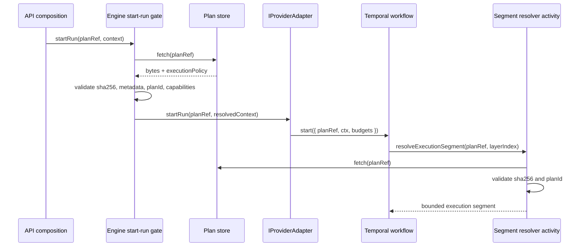

# Temporal Plan-Ref Execution Contract Closeout

## Think-First Analysis

Problem summary: active ADR and adapter contract text say provider adapters
receive and execute the exact engine-verified `ExecutionPlan`, while the
Temporal production adapter starts workflows with `PlanRef` and resolves bounded
execution segments inside Temporal activities.

Root cause: ADR-0012 chose exact-plan dispatch before Temporal payload budgets,
continue-as-new segmentation, and activity-time segment resolution became the
actual production path. The code now has two truths: engine pre-dispatch
verification and Temporal activity-time `PlanRef` revalidation.

Constraints and invariants:

- ADR-0003 keeps DVT execution semantics sovereign; provider runtimes do not
  own lifecycle meaning.
- ADR-0012 keeps the engine start-run boundary as the authoritative
  pre-dispatch integrity gate.
- ADR-0014 keeps adapters run-driven; the engine is not in the step execution
  loop.
- The Temporal workflow must keep start and continue-as-new payloads bounded.
- `PlanRef.sha256` must remain the immutable pointer guard for every runtime
  fetch.

Options considered:

- Pass full verified `ExecutionPlan` into the Temporal workflow. Rejected:
  violates payload-budget direction and duplicates the segmented workflow
  resolver design.
- Keep `startRun(plan, planRef, ctx)` and document that Temporal ignores
  `plan`. Rejected: this preserves a misleading parameter and invites future
  adapter drift.
- Hard-cut the adapter boundary to `startRun(planRef, ctx)` while preserving
  engine pre-dispatch verification and requiring provider-side `PlanRef`
  revalidation before segment execution. Selected.

Selected option and rationale: formalize "verified immutable pointer plus
activity-time revalidation" as the production contract. This keeps the engine
as the admission authority, keeps Temporal payloads bounded, and removes a fake
adapter input that no production runtime can safely rely on.

Rejected alternatives:

- Adapter-owned verification remains rejected because it decentralizes the
  authoritative approval.
- Dual authoritative verification remains rejected because it makes audit
  ambiguous.
- Exact object dispatch remains rejected for Temporal because it conflicts with
  bounded workflow payload and segmented execution.

## Pre-Implementation Brief

Mode: Full.

Scope:

- hard-cut `IProviderAdapter.startRun` to accept only `PlanRef` and
  `ResolvedRunContext`;
- keep engine pre-dispatch plan fetch/validation and capability admission;
- keep Temporal workflow execution pointer-backed through `PlanRef`;
- add semantic tests for the adapter signature and segment revalidation;
- align ADR, contract docs, evidence, risk, and generated docs indexes.

Out of scope:

- changing planner identity calculation;
- adding Conductor support;
- replacing Temporal segmented workflow execution;
- changing `IWorkflowEngine.startRun(planRef, context)`.

Validation plan:

- `pnpm --filter @dvt/contracts test`
- `pnpm --filter @dvt/engine test`
- `pnpm --filter @dvt/adapter-temporal test`
- `GIT_BASE=origin/main GIT_HEAD=HEAD node tools/ci/arc-check.mjs`
- `pnpm docs:sync`
- `pnpm docs:status:generate`
- `pnpm verify:prepush`

## Design Diagram

## Implementation Summary

- `IProviderAdapter.startRun()` was hard-cut from
  `startRun(plan, planRef, ctx)` to `startRun(planRef, ctx)` in contracts,
  engine, Temporal, Conductor stub, in-memory adapter, and API composition tests.
- Engine start-run admission still fetches and validates the executable plan
  before selecting and dispatching an adapter.
- Temporal runtime remains pointer-backed; activity-time execution segment
  resolution revalidates fetched bytes through `PlanIntegrityValidator` before
  returning executable segments.
- Versioned engine contract docs keep their contract-identity filenames
  (`IProviderAdapter.v1.md`, `StartRunProtocol.v1.md`); the filename gate now
  models that existing documented convention instead of forcing link-breaking
  renames.
- Fowler QA was stored in
  `buzon/20260424-codex-fowler-temporal-plan-ref-contract-qa.md`.

## Validation Evidence

The following commands were run successfully before PR publication:

- `pnpm --filter @dvt/contracts typecheck`
- `pnpm --filter @dvt/engine typecheck`
- `pnpm --filter @dvt/adapter-temporal typecheck`
- `pnpm --filter dvt-api typecheck`
- `pnpm --filter @dvt/web typecheck`
- `pnpm --filter @dvt/contracts test`
- `pnpm --filter @dvt/engine test`
- `pnpm --filter @dvt/adapter-temporal test`
- `pnpm --filter dvt-api test -- test/application/services/WorkflowEngineFactory.test.ts test/integration/plannerEngineContract.test.ts`
- `pnpm --filter @dvt/web test`
- `pnpm lint`
- `pnpm docs:gov:filenames:changed`
- `pnpm docs:gov:links:changed`
- `pnpm docs:quality:check`
- `pnpm docs:doctor`
- `git diff --check`

`docs:sync:check` and `docs:gov:manifest:check` were intentionally expected to
show generated index/manifest diffs before commit; they must pass after the
generated files are committed and the worktree is clean.

## No-Debt / No-Stub Evidence

- No fake adapter, fallback execution path, placeholder, TODO, or compatibility
  shim was added.
- The removed `ExecutionPlan` adapter parameter is a breaking hard cut, not a
  deprecated dual path.
- The only tooling rule change is a narrow filename-policy correction for
  versioned contract docs under the governed engine contracts tree.
