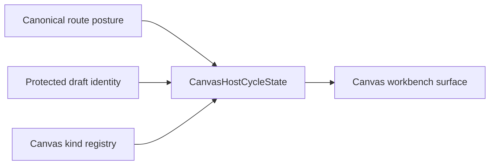

# TF-E2-K-D Host-Cycle DTO Closeout

## Summary

`TF-E2-K-D` starts by introducing `CanvasHostCycleState` as the stable host-cycle
DTO between canonical route posture and the workbench surface.

This slice does not yet close the full `transformation` first-node journey.
It closes the first architectural step required to prove that journey cleanly:
the host and workbench now share one story-shaped contract for
`needs_canvas -> typed_empty -> graph_ready` instead of rebuilding broad
transport-shaped setup bags in each test.

## Governing sources

- [TF-E2 project playground and multi-canvas host plan 2026-04-23](../proposals/mandatory/frontend-and-ux/tf-e2-project-playground-and-multi-canvas-host-plan-20260423.md)
- [TF-E2-K playground complete-cycle stories 2026-04-24](../proposals/mandatory/frontend-and-ux/tf-e2-k-playground-complete-cycle-stories-20260424.md)
- [Canvas playground host component](../../architecture/components/web/graph/canvas-playground-host-component.md)
- [AI work protocol](../../guides/ai-work-protocol.md)

## Real work performed

- Added [`canvasHostCycleState.ts`](../../apps/web/src/app/views/canvas/canvasHostCycleState.ts)
  as the owned DTO seam for host-cycle derivation.
- Added [`canvasHostCycleState.test.ts`](../../apps/web/src/app/views/canvas/canvasHostCycleState.test.ts)
  to prove `needs_canvas`, typed empty, read-only empty, and `graph_ready`.
- Updated
  [`canvasCenterSurfaceWorkbench.tsx`](../../apps/web/src/app/views/canvas/canvasCenterSurfaceWorkbench.tsx)
  so the workbench surface renders through the DTO instead of branching over
  transport-shaped bags.
- Updated
  [`CanvasCenterSurface.architecture.test.ts`](../../apps/web/src/app/views/canvas/CanvasCenterSurface.architecture.test.ts)
  so the fitness function locks the DTO seam in place.

## Fowler reading

- `CanvasHostCycleState` is a DTO, not a new domain root.
- The workbench surface remains a thin presentation seam.
- The plugin registry still owns typed empty-canvas semantics.
- The protected draft boundary still owns authoritative canvas identity.

## Resulting posture

## Validation

- `pnpm --filter @dvt/web test -- src/app/views/canvas/canvasHostCycleState.test.ts src/app/views/canvas/CanvasCenterSurface.architecture.test.ts`

The broader package validation remains part of the next step before commit
readiness for the full slice.

## Remaining work inside TF-E2-K-D

- prove the complete `transformation` host cycle from `create canvas` to first
  node through the real host path
- carry the DTO seam into route-level proof without widening it back into a
  transport setup bag
