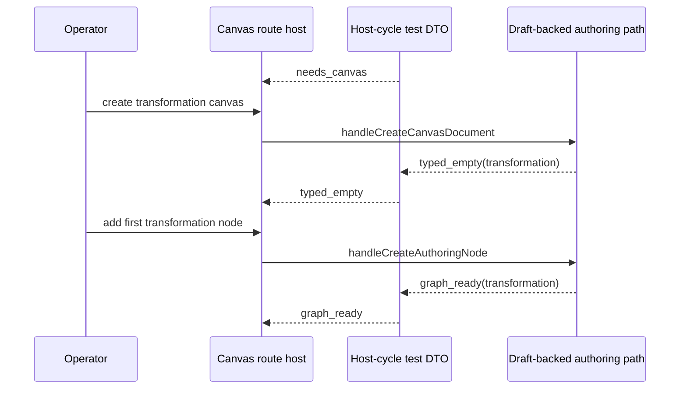

# TF-E2-K-D Transformation Host-Cycle Proof Closeout

## Summary

`TF-E2-K-D` is now closed.

The Canvas route proves one complete `transformation` host cycle through the
real route posture:

1. `needs_canvas`
2. `typed_empty`
3. `graph_ready`

The proof no longer rebuilds broad transport-shaped controller setup by hand.
It uses a small story-owned test DTO,
`buildCanvasHostCycleControllerState(...)`, to drive the cycle transitions.

## Governing sources

- [TF-E2 project playground and multi-canvas host plan 2026-04-23](../proposals/mandatory/frontend-and-ux/tf-e2-project-playground-and-multi-canvas-host-plan-20260423.md)
- [TF-E2-K playground complete-cycle stories 2026-04-24](../proposals/mandatory/frontend-and-ux/tf-e2-k-playground-complete-cycle-stories-20260424.md)
- [Canvas playground host component](../../architecture/components/web/graph/canvas-playground-host-component.md)
- [AI work protocol](../../guides/ai-work-protocol.md)

## Real work performed

- Added `buildCanvasHostCycleControllerState(...)` in
  [Canvas.test.controller.defaults.ts](../../apps/web/src/app/views/Canvas.test.controller.defaults.ts)
  so route tests can express `needs_canvas`, `typed_empty`, and `graph_ready`
  as a stable cycle DTO instead of wide controller override bags.
- Extended
  [Canvas.routeStates.test.tsx](../../apps/web/src/app/views/Canvas.routeStates.test.tsx)
  with one story proof that:
  - creates a `transformation` canvas through the host
  - re-renders the typed empty canvas
  - creates the first node
  - re-renders graph-ready authoring

## Fowler reading

- `CanvasHostCycleState` remains the production DTO between canonical route
  posture and the workbench surface.
- `buildCanvasHostCycleControllerState(...)` is the test-support analogue of
  that DTO. It is not a second runtime model.
- The route proof now follows the operator story instead of reconstructing
  implementation-shaped transport bags.

## Sequence

## Validation

- `pnpm --filter @dvt/web test -- src/app/views/Canvas.routeStates.test.tsx`

## Outcome

The next hito is `TF-E2-K-E`: the same complete host-cycle proof for `dbt`,
keeping typed behavior visibly distinct end to end.
