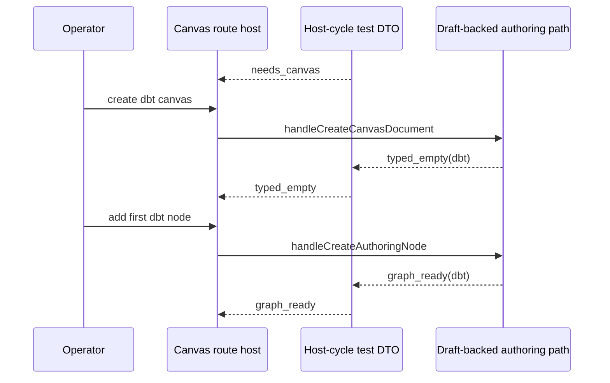

# TF-E2-K-E Dbt Host-Cycle Proof Closeout

## Summary

`TF-E2-K-E` is now closed.

The Canvas route now proves the same complete host cycle for `dbt` that was
already proven for `transformation`:

1. `needs_canvas`
2. `typed_empty`
3. `graph_ready`

This closes the specific risk that `dbt` host posture could appear typed in
copy only while still inheriting `transformation` assumptions in route proof
fixtures.

## Governing sources

- [TF-E2-K playground complete-cycle stories 2026-04-24](../proposals/mandatory/frontend-and-ux/tf-e2-k-playground-complete-cycle-stories-20260424.md)
- [Canvas playground host component](../../architecture/components/web/graph/canvas-playground-host-component.md)
- [AI work protocol](../../guides/ai-work-protocol.md)

## Real work performed

- Extended
  [Canvas.routeStates.test.tsx](../../apps/web/src/app/views/Canvas.routeStates.test.tsx)
  with a full `dbt` host-cycle proof.
- Hardened the route-test fixture helper so `requireAuthoringNodeKind(...)`
  resolves from the typed registered catalog instead of a
  `transformation`-only fixture list.

## Fowler reading

- The host-cycle proof stays story-shaped.
- `dbt` remains a separate typed path, not a variation hidden inside one
  transformation-default fixture.
- The fixture correction is a drift fix, not a new runtime abstraction.

## Sequence

## Validation

- `pnpm --filter @dvt/web test -- src/app/views/Canvas.routeStates.test.tsx`

## Outcome

The next hito is `TF-E2-K-F`: prove authoritative restore of the active typed
canvas tab and posture when the workspace is reopened.
