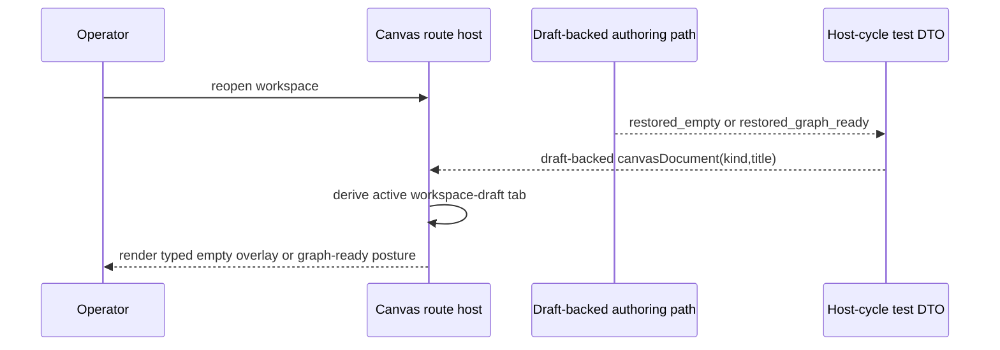

# TF-E2-K-F Authoritative Restore Proof Closeout

## Summary

`TF-E2-K-F` is now closed.

The Canvas route now proves the reopen cycle from authoritative draft truth:

1. restore the active workspace-draft tab
2. restore the correct typed posture
3. keep that posture anchored to `canvasDocument`, not ambient mode

This closes the host-level drift where restore proofs could silently depend on
controller setup defaults instead of the persisted draft-backed canvas
identity.

## Governing sources

- [TF-E2-K playground complete-cycle stories 2026-04-24](../proposals/mandatory/frontend-and-ux/tf-e2-k-playground-complete-cycle-stories-20260424.md)
- [Canvas playground host component](../../architecture/components/web/graph/canvas-playground-host-component.md)
- [AI work protocol](../../guides/ai-work-protocol.md)

## Real work performed

- Extended
  [Canvas.routeStates.test.tsx](../../apps/web/src/app/views/Canvas.routeStates.test.tsx)
  with restore proofs for:
  - typed-empty reopen posture
  - graph-ready reopen posture
- Hardened
  [Canvas.test.controller.defaults.ts](../../apps/web/src/app/views/Canvas.test.controller.defaults.ts)
  so the host-cycle DTO models `restored_empty` and `restored_graph_ready`
  explicitly instead of collapsing them into transport-shaped fallback setup.

## Fowler reading

- The route proof still uses a story-shaped DTO rather than a wide controller
  transport bag.
- Restore semantics stay at the host boundary: the active tab and posture come
  from draft truth, not from ambient controller mode.
- The typed-empty reopen posture remains an overlay concern of the shell, so
  the viewport stays mounted while the typed guidance is restored.

## Sequence

## Validation

- `pnpm --filter @dvt/web test -- src/app/views/Canvas.routeStates.test.tsx`

## Outcome

The next hito is `TF-E2-K-G`: prove typed-canvas continuation from authoring
into preview and run without losing host context.
