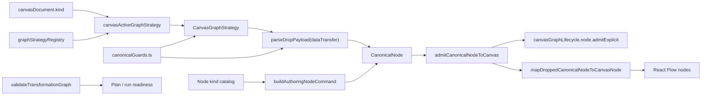
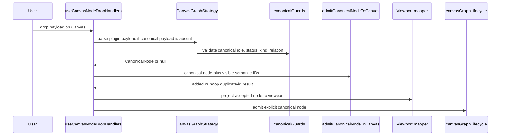

# Canvas Graph Strategy Policy QA Closeout

## Think-First Analysis

Problem summary:

The Canvas graph strategy slice carried a policy named
`enforceTransformationTopology` into node drop and duplicate paths even though
authoring intentionally allows larger, intermediate, and incomplete graphs.
The name implied authoring enforcement, while the implementation always
returned `allowed: true`.

Root cause:

The plugin strategy contract mixed three concerns in one transport shape:

- plugin graph projection and drag payload parsing
- route posture for the active Canvas kind
- transformation topology validation that actually belongs to plan/run
  readiness

That created a Fowler smell: a data clump with false semantic authority. The
drop aggregate consumed strategy policy it did not own, and the DVT
transformation strategy accepted unknown canonical roles, statuses, and edge
relations as if every string were valid domain vocabulary.

Constraints and invariants:

- Canvas authoring remains compositional. It must allow incomplete graphs while
  the operator is still building a flow.
- The `source -> sql_transform -> sink` rule is enforced by
  `validateTransformationGraph` before planning and run.
- Plugin strategies may parse plugin-owned drag payloads and project plugin
  graph objects into canonical graph primitives.
- Canonical graph primitives must be validated at runtime when they cross
  unknown or plugin-owned boundaries.
- Canvas application code must depend on neutral contracts, not concrete DBT
  adapter modules.

Options considered:

| Option                                                                 | Outcome                                                                                                            |
| ---------------------------------------------------------------------- | ------------------------------------------------------------------------------------------------------------------ |
| Keep `enforceTransformationTopology` and implement authoring rejection | Rejected. It would contradict the intended authoring workflow and block intermediate graphs.                       |
| Rename the flag to a run-readiness flag                                | Rejected. The existing run validation already owns that rule; adding an unused flag would preserve the data clump. |
| Move Canvas-kind posture to the active canvas document                 | Selected. It matches the actual ownership boundary and removes the false policy seam.                              |

## Pre-Implementation Brief

Mode: Full.

Scope:

- Canvas graph strategy contract and registry tests.
- DVT transformation strategy runtime guards.
- Node drop and duplicate aggregate boundaries.
- Canvas graph architecture documentation.

Expected outcome:

- `CanvasGraphStrategy` exposes payload parsing/projection only.
- `canvasDocument.kind` selects the active graph strategy and toolbar
  authoring mode.
- `admitCanonicalNodeToCanvas` performs canonical node admission without
  importing React Flow or producing viewport nodes.
- Viewport projection is performed by the handler layer after canonical
  admission succeeds.
- Transformation strategy rejects malformed canonical node roles, statuses, and
  edge relations.
- Docs and diagrams describe where topology validation actually lives.

Out of scope:

- Changing transformation plan/run validation semantics.
- Changing DBT graph mapping behavior beyond policy shape alignment.
- Reworking connection admission rules.

## Fowler Architecture Fix

| Concern             | Before                                                     | After                                                               |
| ------------------- | ---------------------------------------------------------- | ------------------------------------------------------------------- |
| Policy object       | Mixed toolbar mode and fake authoring topology enforcement | Removed from graph strategy; canvas kind comes from active document |
| Drop aggregate      | Received strategy and viewport projection data             | Receives canonical node plus semantic visible-node IDs only         |
| Duplicate command   | Reused drop to return React Flow nodes                     | Returns canonical duplicate command plus projection position        |
| Runtime guards      | DVT strategy accepted any string role, status, or relation | Shared canonical guards validate domain vocabulary                  |
| Topology validation | Implied by authoring policy name                           | Owned by transformation graph validation before plan/run            |

## Component Topology

## Drop Sequence

## Validation Evidence

- Red:
  `pnpm --filter @dvt/web test -- graphStrategyRegistry.test.ts canvasDraftAuthoringComponent.architecture.test.ts`
  failed because the old policy still exposed `toolbarMode` plus
  `enforceTransformationTopology`, drop still consumed strategy policy, and
  malformed transformation nodes were accepted.
- Green:
  `pnpm --filter @dvt/web test -- graphStrategyRegistry.test.ts canvasDraftAuthoringComponent.architecture.test.ts canvasNodeDropAggregate.test.ts canvasDuplicateNodeCommand.test.ts canvasNodeDropPayload.test.ts`
  passed with 5 files and 16 tests.
- Scope typecheck:
  `pnpm --filter @dvt/web typecheck` passed.
- Full web suite:
  `pnpm --filter @dvt/web test` passed. The suite still emits existing
  React `act(...)` warnings from Canvas and React Flow test harnesses; they are
  visible in command output and were not hidden.
- Root lint:
  `pnpm lint` initially exposed unrelated Cypress/test lint drift on
  `origin/main`. The branch fixed those import-order, unused import, and
  explicit-return-type findings. `pnpm lint` then passed.
- Generated docs:
  `pnpm docs:status:generate`, `pnpm docs:sync`, and
  `pnpm docs:workboard:generate` were run after source/doc/planning changes.
- Prepush:
  `pnpm verify:prepush` passed.

Additional Fowler hardening on the same route:

- `CanvasGraphStrategy` no longer exposes `authoringPolicy`.
- `canvasActiveGraphStrategy.ts` resolves strategy and authoring mode from the
  active canvas document.
- `admitCanonicalNodeToCanvas` is a pure canonical admission function; drop,
  first-node creation, and duplicate handlers project to viewport nodes only
  after canonical admission succeeds.
- Green validation rerun:
  `pnpm --filter @dvt/web test -- graphStrategyRegistry.test.ts canvasActiveGraphStrategy.test.ts useCanvasController.core.test.tsx canvasNodeDropAggregate.test.ts canvasDuplicateNodeCommand.test.ts useCanvasGraphHandlers.nodeDrop.test.tsx useCanvasGraphHandlers.nodeDuplicate.test.tsx CanvasEmptyAuthoringEntrypoint.architecture.test.ts useCanvasNodeAuthoringHandlers.architecture.test.ts`
  passed.

## No-Debt Evidence

- No topology placeholder or authoring-time fake rejection was added.
- No rule was disabled or relaxed.
- No mock adapter or fake success path was introduced.
- The old authoring guard module was removed instead of kept as dead policy.
