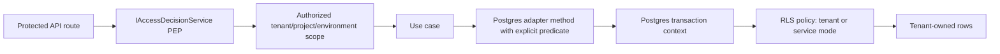
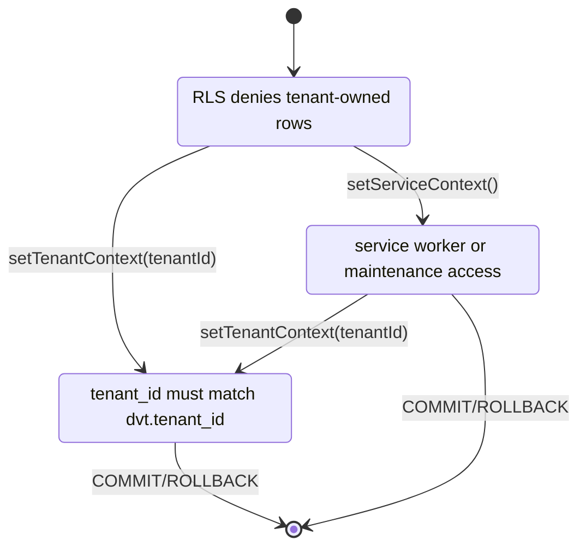

# Production Tenant Isolation Baseline

## Think-First Analysis

### Problem Summary

DVT+ has real API authorization and tenant-scoped adapter predicates, but the
production storage baseline is still incomplete: PostgreSQL has tenant context
plumbing, yet active migrations do not create RLS policies. One missing SQL
predicate can still become a cross-tenant data leak.

### Root Cause

The system evolved from application-level tenant predicates first. ADR-0031
added transaction tenant context as defense-in-depth, but the schema never
materialized that context into PostgreSQL row-level policies. Several derived or
delivery tables also lacked top-level `tenant_id`, so database policy could not
be applied uniformly without either adding columns or pretending JSON payloads
were a security boundary.

### Constraints And Invariants

- ADR-0003: execution semantics belong to DVT+, not to infrastructure vendors.
- ADR-0004: state is append-only, tenant-scoped, and query paths must preserve
  ordering and idempotency.
- ADR-0031: adapter-level tenant isolation uses application predicates plus
  Postgres tenant context as defense-in-depth.
- ADR-0051: API remains the PEP through `IAccessDecisionService`; engine does
  not own general RBAC.
- `SECURITY_INVARIANTS.v1.md`: `INV-SCOPE-01/02/03` require explicit tenant
  scope, no default tenant, and no cross-tenant inference.
- `TENANT_ISOLATION_TESTS.v1.md`: direct access tests require RLS or an
  accepted equivalent, zero cross-tenant rows, and tenant-scoped predicates.

### Options Considered

| Option                                                                     | Result                  | Reason                                                                                                                                       |
| -------------------------------------------------------------------------- | ----------------------- | -------------------------------------------------------------------------------------------------------------------------------------------- |
| Keep explicit predicates only                                              | Rejected                | It leaves the same single-bug leak class called out by the architecture review.                                                              |
| Enable RLS everywhere with owner-force policies                            | Rejected for this slice | Correct long term, but it breaks archive/projector/worker flows unless every maintenance path is first classified and given service context. |
| Add RLS to tenant-owned online tables with explicit tenant/service context | Selected                | It closes the production baseline without hiding role assumptions or forcing plan-store contract churn into the same slice.                  |
| Add plan-record tenant columns now                                         | Deferred                | It requires contract and repository API evolution; doing it opportunistically here would mix two bounded contexts.                           |

### Selected Option And Rationale

Postgres RLS is mandatory for production tenant-owned online tables. The runtime
MUST use a non-owner application role; schema-owner connections are reserved for
migrations. RLS policies authorize either:

- `tenant` mode, where `tenant_id = current_setting('dvt.tenant_id', true)`;
- `service` mode, where maintenance/worker operations set
  `current_setting('dvt.access_mode', true) = 'service'`.

Application predicates remain mandatory. RLS is the secondary enforcement
layer, not a replacement for explicit tenant scope in code.

### Rejected Alternatives

- JSON ownership in plan records is not accepted as a storage isolation
  primitive. It remains a separate plan-record tenancy task.
- A permissive `__unknown_tenant__` backfill is not accepted. If existing rows
  cannot derive tenant ownership during migration, the migration should fail
  and force operator repair instead of creating hidden security debt.
- API-only authorization is insufficient. A bypassed route or missed predicate
  must not expose tenant data.

## Pre-Implementation Brief

### Mode

Full.

### Scope

- Add a PostgreSQL tenant isolation policy module.
- Add core schema migration posture for RLS on tenant-owned online tables.
- Add missing top-level `tenant_id` columns to run snapshots and outbox rows.
- Ensure state-store client sessions keep tenant context alive for the full
  query by wrapping `withClient` work in an explicit transaction.
- Add unit and architecture tests that prove the migration posture and runtime
  SQL semantics.
- Update docs, evidence, and risk register.

### Out Of Scope

- Plan-store top-level tenant/project/environment columns.
- Timing-oracle statistical suite.
- Artifact/object-store tenant isolation.
- Full service-role rollout for archive restore drills.

### Expected Outcome

The repository has one explicit production tenant isolation baseline:
Postgres RLS is the accepted storage defense-in-depth for tenant-owned online
run state, and the code/tests/docs agree on that posture.

### Risks And Mitigations

| Risk                                          | Mitigation                                                                                           |
| --------------------------------------------- | ---------------------------------------------------------------------------------------------------- |
| RLS silently bypassed by table owner          | Document non-owner runtime role as production requirement and keep schema owner for migrations only. |
| Tenant context lost between pooled statements | Run `withClient` operations in an explicit transaction so `set_config(..., true)` remains visible.   |
| Worker/global flows need cross-tenant access  | Use explicit service context, not implicit owner bypass.                                             |
| Existing orphan rows block migration          | Fail fast; no `__unknown_tenant__` backfill for new baseline tables.                                 |

## Architecture

### Target Enforcement Path

### Runtime Context Modes

### Table Classification

| Table                  | Baseline posture                                                     |
| ---------------------- | -------------------------------------------------------------------- |
| `run_metadata`         | Tenant-owned, RLS policy required                                    |
| `run_events`           | Tenant-owned, RLS policy required                                    |
| `run_snapshots`        | Tenant-owned derived state, top-level `tenant_id` and RLS required   |
| `outbox`               | Tenant-owned delivery buffer, top-level `tenant_id` and RLS required |
| `outbox_dead_letter`   | Tenant-owned delivery buffer, top-level `tenant_id` and RLS required |
| `lineage_outbox`       | Tenant-owned delivery buffer, RLS required                           |
| `lineage_dead_letter`  | Tenant-owned delivery buffer, RLS required                           |
| `run_event_heads`      | Tenant-owned derived head, RLS required                              |
| `snapshot_work_queue`  | Tenant-owned derived work queue, RLS required                        |
| `plan_records`         | Deferred plan-record tenancy task                                    |
| `stored_plans`         | Deferred plan-record tenancy task                                    |
| Archive catalog tables | Service/maintenance posture, not tenant API baseline                 |

## Fowler QA

### Improved Patterns

- Defense in depth replaces predicate-only security.
- Storage policy is separated into a dedicated module instead of inline SQL
  drift across migrations.
- Runtime context becomes explicit tenant/service mode instead of accidental
  pool state.

### Antipatterns Removed

- Security by convention: no longer acceptable for tenant-owned online tables.
- JSON ownership as a database isolation mechanism: explicitly rejected for the
  production baseline.
- Silent legacy backfill: rejected for new baseline tenant columns.

### Residual Risks

- Plan records still need top-level tenant/project/environment columns.
- Archive and restore workflows still need their own production drill with
  explicit service-role validation.
- Timing-oracle tests remain outside this implementation slice.

## Implementation Outcome

- Added `PostgresTenantIsolationPolicy` as the single owned concern for the RLS
  table catalog, tenant context SQL, service context SQL, and policy generation.
- Added `core_017_tenant_rls_baseline` to enable RLS on tenant-owned online
  state tables and to add top-level `tenant_id` to `run_snapshots`, `outbox`,
  and `outbox_dead_letter`.
- Changed `withClient` to run inside an explicit transaction so
  transaction-local tenant context remains valid for pooled reads.
- Updated run-state, outbox, lineage, snapshot, archive, purge, and staleness
  paths to use explicit tenant or service context before touching
  RLS-protected tables.
- Added ARC evidence and risk register entries:
  `docs/evidence/ed-20260425-production-tenant-isolation-baseline.md` and
  `docs/risk-register/quality/R-20260425-PRODUCTION-TENANT-ISOLATION-BASELINE.yaml`.

## Validation Plan

- `pnpm --filter @dvt/adapter-postgres test -- PostgresTenantIsolationPolicy.test.ts PostgresStateStoreAdapter.migrate.test.ts PostgresOutboxStore.test.ts PostgresRunSnapshotStore.test.ts`
- `pnpm --filter @dvt/adapter-postgres build`
- `pnpm docs:sync`
- `pnpm docs:status:generate`
- `GIT_BASE=origin/main GIT_HEAD=HEAD node tools/ci/arc-check.mjs`
- `pnpm verify:prepush`
