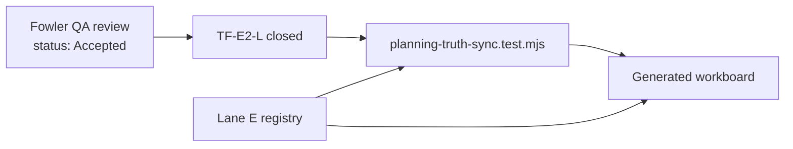

# TF-E2-L Canvas Strategy Boundary Truth Sync Closeout

## Scope

This closeout reconciles the planning truth for `TF-E2-L` after the Canvas
graph-strategy Fowler QA and its follow-up remediation were already merged into
`main`.

The active code and the governed QA artifact agree that `TF-E2-L` is closed:

- active canvas graph strategy resolves from the persisted
  `canvasDocument.kind`;
- unsupported persisted canvas kinds and disabled registered plugins fail
  closed instead of receiving a fallback strategy;
- DBT and DVT graph adapters validate plugin and canonical vocabulary at their
  boundaries;
- canonical node admission is separate from React Flow viewport projection;
- semantic architecture tests guard runtime registration, command transaction,
  and typed empty-authoring behavior.

The remaining defect was planning drift: Lane E still published `TF-E2-L` as
`queued` while the QA review final verdict declared it closed.

## Fowler Reading

The issue was not an implementation gap; it was a source-of-truth split between
the review artifact and the lane registry. In Fowler terms, the branch had
fixed the component boundary but left a parallel metadata model behind. The lane
YAML, review status board, and QA artifact must describe the same lifecycle
state or future work selection will reopen closed architecture decisions.

## Current-State Diagram

## Invariants

- A governed QA verdict that states a lane task is closed must not coexist with
  a `queued` lane entry for the same task.
- Generated workboard truth must be derived from the lane YAML, not manually
  patched.
- Historical remediation tasks may remain in the QA artifact, but active task
  routing must move to the lane status.

## Files Changed

- `docs/planning/state/agent-lane-e.yaml`
- `docs/planning/reviews/review-status-board.md`
- `docs/planning/reviews/architecture-and-governance/20260425-canvas-graph-strategy-fowler-hard-qa-review.md`
- `docs/planning/closeouts/20260426-tf-e2-l-canvas-strategy-boundary-truth-sync-closeout.md`
- `tools/ci/planning-truth-sync.test.mjs`

## Validation Evidence

- Red phase:
  `node --test tools/ci/planning-truth-sync.test.mjs` failed because
  `TF-E2-L` was still `queued`.
- Green phase:
  `node --test tools/ci/planning-truth-sync.test.mjs` passes after Lane E
  status reconciliation.

Full closeout validation is recorded in the task final report.

## No-Debt Statement

No runtime behavior was changed. No stubs, placeholders, fake implementations,
or rule relaxations were introduced. The new CI guard exists to prevent the
same planning drift from recurring for this governed Fowler QA closure.
