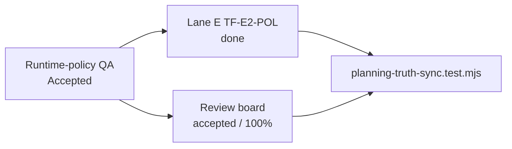
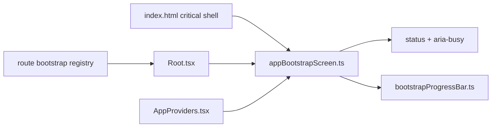

# Frontend Policy Drift And Bootstrap Maturity Closeout

## Think-First Analysis

Problem summary: Lane E and the review board had drifted away from the accepted
Canvas runtime-policy QA verdict, and the startup bootstrap screen was visually
heavier than the operational workbench posture it represents.

Root cause: the runtime-policy remediation had a final QA verdict and code
evidence, but no Lane E task entry or truth-sync guard. The bootstrap had a
sound state machine, but its critical HTML still presented a large decorative
image and lacked screen-level busy/status semantics owned by the state machine.

Constraints and invariants:

- `AGENTS.md` requires governance-first execution, validation evidence, and no
  hidden debt.
- `docs/guides/ai-work-protocol.md` requires canonical planning surfaces to
  move together when a review finding closes.
- `docs/planning/state/planning-control-tower.md` makes Lane E the execution
  registry for frontend work.
- `docs/architecture/components/web/graph/graph-route-bootstrap-architecture.md`
  requires route startup truth to be published through explicit bootstrap
  contracts, not inferred from route heuristics.

Options considered:

- Patch only `review-status-board.md`; rejected because Lane E would keep a
  missing execution entry for `TF-E2-POL`.
- Change only visual CSS; rejected because accessibility semantics would remain
  passive HTML instead of state-machine-owned behavior.
- Add a full React bootstrap component; rejected because the startup gate must
  work before React mounts.

Selected option and rationale: reconcile the planning surfaces with a
truth-sync test, keep the bootstrap pre-React, add state-owned ARIA semantics,
replace the decorative image-heavy layout with a compact operational status
panel, and document the component API/invariants.

## Pre-Implementation Brief

Mode: Slim.

Scope:

- Planning drift for `TF-E2-POL`.
- Pre-React bootstrap screen behavior, critical HTML, and local component docs.

Touched paths:

- `docs/planning/state/agent-lane-e.yaml`
- `docs/planning/reviews/review-status-board.md`
- `docs/planning/reviews/architecture-and-governance/20260426-canvas-runtime-policy-architecture-review.md`
- `tools/ci/planning-truth-sync.test.mjs`
- `apps/web/index.html`
- `apps/web/src/app/bootstrap/appBootstrapScreen.ts`
- `apps/web/src/app/bootstrap/bootstrapProgressBar.ts`
- `apps/web/src/app/bootstrap/appBootstrapScreen.test.ts`
- `docs/architecture/components/web/app-bootstrap-screen-component.md`
- `docs/architecture/components/web/index.md`

Out of scope:

- Backend health availability on `localhost:3000`.
- React route bootstrap contract redesign.
- Canvas runtime-policy implementation changes.

Validation plan:

- Red/green planning truth-sync test.
- Red/green bootstrap unit test.
- Desktop and mobile Playwright screenshots against the local Vite server.
- Web typecheck and test baseline.
- Docs sync/workboard generation and changed-doc gates.
- Repository pre-push gate.

## Architecture Outcome

## Validation Evidence

- `node --test tools/ci/planning-truth-sync.test.mjs`
  - red: failed because `TF-E2-POL` was absent from Lane E.
  - green: passed after Lane E and review board reconciliation.
- `pnpm --filter @dvt/web test -- appBootstrapScreen.test.ts`
  - red: failed because the startup screen did not publish `role="status"`.
  - green: passed with 6 tests.
- Playwright visual inspection against `http://localhost:5173/canvas`:
  - before: desktop and mobile bootstrap showed a large decorative image taking
    primary startup space;
  - after: desktop and mobile bootstrap show a compact operational status panel
    with brand, ordered steps, progress, and metadata.
- `pnpm --filter @dvt/web typecheck`: passed.
- `pnpm --filter @dvt/web test`: passed. The suite still emits the historical
  React `act(...)` warnings around React Flow/MiniMap, but exits green.
- `pnpm lint`: passed.
- `pnpm docs:workboard:generate`: regenerated planning views.
- `pnpm docs:sync`: synced docs and regenerated Lane E rendered output.
- `pnpm docs:workboard:check`: passed.
- `pnpm docs:sync:check`: passed.
- `pnpm exec markdownlint-cli2 ...`: passed for the changed and new docs in
  this slice.
- `pnpm lint:md:changed`: passed.
- `pnpm qa:artifact:check`: passed.
- `pnpm verify:prepush`: passed.

## No-Debt Statement

No stubs, placeholders, fake implementations, TODO markers, hook bypasses, or
rule relaxations were introduced. The local Vite screen still reports
`ERR_CONNECTION_REFUSED` for backend calls when `localhost:3000` is not running;
that is an environment/backend-availability signal, not a hidden frontend
success path.

## QA Follow-Up Fix

Problem summary: the Fowler QA follow-up found three residual gaps: touched
bootstrap files did not pass an explicit Prettier check, the bootstrap tests
used a synthetic DOM instead of protecting the production `index.html` shell,
and the component guide mixed component test coverage with a planning
truth-sync guard.

Root cause: the pre-commit formatting coverage did not include `apps/**` source
or shell markup, and the bootstrap component had runtime behavior tests but no
contract test for the pre-React HTML adapter. The guide listed a governance
guard under component tests because both were introduced in the same slice.

Selected fix:

- Added a production HTML shell contract test to
  `apps/web/src/app/bootstrap/appBootstrapScreen.test.ts`.
- Made the pre-React shell state explicit with `data-state="loading"` in
  `apps/web/index.html`.
- Added changed-file/pre-commit formatting coverage for `apps/**/*.{ts,tsx}`
  and `apps/**/*.{html,css}`.
- Extended `scripts/fix-changed.cjs` so changed HTML/CSS files can be formatted
  by the local changed-file fixer.
- Added CI-tool tests for formatting coverage and component-guide section
  semantics.
- Moved the planning truth-sync reference into a dedicated
  `Governance Drift Guard` section in the component guide.

Validation evidence:

- Red tests:
  - `pnpm --filter @dvt/web test -- appBootstrapScreen.test.ts` failed because
    the production shell had no initial `data-state="loading"`.
  - `node --test tools/ci/quality-format-config.test.mjs tools/ci/web-bootstrap-docs.test.mjs`
    failed because apps formatting coverage and the governance-drift section
    were missing.
- Green tests:
  - `pnpm --filter @dvt/web test -- appBootstrapScreen.test.ts`: passed with
    10 tests.
  - `node --test tools/ci/quality-format-config.test.mjs tools/ci/web-bootstrap-docs.test.mjs`:
    passed with 3 tests.
  - `pnpm exec prettier --check ...`: passed for all touched files in the QA
    follow-up set.
  - `pnpm lint`: passed.
  - `pnpm --filter @dvt/web test`: passed. The suite still emits historical
    React `act(...)` warnings around React Flow/MiniMap and exits green.
  - `pnpm test:ci-tools`: passed with 73 tests.
  - `pnpm verify:prepush`: passed.

Residual observation: `pnpm format:check` still fails repository-wide on a large
pre-existing formatting backlog outside this slice. The QA fix therefore guards
the changed-file and pre-commit paths without attempting a monorepo-wide
formatting sweep.

## Startup UX Follow-Up Fix

Problem summary: live visual QA showed two startup-quality issues. First, the
progress meter rendered as a percentage bar that could imply arbitrary
regression. Second, a backend-unavailable Canvas startup needed a governed
first visible surface instead of implying that editing was ready.

Root cause: the progress control was modeled as a linear percentage instead of
a startup-readiness stepper, and the route policy initially conflated shell
startup completion with Canvas editability. Canvas authoring depends on the
protected backend contract, but the shell can still reveal a governed
backend-blocked route surface.

Selected fix:

- Canvas `blocked_backend` remains a route-visible blocker with unsafe
  interactions disabled.
- Backend-readiness failure is not a pre-React startup blocker when Canvas can
  render a governed backend-blocked route surface as the first useful screen.
- The bootstrap progress UI now renders readiness segments by step status
  instead of a percentage bar.
- The readiness segment renderer now writes DOM nodes and attributes through DOM
  APIs instead of interpolating segment data through `innerHTML`.

Validation evidence:

- Red tests:
  - `pnpm --filter @dvt/web test -- canvasDraftPresentationModel.test.ts`
    failed during the initial correction because the route-presentation contract
    did not yet distinguish shell reveal from Canvas editability.
  - `pnpm --filter @dvt/web test -- Canvas.routeStates.test.tsx` failed for
    the same backend-readiness bootstrap contract drift.
  - `pnpm --filter @dvt/web test -- appBootstrapScreen.test.ts` failed because
    the progress UI still rendered percentage copy and no readiness segments.
  - `pnpm --filter @dvt/web test -- appBootstrapScreen.test.ts` failed because
    segment data could be parsed as markup instead of written as DOM attributes.
- Green tests:
  - `pnpm --filter @dvt/web test -- canvasDraftPresentationModel.test.ts`:
    passed with 5 tests.
  - `pnpm --filter @dvt/web test -- Canvas.routeStates.test.tsx`: passed with
    21 tests.
  - `pnpm --filter @dvt/web test -- appBootstrapScreen.test.ts`: passed with
    10 tests.
- Browser expectation against `http://localhost:5173/canvas` with backend
  offline: the startup gate may complete once Canvas reports a controlled
  backend-blocked route surface.

### Startup Retry Anti-Flap Fix

Problem summary: follow-up visual QA showed the startup gate alternating
between `Preparing Raven` at `3/5` and blocked readiness at `4/5` while the
backend stayed offline.

Root cause: the health query's retry cycle was treated as a new cold-start
pending probe. During some refetch windows React Query reports a pending fetch
after a prior failure, so Root and Canvas briefly republished health/route as
pending before the next failure settled.

Selected fix:

- `buildShellHealthPresentationModel(...)` now treats `failureCount` or
  `errorUpdatedAt` as evidence that the first health probe has already settled.
- Canvas backend posture receives `failureCount` and `errorUpdatedAt`, so a
  retry after a failed `/healthz` probe remains backend-blocked instead of
  returning to `loading_backend`.
- The Canvas route remains on backend-blocked readiness while retry detail copy
  updates in place.

Validation evidence:

- Red tests:
  - `pnpm --filter @dvt/web test -- platformHealthStatus.test.ts` failed
    because a pending retry with `failureCount=1` still returned
    `connectionState: null`.
  - `pnpm --filter @dvt/web test -- canvasBackendPosture.test.ts` failed
    because pending retries with a prior failure still returned
    `isBackendCheckPending: true`.
- Green tests:
  - `pnpm --filter @dvt/web test -- platformHealthStatus.test.ts`: passed with
    6 tests.
  - `pnpm --filter @dvt/web test -- canvasBackendPosture.test.ts`: passed with
    4 tests.
- Browser proof against `http://localhost:5173/canvas` with backend offline:
  sampled startup posture for 10 seconds and found no route
  `pending`/`loading` samples; Canvas remained backend-blocked throughout
  retries.

### Startup Shell Reveal And Capability Fallback Fix

Problem summary: later QA found that treating backend offline as a pre-React
startup blocker prevented Raven from starting at all when the API was absent.
The same run also showed transport failures with degraded amber status and a
capabilities query that failed instead of loading a local shell capability
surface.

Root cause: the bootstrap model had no non-blocking failed status. It therefore
used `degraded` for `/healthz` network failure and used route `blocked` for
Canvas backend readiness, which kept `completeBootstrapScreen()` guarded
forever. Capabilities also delegated directly to the backend endpoint without a
network-only local shell fallback.

Selected fix:

- Added non-blocking bootstrap `failed` status for transport failures that must
  be red but must not prevent shell reveal when the active route is useful.
- Kept `pending` visually neutral instead of amber, so loading is not confused
  with degraded or failed state.
- Changed Canvas `blocked_backend` to publish `bootstrapStatus: "complete"` and
  `canCompleteBootstrap: true` while keeping the Canvas surface itself blocked
  and interactions disabled.
- Added a network-only local shell capabilities fallback
  (`apiVersion: "frontend-local"`, empty plugin map), while still propagating
  backend response failures such as 500.

Validation evidence:

- Red tests:
  - `pnpm --filter @dvt/web test -- canvasDraftPresentationModel.test.ts Canvas.routeStates.test.tsx appServices.test.ts Root.bootstrapFlow.test.tsx appBootstrapScreen.test.ts`
    failed because backend readiness still blocked bootstrap, health offline
    was still `degraded`, pending was still amber, and capabilities network
    failure still rejected.
- Green tests:
  - The extended targeted command covering route presentation, shell bootstrap,
    capabilities fallback, health retry posture, and backend posture passed with
    62 tests after the fix.
- Browser proof:
  - Playwright against `http://localhost:5173/canvas` with backend offline
    showed `startupGatePresent: false`, a visible
    `canvas-blocked-state`, top-bar `Offline`, and disabled primary mutation
    actions.

### Dev Stack Runtime Bootstrap Fix

Problem summary: after the shell-reveal fix, the coordinated application still
did not start as a usable Canvas workspace from `pnpm dev:app` on a clean local
machine. The frontend could mount, but Canvas remained blocked when only Vite
was running, and the full dev stack failed before API readiness.

Root cause: Canvas correctly requires API runtime and protected workspace draft
access. The local dev-stack wrapper bootstrapped Postgres and local OIDC, then
started `dvt-temporal-worker`, but it did not bootstrap the Temporal service
that the worker must connect to. The wrapper therefore created a protected
runtime posture that depended on `127.0.0.1:7233` while leaving that dependency
external.

Constraints and invariants:

- Do not make Canvas pretend the backend is available when it is not.
- Do not re-enable mock Canvas authoring in API runtime as a hidden fallback.
- Keep protected runtime routes backed by the real API, Postgres, OIDC grant,
  and Temporal SDK runtime.
- Preserve explicit operator control when `TEMPORAL_ADDRESS` is supplied by the
  caller.

Selected fix:

- Teach `run-dev-stack` to bootstrap a local Temporal dev service through
  `@temporalio/testing` when it is creating the local protected runtime and the
  caller has not provided `TEMPORAL_ADDRESS`.
- Use the full local Temporal dev server path, not the time-skipping test
  server path, for the long-running app stack.
- Keep the existing external-Temporal behavior when `TEMPORAL_ADDRESS` is
  explicitly configured.
- Add negative tests that prove the wrapper does not hide an explicitly
  configured external Temporal dependency behind an automatic local runtime.

Validation plan:

- Red/green `scripts/run-dev-stack.test.cjs` coverage for local Temporal
  bootstrap decision semantics.
- `node --test scripts/run-dev-stack.test.cjs`
- `$env:DVT_TEMPORAL_ADMIN_PORT='9470'; node scripts/run-dev-stack.cjs --test-only --api-port 3001 --web-port 5174 --ready-timeout-ms 240000`
- Playwright proof against the coordinated stack with Canvas no longer stuck on
  backend-offline state.

Validation evidence:

- Red tests:
  - `node --test scripts/run-dev-stack.test.cjs` failed because
    `shouldBootstrapLocalTemporal` did not exist.
  - `pnpm --filter @dvt/adapter-temporal test -- TemporalWorkerHost.lifecycle.test.ts`
    failed because the default workflow path still used `require.resolve(...)`
    from an ESM module.
  - The same adapter test then failed because `Worker.create(...)` still
    received `identity: undefined`.
- Green tests and proofs:
  - `node --test scripts/run-dev-stack.test.cjs`: passed with 12 tests.
  - `pnpm --filter @dvt/adapter-temporal test -- TemporalWorkerHost.lifecycle.test.ts`:
    passed with the package unit suite, 181 tests.
  - `pnpm --filter @dvt/adapter-temporal build`: passed.
  - `$env:DVT_TEMPORAL_ADMIN_PORT='9470'; node scripts/run-dev-stack.cjs --test-only --api-port 3001 --web-port 5174 --ready-timeout-ms 240000`:
    passed; local Temporal dev service started, `dvt-temporal-worker` reached
    `RUNNING`, protected runtime routes registered, `/readyz` returned `200`,
    and the web server returned `200`.
  - Playwright against `http://127.0.0.1:5173/canvas` showed the startup gate
    removed, no backend-offline/backend-blocked copy, and the Canvas graph
    loaded.

ARC evidence:

- Added `docs/evidence/ED-20260427-dev-stack-local-temporal-bootstrap.md`.
- Added
  `docs/risk-register/quality/R-20260427-DEV-STACK-TEMPORAL-BOOTSTRAP.yaml`.
