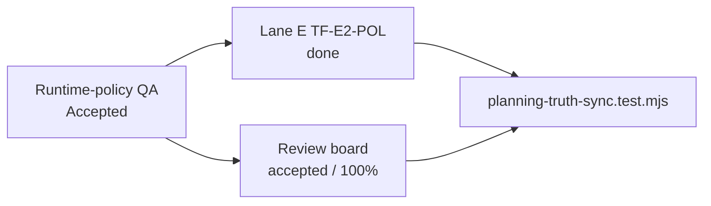
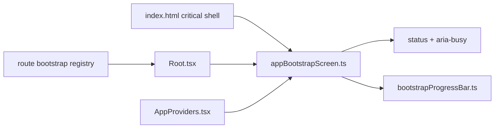

# Frontend Policy Drift And Bootstrap Maturity Closeout

## Think-First Analysis

Problem summary: Lane E and the review board had drifted away from the accepted
Canvas runtime-policy QA verdict, and the startup bootstrap screen was visually
heavier than the operational workbench posture it represents.

Root cause: the runtime-policy remediation had a final QA verdict and code
evidence, but no Lane E task entry or truth-sync guard. The bootstrap had a
sound state machine, but its critical HTML still presented a large decorative
image and lacked screen-level busy/status semantics owned by the state machine.

Constraints and invariants:

- `AGENTS.md` requires governance-first execution, validation evidence, and no
  hidden debt.
- `docs/guides/ai-work-protocol.md` requires canonical planning surfaces to
  move together when a review finding closes.
- `docs/planning/state/planning-control-tower.md` makes Lane E the execution
  registry for frontend work.
- `docs/architecture/components/web/graph/graph-route-bootstrap-architecture.md`
  requires route startup truth to be published through explicit bootstrap
  contracts, not inferred from route heuristics.

Options considered:

- Patch only `review-status-board.md`; rejected because Lane E would keep a
  missing execution entry for `TF-E2-POL`.
- Change only visual CSS; rejected because accessibility semantics would remain
  passive HTML instead of state-machine-owned behavior.
- Add a full React bootstrap component; rejected because the startup gate must
  work before React mounts.

Selected option and rationale: reconcile the planning surfaces with a
truth-sync test, keep the bootstrap pre-React, add state-owned ARIA semantics,
replace the decorative image-heavy layout with a compact operational status
panel, and document the component API/invariants.

## Pre-Implementation Brief

Mode: Slim.

Scope:

- Planning drift for `TF-E2-POL`.
- Pre-React bootstrap screen behavior, critical HTML, and local component docs.

Touched paths:

- `docs/planning/state/agent-lane-e.yaml`
- `docs/planning/reviews/review-status-board.md`
- `docs/planning/reviews/architecture-and-governance/20260426-canvas-runtime-policy-architecture-review.md`
- `tools/ci/planning-truth-sync.test.mjs`
- `apps/web/index.html`
- `apps/web/src/app/bootstrap/appBootstrapScreen.ts`
- `apps/web/src/app/bootstrap/bootstrapProgressBar.ts`
- `apps/web/src/app/bootstrap/appBootstrapScreen.test.ts`
- `docs/architecture/components/web/app-bootstrap-screen-component.md`
- `docs/architecture/components/web/index.md`

Out of scope:

- Backend health availability on `localhost:3000`.
- React route bootstrap contract redesign.
- Canvas runtime-policy implementation changes.

Validation plan:

- Red/green planning truth-sync test.
- Red/green bootstrap unit test.
- Desktop and mobile Playwright screenshots against the local Vite server.
- Web typecheck and test baseline.
- Docs sync/workboard generation and changed-doc gates.
- Repository pre-push gate.

## Architecture Outcome

## Validation Evidence

- `node --test tools/ci/planning-truth-sync.test.mjs`
  - red: failed because `TF-E2-POL` was absent from Lane E.
  - green: passed after Lane E and review board reconciliation.
- `pnpm --filter @dvt/web test -- appBootstrapScreen.test.ts`
  - red: failed because the startup screen did not publish `role="status"`.
  - green: passed with 6 tests.
- Playwright visual inspection against `http://localhost:5173/canvas`:
  - before: desktop and mobile bootstrap showed a large decorative image taking
    primary startup space;
  - after: desktop and mobile bootstrap show a compact operational status panel
    with brand, ordered steps, progress, and metadata.
- `pnpm --filter @dvt/web typecheck`: passed.
- `pnpm --filter @dvt/web test`: passed. The suite still emits the historical
  React `act(...)` warnings around React Flow/MiniMap, but exits green.
- `pnpm lint`: passed.
- `pnpm docs:workboard:generate`: regenerated planning views.
- `pnpm docs:sync`: synced docs and regenerated Lane E rendered output.
- `pnpm docs:workboard:check`: passed.
- `pnpm docs:sync:check`: passed.
- `pnpm exec markdownlint-cli2 ...`: passed for the changed and new docs in
  this slice.
- `pnpm lint:md:changed`: passed.
- `pnpm qa:artifact:check`: passed.
- `pnpm verify:prepush`: passed.

## No-Debt Statement

No stubs, placeholders, fake implementations, TODO markers, hook bypasses, or
rule relaxations were introduced. The local Vite screen still reports
`ERR_CONNECTION_REFUSED` for backend calls when `localhost:3000` is not running;
that is an environment/backend-availability signal, not a hidden frontend
success path.
