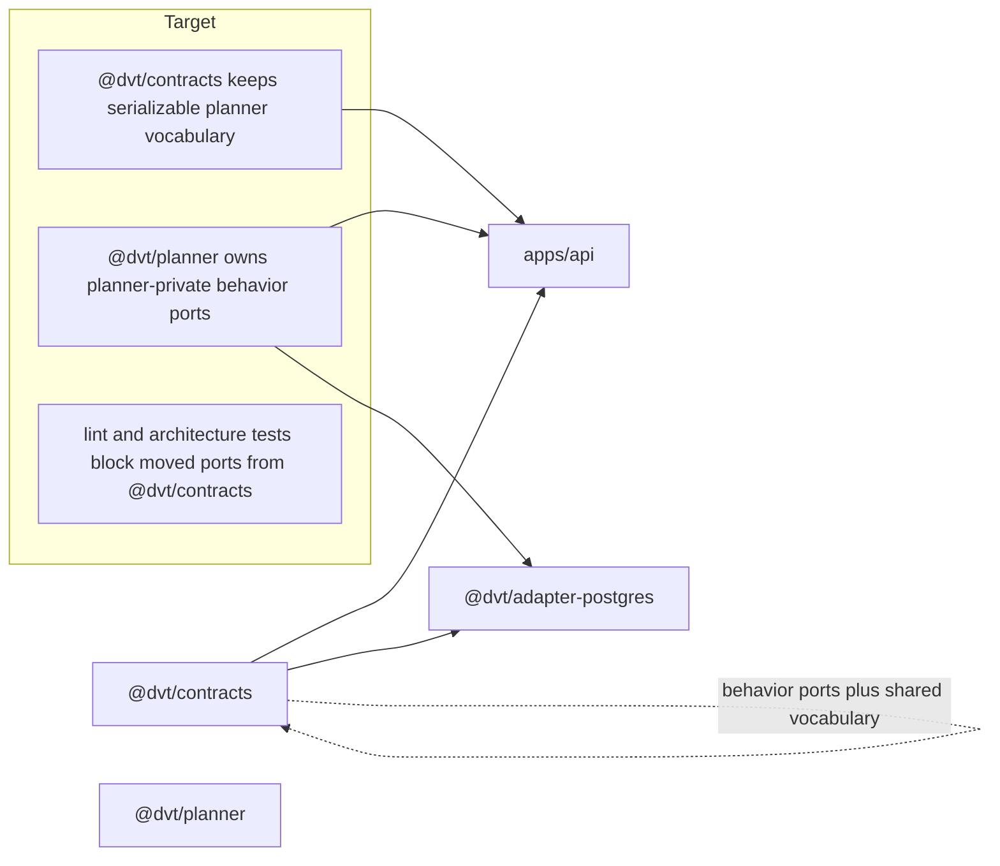

# Closeout: RC-G1-D planner ownership migration

## Think-First

### Problem Summary

`RC-G1-B` and `RC-G1-C` already removed engine-owned, delivery-owned,
traceability-owned, and retired artifact behavior from the active
`@dvt/contracts` shared-kernel surface. The remaining live `RC-G1` scope is the
planner-private contract family:

- `IPlanExecutabilityValidator`
- `IExecutionBindingVerifier`
- `IPlanValidationLifecycleStore`
- `ICustomPolicyNamespaceRegistry`

Those interfaces still publish behavior ports from `@dvt/contracts`, even
though the active `RC-G1` proposal classifies them as planner-private owner
package concerns. This keeps the shared kernel oversized and allows downstream
composition code to import planner behavior through the wrong package.

### Root Cause

The planner Stage 1.1 canonicalization work originally placed both shared
serializable vocabulary and behavior ports in the same `@dvt/contracts`
files. Later ADRs tightened the boundary:

- ADR-0018 requires serializable cross-package shapes to stay in
  `@dvt/contracts`, while behavior ports move to the owning domain package.
- ADR-0034 requires package imports to express bounded-context ownership.
- ADR-0035 fixes only the public planner contracts in `@dvt/contracts`:
  `ExecutionPlan`, `PlannerInputEnvelope`, and `IExecutionPlanner`.

The current files mix both categories. For example,
`PlanExecutabilityValidation.v1.ts` contains serializable rejection/result
types used by shared start-run contracts and the behavioral
`IPlanExecutabilityValidator` port used by API/admission composition. Moving the
whole file would force `@dvt/contracts` to depend on `@dvt/planner`, which ADR
0018 forbids. Leaving the interface in place would fail `RC-G1-D`.

### Constraints And Invariants

- `AGENTS.md` requires docs-first execution, no hidden debt, no bypassed hooks,
  no stubs, and concrete closeout evidence.
- `docs/guides/ai-work-protocol.md` requires think-first analysis and a
  pre-implementation brief before code changes.
- `docs/planning/state/planning-control-tower.md` requires active lane YAML and
  generated planning views to remain synchronized.
- `docs/planning/proposals/mandatory/runtime-and-contracts/contracts-domain-ownership-migration-plan-20260327.md`
  is the canonical `RC-G1` proposal. It freezes the binary taxonomy:
  `stay shared` or `move to owner`.
- ADR-0018 requires `@dvt/contracts` to own shared serializable contracts only
  and behavior ports to live with the owning domain.
- ADR-0034 requires bounded contexts to communicate through shared contracts,
  refs, messages, or composition roots, and forbids ownerless convenience
  barrels.
- ADR-0035 keeps only the public planner contracts in `@dvt/contracts`.
- ARC-2 evidence and risk update are mandatory because this slice touches
  `packages/@dvt/contracts/**`, `packages/@dvt/planner/**`, and
  `packages/@dvt/adapter-postgres/**`.

### Options Considered

1. Move the four current files wholesale to `@dvt/planner`.
2. Leave the files in `@dvt/contracts` and only add lint guidance.
3. Split each mixed file so serializable shared vocabulary remains in
   `@dvt/contracts`, while planner-owned behavior ports move to
   `@dvt/planner`.

Libraries evaluated:

- None evaluated. This is an ownership migration inside existing repository
  packages, not a library adoption problem.

### Selected Option And Rationale

Use the split ownership cut.

The serializable vocabulary stays shared:

- `EXECUTABILITY_REJECTION_CODES`
- `ExecutabilityRejectionCode`
- `ExecutabilityValidationResult`
- `BindingRejectionCode`
- `ExecutionBindingVerificationResult`
- `PlanBindingRecord`
- `StepBindingEntry`
- `PlanValidationState`
- `PlanValidationRecord`
- `CustomPolicy*` serializable namespace vocabulary

The behavior ports move to `@dvt/planner`:

- `IPlanExecutabilityValidator`
- `IExecutionBindingVerifier`
- `IPlanValidationLifecycleStore`
- `ICustomPolicyNamespaceRegistry`

This preserves the dependency rule that `@dvt/contracts` must not import
`@dvt/planner`, while still closing the behavior-port drift targeted by
`RC-G1-D`.

### Rejected Alternatives

- Whole-file relocation was rejected because shared contracts such as
  `StartRunBoundary` and plan-record DTOs still need serializable rejection
  vocabulary without depending on planner internals.
- Lint-only hardening was rejected because the wrong package would remain the
  physical host of planner-private behavior ports.
- Permanent compatibility aliases were rejected because `RC-G1` requires
  residual imports of moved behavioral ports to close to zero rather than
  preserving dual ownership.

### Current State And Target

## Pre-Implementation Brief

- Mode: `Full`
- Scope:
  - add planner-owned behavior-port modules under `@dvt/planner`
  - remove behavior-port exports from `@dvt/contracts`
  - cut `apps/api` and `@dvt/adapter-postgres` consumers over to
    `@dvt/planner`
  - add regression tests and lint guards so moved ports cannot return through
    `@dvt/contracts`
  - update `RC-G1` proposal, lane state, evidence, risk, and generated docs
- Touched files or paths:
  - `packages/@dvt/contracts/**`
  - `packages/@dvt/planner/**`
  - `packages/@dvt/adapter-postgres/**`
  - `apps/api/**`
  - `eslint.config.cjs`
  - `docs/planning/proposals/mandatory/runtime-and-contracts/contracts-domain-ownership-migration-plan-20260327.md`
  - `docs/planning/state/agent-lane-a.yaml`
  - `docs/planning/closeouts/20260427-rc-g1-d-planner-ownership-migration-closeout.md`
  - `docs/evidence/**`
  - `docs/risk-register/quality/**`
- Expected outcome:
  - planner-private behavior ports are no longer exported from
    `@dvt/contracts`
  - `@dvt/planner` is the canonical import surface for those behavior ports
  - `@dvt/contracts` still owns shared serializable planner vocabulary needed
    by contracts, schema packs, records, API responses, and runtime DTOs
  - governed consumers fail lint if they reimport the moved behavior ports from
    `@dvt/contracts`
- Risks and mitigations:
  - risk: accidentally moving shared vocabulary creates a forbidden
    contracts-to-planner dependency
  - mitigation: split ports from serializable types and add architecture tests
    that assert shared vocabulary remains available from `@dvt/contracts`
  - risk: adapter-postgres gains an undeclared planner dependency
  - mitigation: update package metadata and TypeScript paths with the cutover
  - risk: old root barrel exports hide residual imports
  - mitigation: remove the moved names from the root `@dvt/contracts` barrel
    and add no-restricted-imports coverage
  - risk: CustomPolicyNamespaceRegistry is still speculative
  - mitigation: move only the existing interface ownership; do not expand the
    feature and leave broader freeze/removal to the already queued `AR-A4`
- Out-of-scope items:
  - changing public planner contracts governed by ADR-0035
  - deleting serializable planner DTOs, schemas, or shared validation
    vocabulary from `@dvt/contracts`
  - implementing new custom policy namespace behavior
  - broad plan-store redesign beyond the moved interface ownership
- Validation plan:
  - `pnpm --filter @dvt/contracts build`
  - `pnpm --filter @dvt/contracts test`
  - `pnpm --filter @dvt/planner build`
  - `pnpm --filter @dvt/planner test`
  - `pnpm --filter @dvt/adapter-postgres build`
  - `pnpm --filter @dvt/adapter-postgres test`
  - `pnpm --filter dvt-api build`
  - `pnpm --filter dvt-api test`
  - `GIT_BASE=origin/main GIT_HEAD=HEAD node tools/ci/arc-check.mjs`
  - `pnpm docs:status:generate`
  - `pnpm docs:sync`
  - `pnpm docs:workboard:generate`
  - `pnpm docs:arc:evidence:check`
  - `pnpm verify:prepush`
- Test coverage plan:
  - add contract architecture tests proving moved planner behavior ports are
    absent from `@dvt/contracts` files and root barrel
  - add planner architecture tests proving the moved ports are exported by
    `@dvt/planner`
  - keep package behavior tests for API stored-plan validation and
    Postgres-backed plan lifecycle green after import cutover
  - add or extend lint restrictions for API, adapter-postgres, and planner
    paths
- Libraries evaluated:
  - None evaluated; no custom implementation or external library is needed.

## Normative Baseline Verification

Verified before code changes:

- ADR-0018 authorizes moving behavior ports to owner packages and keeping
  serializable shared contracts in `@dvt/contracts`.
- ADR-0034 authorizes enforcing bounded-context imports with package exports,
  lint, and architecture tests.
- ADR-0035 keeps public planner contracts in `@dvt/contracts`; this slice does
  not move `ExecutionPlan`, `PlannerInputEnvelope`, or `IExecutionPlanner`.

## Implementation Results

Implemented the selected split-ownership cut.

- Added planner-owned behavior-port modules under `@dvt/planner/src/contracts`.
- Removed `IPlanExecutabilityValidator`, `IExecutionBindingVerifier`,
  `IPlanValidationLifecycleStore`, and `ICustomPolicyNamespaceRegistry` from
  `@dvt/contracts` source files and the root barrel.
- Kept shared serializable planner vocabulary in `@dvt/contracts`, including
  executability, binding, validation lifecycle, and custom policy DTO/result
  shapes.
- Redirected `apps/api` and `@dvt/adapter-postgres` consumers to import moved
  ports from `@dvt/planner`.
- Declared the explicit `@dvt/planner` dependency and TypeScript path mapping
  for `@dvt/adapter-postgres`.
- Added architecture tests proving the moved behavior ports are absent from
  `@dvt/contracts` and present in `@dvt/planner`.
- Hardened the planner-side architecture test so it also validates semantic
  encapsulation: each moved port module starts with an `Owned concern`
  docblock, imports shared vocabulary from `@dvt/contracts` with `import type`,
  does not export DTO vocabulary, and does not import peer domains or concrete
  adapters.
- Added the local component guide
  `docs/architecture/components/planner/planner-private-behavior-ports-component.md`
  with public API, invariants, transition diagrams, consumers, and extension
  rules.
- Saved the Fowler-style architecture review and mature-system comparison in
  `docs/planning/reviews/architecture-and-governance/20260427-rc-g1-d-fowler-architecture-review.md`.
- Added lint guards blocking governed runtime code from importing the moved
  ports through `@dvt/contracts`.
- Published ARC-2 evidence and risk updates for the contract, planner, adapter,
  and API boundary change.

## Validation Results

Passed:

- `pnpm --filter @dvt/contracts test -- planner-private-ownership.architecture.test.ts`
- `pnpm --filter @dvt/planner test -- planner-private-ownership.architecture.test.ts`
  (semantic encapsulation guard)
- `pnpm --filter @dvt/contracts build`
- `pnpm --filter @dvt/planner build`
- `pnpm --filter @dvt/adapter-postgres build`
- `pnpm --filter dvt-api build`
- `pnpm --filter @dvt/contracts typecheck`
- `pnpm --filter @dvt/planner typecheck`
- `pnpm --filter @dvt/adapter-postgres typecheck`
- `pnpm --filter dvt-api typecheck`
- `pnpm --filter @dvt/contracts test`
- `pnpm --filter @dvt/planner test`
- `pnpm --filter @dvt/adapter-postgres test`
- `pnpm --filter dvt-api test`
- `pnpm docs:status:generate`
- `pnpm docs:sync`
- `pnpm docs:workboard:generate`
- `pnpm lint`
- `pnpm docs:arc:evidence:check`
- `pnpm verify:prepush`

Final repository gate:

- `GIT_BASE=origin/main GIT_HEAD=HEAD node tools/ci/arc-check.mjs` will be run
  after the implementation commit so the command evaluates the real committed
  diff.

## No-Debt / No-Stub Evidence

- No behavior stubs, placeholders, fake adapters, or TODO/FIXME markers were
  added.
- No lint, type, test, ARC, documentation, or hook rule was relaxed.
- No `--no-verify` or hook bypass was used.
- The only lint policy adjustment permits the explicit `@dvt/adapter-postgres`
  planner dependency required by the `RC-G1-D2` definition of done; the old
  `@dvt/contracts` import path is now mechanically blocked for the moved ports.
- `.vscode/settings.json` was already dirty before this slice and was not
  touched by this work.
