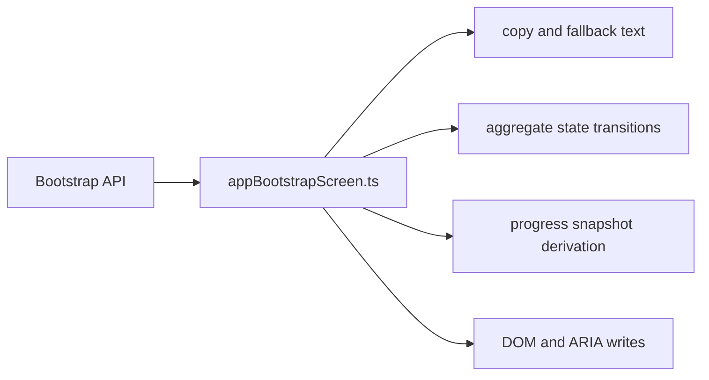
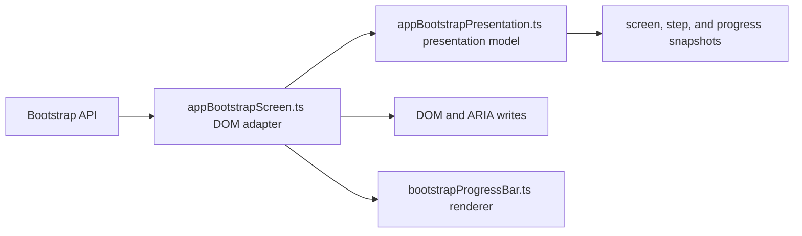

# Bootstrap Presentation Separation Closeout

## Think-First Analysis

Problem summary: `appBootstrapScreen.ts` still mixed presentation decisions
with pre-React DOM mutation. The module owned startup step copy, aggregate
screen posture, progress snapshot derivation, metadata formatting, and direct
DOM writes in one file.

Root cause: the bootstrap screen evolved from a small startup helper into a
startup gate. Later fixes hardened behavior and accessibility, but the module
boundary did not keep up with the larger responsibility set.

Constraints and invariants:

- `AGENTS.md` requires governance-first work, validation evidence, no hidden
  debt, and no stub implementations.
- `docs/guides/ai-work-protocol.md` classifies this as a Slim refactor because
  it changes internal structure without adding a new external behavior.
- `docs/architecture/reference-architecture.md` favors explicit boundaries and
  adapters; here the browser DOM is the adapter boundary.
- `docs/architecture/components/web/app-bootstrap-screen-component.md` requires
  the bootstrap gate to keep a deterministic startup surface alive until
  readiness is settled.

Options considered:

- Keep `appBootstrapScreen.ts` as-is and rename helpers; rejected because the
  presentation and DOM responsibilities would remain coupled.
- Move only the status labels into a copy file; rejected because the aggregate
  state and progress derivation would still live in the DOM adapter.
- Extract a pure presentation module that resolves step state, screen state,
  progress snapshot, and metadata formatting; selected because it gives the
  component a Fowler-style Presentation Model while keeping the pre-React DOM
  adapter small and explicit.

Selected option and rationale: introduce `appBootstrapPresentation.ts` as the
pure presentation model for startup copy, transition resolution, and progress
snapshots. Keep `appBootstrapScreen.ts` responsible for DOM lookup, ARIA writes,
metadata writes, and the exported bootstrap control API.

## Pre-Implementation Brief

Mode: Slim.

Scope:

- Separate the bootstrap presentation model from the DOM screen adapter.
- Preserve the existing external bootstrap API and behavior.
- Add direct tests for presentation-model decisions and negative states.
- Update the local component guide so the documented architecture matches the
  implementation.

Touched paths:

- `apps/web/src/app/bootstrap/appBootstrapPresentation.ts`
- `apps/web/src/app/bootstrap/appBootstrapPresentation.test.ts`
- `apps/web/src/app/bootstrap/appBootstrapScreen.ts`
- `apps/web/src/app/bootstrap/appBootstrapScreen.test.ts`
- `docs/architecture/components/web/app-bootstrap-screen-component.md`
- `docs/planning/status/generated-code-state.md`

Out of scope:

- React route bootstrap redesign.
- Runtime health probing semantics.
- Visual redesign of the startup gate.

Validation plan:

- `pnpm docs:status:generate`
- `pnpm docs:sync`
- `pnpm --filter @dvt/web typecheck`
- `pnpm --filter @dvt/web test -- appBootstrapScreen.test.ts appBootstrapPresentation.test.ts`
- `pnpm lint`
- `pnpm verify:prepush`

## Current Coupling

## Target Boundary

## Architecture Outcome

The bootstrap component now follows a local Presentation Model split:

- `appBootstrapPresentation.ts` derives startup step state, aggregate screen
  state, user-facing copy, announcement state, progress labels, progress
  segments, and build-date formatting without touching browser globals.
- `appBootstrapScreen.ts` applies the resolved presentation snapshot to the
  startup DOM and keeps the existing app-facing control API stable.
- `bootstrapProgressBar.ts` remains a focused renderer for a supplied progress
  snapshot.

This removes the previous mixed responsibility where one module decided domain
posture and mutated the DOM in the same flow.

## Validation Evidence

- `pnpm --filter @dvt/web typecheck`
  - failed first with `TS2538` in the reverse step-detail lookup;
  - passed after replacing unchecked tuple indexing with an iterator over a
    reversed step-order copy.
- `pnpm --filter @dvt/web test -- appBootstrapScreen.test.ts appBootstrapPresentation.test.ts`
  - passed with 17 tests.
- `pnpm docs:status:generate`
  - passed and updated `docs/planning/status/generated-code-state.md`.
- `pnpm docs:sync`
  - passed with documentation indexes already in sync.
- `pnpm lint`
  - passed.
- `pnpm verify:prepush`
  - passed as the repository pre-push gate.

## No-Debt Statement

No stubs, placeholders, TODO/FIXME markers, fake implementations, hook bypasses,
or rule relaxations were introduced. No ARC-2 evidence or risk register entry
was required because this slice only touched `apps/web/**`, documentation, and
generated code-state status.
