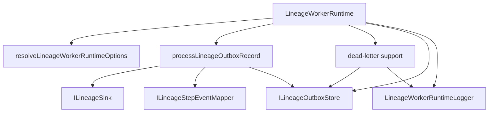
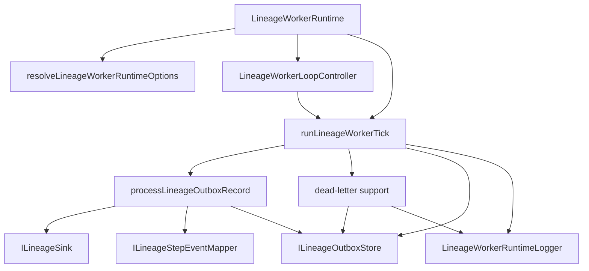

# Closeout: AR-B5 Lineage Worker Runtime Decomposition

## Think-First Analysis

### Problem summary

`AR-B5` exists because `RC-G1-C` moved lineage behavior into the correct
bounded context, but `LineageWorkerRuntime` still keeps too many runtime
responsibilities in one coordinator class. The package already has extracted
record-processing, dead-letter, and configuration helpers, yet the public
runtime still directly coordinates per-tick processing, dead-letter recovery,
lag state, logging, loop control, abort waiting, and start/stop lifecycle.

### Root cause

The owner-package migration fixed package ownership first. It intentionally did
not finish every decomposition seam in the same slice. That left the lineage
runtime structurally behind the newer delivery runtime decomposition: delivery
has a thin runtime plus focused loop and hook collaborators, while lineage still
mixes lifecycle mechanics with one-tick orchestration and operational reporting.

### Constraints and invariants

- `AGENTS.md`: repository governance is source-of-truth; no hidden debt, no
  stubs, no skipped checks, and closeout evidence is required.
- `docs/planning/status/governance-document-rule-inventory.md`: code,
  architecture, planning, and validation surfaces must stay aligned.
- `docs/guides/ai-work-protocol.md`: this is a Slim refactor slice because it
  changes internal structure without new external behavior.
- `docs/architecture/reference-architecture.md`: bounded-context ownership and
  replaceable infrastructure stay behind owner-local ports.
- `docs/architecture/command-query-rail-governance.md`: no new command/query
  rail is introduced; this is internal worker orchestration under the existing
  lineage outbox delivery behavior.
- `docs/architecture/fowler-opportunity-planning-governance.md`: the slice must
  name responsibility overload, implementation surfaces, tests, and residual
  work before code changes.
- `docs/planning/reviews/architecture-and-governance/20260419-post-rc-g1-c-architecture-review.md`:
  `AR-B5` owns the remaining decomposition of `LineageWorkerRuntime` without
  moving lineage ownership back to shared helpers.

### Existing material checked

- `packages/@dvt/traceability-service/src/lineage/LineageWorkerRuntime.ts`
- `packages/@dvt/traceability-service/src/lineage/runtime/lineageWorkerRecordProcessor.ts`
- `packages/@dvt/traceability-service/src/lineage/runtime/lineageWorkerDeadLetterSupport.ts`
- `packages/@dvt/traceability-service/src/lineage/runtime/lineageWorkerRuntimeConfig.ts`
- `packages/@dvt/traceability-service/test/lineage/LineageWorkerRuntime.*.test.ts`
- `packages/@dvt/traceability-service/test/lineage/support/lineageRuntimeTestSupport.ts`

### Current topology



### Target topology



### Options considered

1. Leave `LineageWorkerRuntime` as-is because record and dead-letter helpers
   already exist. Rejected because the runtime still directly owns tick,
   observability, and lifecycle mechanics, which is the core `AR-B5` finding.
2. Extract a broad `LineageWorkerRuntimeService` that owns everything behind
   the public class. Rejected because it would only move the overloaded class
   shape to a new file.
3. Extract one tick coordinator and one loop controller, keeping
   `LineageWorkerRuntime` as the public facade. Selected because it makes the
   reasons to change explicit while preserving the current constructor,
   `start`, `stop`, `runOnce`, `lagCount`, and `deadLetterCount` API.

### Selected option and rationale

Implement two owner-local collaborators:

- `runLineageWorkerTick`: owns per-tick orchestration, lag/dead-letter counting,
  auto-replay, backlog alerting, and tick summary logging.
- `LineageWorkerLoopController`: owns start/stop lifecycle, abort listener
  cleanup, run-loop iteration, wait cancellation, and tick failure backoff.

`LineageWorkerRuntime` remains the compatibility facade and state holder for
observed counters. No contracts, adapters, routes, or external worker commands
change in this slice.

### Rejected alternatives

- Moving the helpers into `@dvt/delivery` or `@dvt/contracts`: rejected because
  that would reintroduce the shared-kernel leakage that `RC-G1-C` removed.
- Changing `LineageWorkerRuntime` constructor arguments: rejected because this
  slice is a decomposition refactor, not a new composition-root contract.
- Adding a generic worker-loop library: rejected because there is no cross-owner
  requirement yet and the task explicitly warns against convenience shared
  helpers.

## Pre-Implementation Brief

- Mode: Slim.
- Scope:
  - refactor lineage worker runtime internals only;
  - preserve current public API and behavior;
  - add semantic and architecture tests that prevent the overloaded shape from
    returning.
- Touched files or paths:
  - `packages/@dvt/traceability-service/src/lineage/LineageWorkerRuntime.ts`
  - `packages/@dvt/traceability-service/src/lineage/runtime/lineageWorkerTick.ts`
  - `packages/@dvt/traceability-service/src/lineage/runtime/LineageWorkerLoopController.ts`
  - `packages/@dvt/traceability-service/test/lineage/LineageWorkerRuntime.architecture.test.ts`
  - `packages/@dvt/traceability-service/test/lineage/lineageWorkerTick.test.ts`
  - `scripts/planning-db-migrate.cjs`
  - `scripts/planning-db-migrate.test.cjs`
  - `docs/planning/state/agent-lane-b.yaml`
  - this closeout file
- Expected outcome:
  - `LineageWorkerRuntime` delegates tick orchestration and lifecycle mechanics
    to focused collaborators;
  - existing runtime behavior and package tests remain green;
  - architecture guard blocks direct record/dead-letter orchestration from
    returning to the facade.
- Risks and mitigations:
  - Risk: start/stop cancellation behavior regresses. Mitigation: keep existing
    lifecycle tests and keep wait cancellation inside the loop controller.
  - Risk: tick counters drift from previous behavior. Mitigation: add direct
    tick tests and keep existing `runOnce` tests green.
  - Risk: the refactor creates a fake seam with no semantic proof. Mitigation:
    add a source-level architecture test plus behavioral tests for the new tick
    collaborator.
- Out-of-scope items:
  - changing lineage outbox contracts;
  - changing sink publication behavior;
  - introducing a cross-package worker runtime abstraction;
  - changing app bootstrap or deployment topology;
  - deduplicating in-memory outbox semantics, which remains separate follow-up
    work from the post-`RC-G1-C` review.
- Validation plan:
  - `pnpm exec vitest run packages/@dvt/traceability-service/test/lineage/LineageWorkerRuntime.architecture.test.ts`
  - `pnpm exec vitest run packages/@dvt/traceability-service/test/lineage/lineageWorkerTick.test.ts`
  - `pnpm --filter @dvt/traceability-service test`
  - `pnpm governance:refresh`
  - `pnpm verify:prepush`
- Test coverage plan:
  - architecture guard that `LineageWorkerRuntime` no longer directly imports
    record/dead-letter helpers or owns private loop/wait methods;
  - tick coordinator preserves processed/deadLettered/lag behavior;
  - tick coordinator logs unknown dead-letter lag when counting fails;
  - existing runtime lifecycle tests preserve start/stop and abort behavior.
- Libraries evaluated:
  - none adopted; this is local TypeScript decomposition over existing ports,
    not a new scheduling or worker runtime feature.
- Command/query rail impact:
  - none - internal worker orchestration only. The existing lineage outbox
    delivery behavior remains the owning worker behavior and no new externally
    observable command or query is introduced.
- Fowler opportunity matrix:

| Scenario                                                             | Opportunity                          | Fowler pattern                | DDD owner                                       | Command/query rail                   | Implementation surfaces                                                             | Unit or package test            | Architecture test           | User-flow test | Out of scope                    |
| -------------------------------------------------------------------- | ------------------------------------ | ----------------------------- | ----------------------------------------------- | ------------------------------------ | ----------------------------------------------------------------------------------- | ------------------------------- | --------------------------- | -------------- | ------------------------------- |
| Runtime facade owns tick, recovery, logging, and lifecycle mechanics | Responsibility overload              | Extract Class / Service Layer | Traceability lineage worker application service | none - internal worker orchestration | `LineageWorkerRuntime.ts`, `lineageWorkerTick.ts`, `LineageWorkerLoopController.ts` | tick and existing runtime tests | facade source guard         | none           | external worker API changes     |
| Decomposition can regress back into direct helper orchestration      | Documentation and architecture drift | Architecture guard            | Traceability lineage worker application service | none - internal worker orchestration | lineage architecture test                                                           | existing package tests          | import/private-method guard | none           | generic shared worker framework |

### Feature Mechanization Placement Correction

The first AR-B5 pass declared the mechanization data in this closeout after
implementation had started. That was the wrong declared sequence. The canonical
AR-B5 `feature-mechanization` manifest now lives in
`docs/planning/proposals/mandatory/runtime-and-contracts/ar-b5-lineage-worker-runtime-decomposition-plan-20260507.md`,
which is the scanned pre-implementation planning surface. The block below is
retained only as deviation context and is intentionally not a governing manifest.

```yaml
version: 1
featureId: AR-B5-LINEAGE-RUNTIME-DECOMPOSITION
mechanizationStatus: implemented
noHumanDecisionsRemaining: true
implementationPlan: docs/planning/closeouts/20260507-ar-b5-lineage-worker-runtime-decomposition-closeout.md
componentGuides:
  - docs/architecture/reference-architecture.md
  - docs/architecture/command-query-rail-governance.md
  - docs/architecture/fowler-opportunity-planning-governance.md
  - docs/planning/reviews/architecture-and-governance/20260419-post-rc-g1-c-architecture-review.md
userStories:
  - docs/planning/closeouts/20260507-ar-b5-lineage-worker-runtime-decomposition-closeout.md
governingSources:
  - AGENTS.md
  - docs/planning/status/governance-document-rule-inventory.md
  - docs/guides/ai-work-protocol.md
  - docs/architecture/reference-architecture.md
  - docs/architecture/command-query-rail-governance.md
  - docs/architecture/fowler-opportunity-planning-governance.md
  - docs/planning/state/agent-lane-b.yaml
  - docs/planning/reviews/architecture-and-governance/20260419-post-rc-g1-c-architecture-review.md
allowedImplementationSurfaces:
  - docs/planning/closeouts/20260507-ar-b5-lineage-worker-runtime-decomposition-closeout.md
  - docs/planning/state/agent-lane-b.yaml
  - docs/planning/state/agent-lane-b.md
  - docs/planning/state/execution-workboard.md
  - docs/planning/state/open-task-route.md
  - docs/planning/status/**
  - docs/.manifest.json
  - packages/@dvt/traceability-service/src/lineage/LineageWorkerRuntime.ts
  - packages/@dvt/traceability-service/src/lineage/runtime/LineageWorkerLoopController.ts
  - packages/@dvt/traceability-service/src/lineage/runtime/lineageWorkerTick.ts
  - packages/@dvt/traceability-service/test/lineage/LineageWorkerRuntime.architecture.test.ts
  - packages/@dvt/traceability-service/test/lineage/LineageWorkerRuntime.runOnce.test.ts
  - packages/@dvt/traceability-service/test/lineage/lineageWorkerTick.test.ts
  - scripts/planning-db-migrate.cjs
  - scripts/planning-db-migrate.test.cjs
forbiddenImplementationSurfaces:
  - apps/**
  - packages/@dvt/contracts/**
  - packages/@dvt/engine/**
  - packages/@dvt/planner/**
  - packages/@dvt/adapter-*/**
commandQueryRails:
  - name: LineageWorkerInternalOrchestration
    type: command
    dddOwner: TraceabilityLineageWorkerApplicationService
domainObjects:
  - name: TraceabilityLineageWorkerApplicationService
    type: application service
    owner: Traceability service
fowlerSignals:
  - Responsibility overload
  - Documentation drift
  - Test-only confidence
architectureGuards:
  - pnpm exec vitest run packages/@dvt/traceability-service/test/lineage/LineageWorkerRuntime.architecture.test.ts
  - pnpm docs:feature-mechanization:implementation
cypressFlows:
  - Not applicable - internal lineage worker runtime decomposition only
completionGate:
  - pnpm exec vitest run packages/@dvt/traceability-service/test/lineage/LineageWorkerRuntime.architecture.test.ts packages/@dvt/traceability-service/test/lineage/LineageWorkerRuntime.runOnce.test.ts packages/@dvt/traceability-service/test/lineage/lineageWorkerTick.test.ts
  - pnpm --filter @dvt/traceability-service test
  - pnpm --filter @dvt/traceability-service build
  - node --test scripts/planning-db-migrate.test.cjs
  - pnpm governance:refresh
  - pnpm docs:feature-mechanization:implementation
  - pnpm verify:prepush
redGreenCycles:
  - id: lineage-runtime-facade-decomposition
    redTest: pnpm exec vitest run packages/@dvt/traceability-service/test/lineage/LineageWorkerRuntime.architecture.test.ts packages/@dvt/traceability-service/test/lineage/LineageWorkerRuntime.runOnce.test.ts packages/@dvt/traceability-service/test/lineage/lineageWorkerTick.test.ts
    expectedFailure: The tick module does not exist, the runtime facade still imports direct record/dead-letter helpers, and observed lag is not preserved when later tick work fails.
    patchSurfaces:
      - packages/@dvt/traceability-service/src/lineage/LineageWorkerRuntime.ts
      - packages/@dvt/traceability-service/src/lineage/runtime/LineageWorkerLoopController.ts
      - packages/@dvt/traceability-service/src/lineage/runtime/lineageWorkerTick.ts
      - packages/@dvt/traceability-service/test/lineage/LineageWorkerRuntime.architecture.test.ts
      - packages/@dvt/traceability-service/test/lineage/LineageWorkerRuntime.runOnce.test.ts
      - packages/@dvt/traceability-service/test/lineage/lineageWorkerTick.test.ts
    greenTest: pnpm exec vitest run packages/@dvt/traceability-service/test/lineage/LineageWorkerRuntime.architecture.test.ts packages/@dvt/traceability-service/test/lineage/LineageWorkerRuntime.runOnce.test.ts packages/@dvt/traceability-service/test/lineage/lineageWorkerTick.test.ts
  - id: planning-db-migration-line-ending-checksum
    redTest: node --test scripts/planning-db-migrate.test.cjs
    expectedFailure: CRLF and LF variants of the same migration SQL produce incompatible checksums.
    patchSurfaces:
      - scripts/planning-db-migrate.cjs
      - scripts/planning-db-migrate.test.cjs
    greenTest: node --test scripts/planning-db-migrate.test.cjs
symbols:
  - name: LineageWorkerRuntime
    path: packages/@dvt/traceability-service/src/lineage/LineageWorkerRuntime.ts
    dddOwner: TraceabilityLineageWorkerApplicationService
    cqRails:
      - LineageWorkerInternalOrchestration
    fowlerSignals:
      - Responsibility overload
    architectureGuard: pnpm exec vitest run packages/@dvt/traceability-service/test/lineage/LineageWorkerRuntime.architecture.test.ts
    cypressCoverage: Not applicable - internal lineage worker runtime decomposition only
    unitTests:
      - pnpm --filter @dvt/traceability-service test
  - name: LineageWorkerLoopController
    path: packages/@dvt/traceability-service/src/lineage/runtime/LineageWorkerLoopController.ts
    dddOwner: TraceabilityLineageWorkerApplicationService
    cqRails:
      - LineageWorkerInternalOrchestration
    fowlerSignals:
      - Responsibility overload
    architectureGuard: pnpm exec vitest run packages/@dvt/traceability-service/test/lineage/LineageWorkerRuntime.architecture.test.ts
    cypressCoverage: Not applicable - internal lineage worker runtime decomposition only
    unitTests:
      - pnpm --filter @dvt/traceability-service test
  - name: LineageWorkerLoopControllerOptions
    path: packages/@dvt/traceability-service/src/lineage/runtime/LineageWorkerLoopController.ts
    dddOwner: TraceabilityLineageWorkerApplicationService
    cqRails:
      - LineageWorkerInternalOrchestration
    fowlerSignals:
      - Responsibility overload
    architectureGuard: pnpm exec vitest run packages/@dvt/traceability-service/test/lineage/LineageWorkerRuntime.architecture.test.ts
    cypressCoverage: Not applicable - internal lineage worker runtime decomposition only
    unitTests:
      - pnpm --filter @dvt/traceability-service test
  - name: runLineageWorkerTick
    path: packages/@dvt/traceability-service/src/lineage/runtime/lineageWorkerTick.ts
    dddOwner: TraceabilityLineageWorkerApplicationService
    cqRails:
      - LineageWorkerInternalOrchestration
    fowlerSignals:
      - Responsibility overload
    architectureGuard: pnpm exec vitest run packages/@dvt/traceability-service/test/lineage/LineageWorkerRuntime.architecture.test.ts
    cypressCoverage: Not applicable - internal lineage worker runtime decomposition only
    unitTests:
      - pnpm exec vitest run packages/@dvt/traceability-service/test/lineage/lineageWorkerTick.test.ts
  - name: LineageWorkerTickOutcome
    path: packages/@dvt/traceability-service/src/lineage/runtime/lineageWorkerTick.ts
    dddOwner: TraceabilityLineageWorkerApplicationService
    cqRails:
      - LineageWorkerInternalOrchestration
    fowlerSignals:
      - Responsibility overload
    architectureGuard: pnpm docs:feature-mechanization:implementation
    cypressCoverage: Not applicable - internal lineage worker runtime decomposition only
    unitTests:
      - pnpm exec vitest run packages/@dvt/traceability-service/test/lineage/lineageWorkerTick.test.ts
  - name: RunLineageWorkerTickArgs
    path: packages/@dvt/traceability-service/src/lineage/runtime/lineageWorkerTick.ts
    dddOwner: TraceabilityLineageWorkerApplicationService
    cqRails:
      - LineageWorkerInternalOrchestration
    fowlerSignals:
      - Responsibility overload
    architectureGuard: pnpm docs:feature-mechanization:implementation
    cypressCoverage: Not applicable - internal lineage worker runtime decomposition only
    unitTests:
      - pnpm exec vitest run packages/@dvt/traceability-service/test/lineage/lineageWorkerTick.test.ts
  - name: runtimeSourcePath
    path: packages/@dvt/traceability-service/test/lineage/LineageWorkerRuntime.architecture.test.ts
    dddOwner: TraceabilityLineageWorkerApplicationService
    cqRails:
      - LineageWorkerInternalOrchestration
    fowlerSignals:
      - Documentation drift
    architectureGuard: pnpm exec vitest run packages/@dvt/traceability-service/test/lineage/LineageWorkerRuntime.architecture.test.ts
    cypressCoverage: Not applicable - internal lineage worker runtime decomposition only
    unitTests:
      - pnpm exec vitest run packages/@dvt/traceability-service/test/lineage/LineageWorkerRuntime.architecture.test.ts
  - name: normalizeSqlForChecksum
    path: scripts/planning-db-migrate.cjs
    dddOwner: PlanningQueryStoreMigrationReadModel
    cqRails:
      - LineageWorkerInternalOrchestration
    fowlerSignals:
      - Documentation drift
    architectureGuard: node --test scripts/planning-db-migrate.test.cjs
    cypressCoverage: Not applicable - planning DB migration checksum helper only
    unitTests:
      - node --test scripts/planning-db-migrate.test.cjs
  - name: buildLineEndingCompatibleChecksums
    path: scripts/planning-db-migrate.cjs
    dddOwner: PlanningQueryStoreMigrationReadModel
    cqRails:
      - LineageWorkerInternalOrchestration
    fowlerSignals:
      - Documentation drift
    architectureGuard: node --test scripts/planning-db-migrate.test.cjs
    cypressCoverage: Not applicable - planning DB migration checksum helper only
    unitTests:
      - node --test scripts/planning-db-migrate.test.cjs
```

## Implementation Evidence

Implemented in this slice:

- `packages/@dvt/traceability-service/src/lineage/LineageWorkerRuntime.ts`
  now remains the compatibility facade for constructor wiring, observed
  counters, `start`, `stop`, and `runOnce`.
- `packages/@dvt/traceability-service/src/lineage/runtime/lineageWorkerTick.ts`
  now owns one-tick orchestration, lag counting, record processing fanout,
  dead-letter counting, auto-replay, backlog alerting, and summary logging.
- `packages/@dvt/traceability-service/src/lineage/runtime/LineageWorkerLoopController.ts`
  now owns lifecycle loop control, abort listener cleanup, wait cancellation,
  tick failure logging, and backoff.
- `packages/@dvt/traceability-service/test/lineage/lineageWorkerTick.test.ts`
  proves the tick coordinator behavior directly.
- `packages/@dvt/traceability-service/test/lineage/LineageWorkerRuntime.architecture.test.ts`
  prevents the public runtime facade from re-importing record/dead-letter
  helpers or private loop/wait methods.
- `docs/planning/state/agent-lane-b.yaml` records the slice as review-ready.
- `docs/planning/status/generated-code-state.md` was regenerated because new
  package source and test files were added.
- `scripts/planning-db-migrate.cjs` now computes canonical migration checksums
  with normalized SQL line endings and accepts previously recorded
  line-ending-equivalent checksums. This was required because the shared local
  planning database had migrations applied with mixed LF/CRLF hashes, which
  blocked `governance:refresh` even though the SQL schema matched.
- `scripts/planning-db-migrate.test.cjs` now proves both canonical
  line-ending-stable checksums and legacy line-ending-only checksum acceptance.

The public runtime API remains unchanged:

- `new LineageWorkerRuntime(store, sink, mapper, logger, options)`
- `start(signal?)`
- `stop()`
- `runOnce()`
- `lagCount`
- `deadLetterCount`

## Validation Evidence

Commands run before final governance closeout:

- `pnpm exec vitest run packages/@dvt/traceability-service/test/lineage/LineageWorkerRuntime.architecture.test.ts packages/@dvt/traceability-service/test/lineage/lineageWorkerTick.test.ts`
  - RED before implementation: failed because `lineageWorkerTick` did not
    exist and `LineageWorkerRuntime` still imported direct record/dead-letter
    helpers.
- `pnpm exec vitest run packages/@dvt/traceability-service/test/lineage/LineageWorkerRuntime.architecture.test.ts packages/@dvt/traceability-service/test/lineage/lineageWorkerTick.test.ts`
  - PASS after implementation: 2 files, 3 tests.
- `pnpm exec vitest run packages/@dvt/traceability-service/test/lineage`
  - PASS: 12 files, 49 tests.
- `pnpm --filter @dvt/traceability-service test`
  - PASS: 14 files, 54 tests.
- `pnpm --filter @dvt/traceability-service build`
  - PASS.
- `pnpm docs:status:generate`
  - PASS; updated `generated-code-state.md`.
- `pnpm docs:sync`
  - PASS; regenerated the Lane B rendered view.
- `node --test scripts/planning-db-migrate.test.cjs`
  - RED before the migrator fix: line-ending-equivalent migration SQL produced
    different checksums and rejected the legacy local DB row.
- `node --test scripts/planning-db-migrate.test.cjs`
  - PASS after the migrator fix: 7 tests.
- `pnpm governance:refresh`
  - Initial FAIL: `planning:db:import` reported already-applied migration
    checksums that differed only by LF/CRLF history in the shared local DB.
- `pnpm governance:refresh`
  - PASS after migrator fix; imported `lanes=5`, `tasks=329`,
    `governanceFiles=4299`, `governanceComponents=32`, and
    `governanceRemediationTasks=43`; `planning:db:check` and
    `governance:db:check` passed.
- `pnpm verify:prepush`
  - FAIL before this correction: the implementation diff was not covered by a
    canonical `feature-mechanization` manifest under
    `docs/planning/proposals/mandatory/**`, and the declared route did not make
    the manifest-before-code step explicit.
- `docs/guides/ai-work-protocol.md`
  - Updated with the Feature Mechanization Placement Rule so the required
    sequence is declared as a workflow step, not only inferred from CI failure.

Final required gates:

- `pnpm docs:feature-mechanization -- --feature AR-B5-LINEAGE-RUNTIME-DECOMPOSITION`
- `pnpm docs:feature-mechanization:implementation`
- `pnpm docs:sync`
- `pnpm governance:refresh`
- `pnpm verify:prepush`

## No-Debt And No-Stub Evidence

- No new command/query rail was introduced; this is internal worker
  orchestration only.
- No contracts, adapters, engine paths, planner paths, or external worker APIs
  were changed.
- No manual DB checksum repair was performed; the refresh blocker was fixed in
  the migrator so future local Windows/LF checkouts use the same durable rule.
- No `--no-verify`, hook bypass, quality-rule relaxation, or hidden skipped
  check was used.
- No stubs, placeholders, fake adapters, TODO/FIXME markers, or temporary
  bypasses were added.
- Residual out-of-scope work remains the previously documented duplicate
  in-memory outbox semantics follow-up from the post-`RC-G1-C` review; this
  slice does not create new debt for it.
