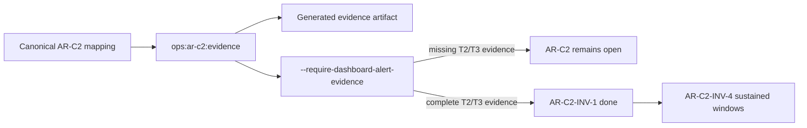

# AR-C2 INV-1 Immutable Evidence Gate Closeout

## Think-First Summary

`AR-C2-INV-1` closes the hidden-authority gap between AR-C2 documentation and
the operational evidence collector. The repository already had canonical SLA
mapping and a generated evidence artifact, but the collector did not fail closed
when reviewers asked whether dashboard and alert evidence was complete.

The selected pattern is Fowler's **Introduce Assertion** at the collector
boundary. The existing `AR-C2OperationalEvidenceCommand` remains the single rail;
no second evidence command was introduced.

## Work Performed

- Added Fowler analysis in
  `buzon/20260513-codex-fowler-ar-c2-inv-1-immutable-evidence-gate-analysis.md`.
- Added the governed implementation plan and feature mechanization manifest in
  `docs/planning/proposals/mandatory/runtime-and-contracts/ar-c2-inv-1-immutable-evidence-gate-plan-20260513.md`.
- Added local component guide and stories under
  `docs/architecture/components/engine/ops/`.
- Extended `tools/ops/ar-c2-evidence-collector.mjs` with
  `--require-dashboard-alert-evidence`.
- Added semantic architecture and behavior coverage in
  `tools/ops/ar-c2-evidence-collector.architecture.test.mjs`.
- Fixed `scripts/governance-refresh.cjs` so generated governance coverage and
  remediation reports are reimported before the DB validation gate.
- Raised the local generated governance file-index policy ceiling from
  `1900000` to `1910000` because the generated
  `SYS-DOCS-GOVERNANCE.files.yaml` artifact reached `1903750` bytes after the
  new docs were indexed.
- Updated the AR-C2 evidence runbook to require the assertion command before
  treating dashboard and alert evidence as complete.

## Validation Evidence

Commands run so far:

- `node --test tools/ops/ar-c2-evidence-collector.architecture.test.mjs`
  - RED: failed because the collector exited zero with missing evidence.
  - GREEN: passed after adding the closure assertion.
- `pnpm docs:feature-mechanization -- --feature AR-C2-INV-1-IMMUTABLE-EVIDENCE-GATE`
  - Passed.
- `pnpm ops:ar-c2:evidence`
  - Passed and regenerated `docs/runbooks/ar-c2-evidence-generated-latest.md`.
- `pnpm ops:ar-c2:evidence -- --require-dashboard-alert-evidence`
  - Expected fail observed and wrapped as a passing validation: current evidence
    has 9 missing dashboard panels and 11 missing alert rules, so AR-C2 remains
    blocked.
- `node --test scripts/governance-refresh.test.cjs`
  - RED: failed before the governance-refresh report reimport stage existed.
  - GREEN: passed after adding that stage.
- `pnpm docs:sync`
  - Passed.
- `pnpm docs:status:generate`
  - Passed.
- `pnpm governance:refresh`
  - Initially failed on stale governance DB coverage/remediation projections.
  - Passed after adding the post-report governance DB import stage.
- `pnpm docs:feature-mechanization:implementation`
  - Passed.
- `pnpm verify:prepush`
  - First post-commit run failed on Prettier for `tools/ops/*`; fixed with a
    formatting follow-up commit.
  - Second post-commit run failed on generated-docs policy size
    `1903750 > 1900000`; fixed by raising the local generated file-index
    ceiling to `1910000`.
- `pnpm planning:db:operate task update --lane C --task AR-C2-INV-1 --actor codex --status done --progress 100 ...`
  - Passed with revision 3.
- `pnpm docs:workboard:generate`
  - Passed after the planning DB status update.

Final closeout gate still pending at this point in the slice:
`pnpm verify:prepush`.

## No-Debt Evidence

- No fake dashboard, alert, or sustained-window evidence was added.
- No lint, type, test, or governance rule was disabled.
- No hook bypass was used.
- `AR-C2-INV-4` remains the owner for sustained validation windows.

## No-Stub Evidence

No stub, placeholder implementation, fake adapter, or fake success path was
introduced. The assertion mode fails on the current repository evidence because
dashboard and alert snapshots are not present.

## Diagram

