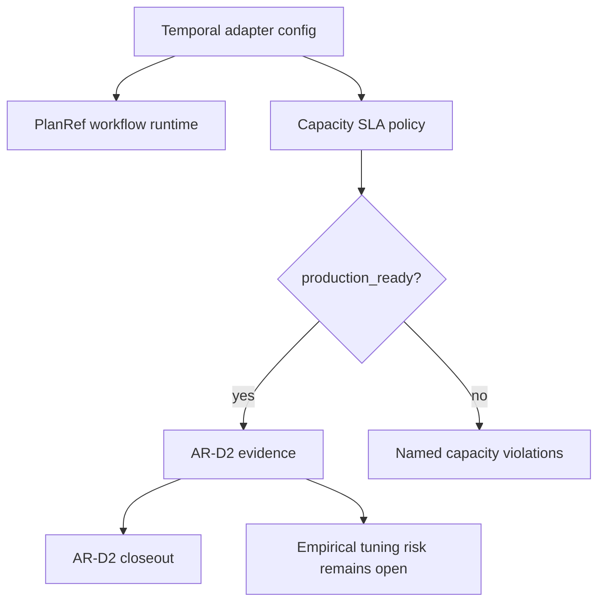

# AR-D2 Temporal PlanRef Capacity SLA Closeout

## Summary

`AR-D2` is closed as an evidence-backed Temporal capacity contract. The
Temporal PlanRef workflow now has a governed `continueAsNewAfterLayerCount`
threshold, a documented production capacity profile, an executable SLA policy,
semantic architecture coverage, ARC-2 evidence, and an explicit residual risk
for empirical production tuning.

The remaining telemetry work is not part of `AR-D2`; it is captured as open
risk so the threshold contract can close without pretending tenant-specific
production profiles already exist.

## Requirement Trace

| Requirement                                                                       | Governing source                                                                                                                                                                                                                                                                                                                                                                       | Implementation                                                                                          | Test or evidence                                                                                                            |
| --------------------------------------------------------------------------------- | -------------------------------------------------------------------------------------------------------------------------------------------------------------------------------------------------------------------------------------------------------------------------------------------------------------------------------------------------------------------------------------- | ------------------------------------------------------------------------------------------------------- | --------------------------------------------------------------------------------------------------------------------------- |
| Govern `continueAsNewAfterLayerCount` as capacity policy                          | [Temporal adapter spec](../../architecture/components/engine/adapters/temporal/temporal-adapter-spec.md), [Temporal PlanRef capacity SLA](../../architecture/components/engine/adapters/temporal/temporal-planref-capacity-sla.md)                                                                                                                                                     | `packages/@dvt/adapter-temporal/src/config.ts`, `packages/@dvt/adapter-temporal/src/TemporalAdapter.ts` | `packages/@dvt/adapter-temporal/test/smoke.test.ts`, `packages/@dvt/adapter-temporal/test/workflow-continue-as-new.test.ts` |
| Define production SLA for history, segment, layer, payload, and retention budgets | [Temporal PlanRef capacity SLA](../../architecture/components/engine/adapters/temporal/temporal-planref-capacity-sla.md)                                                                                                                                                                                                                                                               | `packages/@dvt/adapter-temporal/src/temporalPlanRefCapacitySlaPolicy.ts`                                | `packages/@dvt/adapter-temporal/test/temporalPlanRefCapacitySlaPolicy.test.ts`                                              |
| Keep docs, stories, component guide, and analysis aligned                         | [Temporal PlanRef workflow boundary](../../architecture/components/engine/adapters/temporal/temporal-planref-workflow-boundary.md), [user stories](../../architecture/components/engine/adapters/temporal/temporal-planref-workflow-boundary-user-stories.md), [Fowler mailbox analysis](../../../buzon/20260430-codex-fowler-ar-d2-temporal-capacity-sla-analysis-and-remediation.md) | Semantic architecture guard                                                                             | `packages/@dvt/adapter-temporal/test/workflow-component-semantics.architecture.test.ts`                                     |
| Preserve residual empirical tuning as explicit risk instead of hidden debt        | [AR-D2 risk entry](../../risk-register/quality/R-20260430-AR-D2-TEMPORAL-CAPACITY-SLA.yaml)                                                                                                                                                                                                                                                                                            | Risk register remains open                                                                              | [AR-D2 evidence](../../evidence/ed-20260430-ar-d2-temporal-planref-capacity-sla.md)                                         |

## Fowler Closeout

The slice applies Fowler-style Policy Object and explicit component boundary
separation:

- adapter config parses runtime values;
- workflow code executes deterministic continuation;
- `temporalPlanRefCapacitySlaPolicy.ts` owns production-readiness semantics;
- component docs explain public API, invariants, transitions, consumers, and
  diagrams;
- evidence and risk record proof plus residual tuning.

This removes the previous drift where large-DAG readiness was partly in docs
and partly inferred from adapter defaults.

## Validation

Targeted validation run for this closeout:

- `pnpm --filter @dvt/adapter-temporal exec vitest run test/temporalPlanRefCapacitySlaPolicy.test.ts test/workflow-component-semantics.architecture.test.ts`
- `pnpm --filter @dvt/adapter-temporal typecheck`

The broader closeout baseline still requires documentation sync, planning DB
update to `done`, and `pnpm verify:prepush` before PR/integration readiness.

## Residual Scope

Tenant-specific capacity profiles remain out of scope until production Temporal
telemetry exists. The accepted residual risk is
`R-20260430-AR-D2-TEMPORAL-CAPACITY-SLA`.
