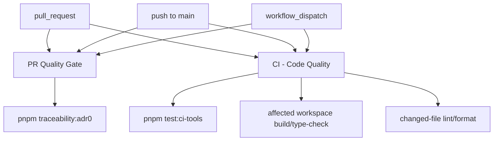

# CI Audit ADR0 Owner Closeout

## Scope

This closeout accepts Lane C `CI-AUDIT-ADR0-OWNER`. The ADR-0000 traceability
gate remains enforced, but remote ownership is no longer duplicated across
GitHub workflows.

No traceability semantics, governed paths, baseline files, package scripts, or
local `verify:prepush` routing changed in this slice.

## Governing Sources

- `AGENTS.md`
- `docs/planning/status/governance-document-rule-inventory.md`
- `docs/guides/ai-work-protocol.md`
- `docs/guides/testing-and-ci-capabilities.md`
- `docs/architecture/command-query-rail-governance.md`
- `docs/architecture/fowler-opportunity-planning-governance.md`
- `docs/archive/planning/proposals/ci-adr0-owner-consolidation-plan-20260511.md`
- `docs/planning/reviews/ci-and-delivery/20260506-ci-build-audit-review.md`

## Accepted Topology

## Acceptance Matrix

| Requirement                                             | Evidence                                                                                  | Result   |
| ------------------------------------------------------- | ----------------------------------------------------------------------------------------- | -------- |
| `PR Quality Gate` owns the remote ADR-0000 command      | `.github/workflows/pr-quality-gate.yml` contains one `pnpm traceability:adr0` invocation. | Accepted |
| `CI - Code Quality` does not own the ADR-0000 command   | `.github/workflows/ci.yml` contains zero `pnpm traceability:adr0` invocations.            | Accepted |
| CI tooling guards ownership drift                       | `tools/ci/workflow-pattern-parity.test.mjs` checks both workflow command counts.          | Accepted |
| Review documentation no longer reports stale duplicity  | The CI audit review now states the accepted single-owner topology.                        | Accepted |
| Local ADR/traceability validation remains command-based | `pnpm traceability:adr0` remains the canonical package script and `verify:prepush` gate.  | Accepted |

## Red/Green Evidence

- RED: `node --test tools/ci/workflow-pattern-parity.test.mjs` failed because
  the CI audit review still said `ci.yml` also ran `pnpm traceability:adr0`.
- GREEN: `node --test tools/ci/workflow-pattern-parity.test.mjs` passed after
  the review and proposal were reconciled with the executable workflow state.

## Debt And Stub Evidence

No debt was introduced. No quality rule was relaxed. No hook was bypassed. No
stub, placeholder, fake adapter, or fake success path was added.
