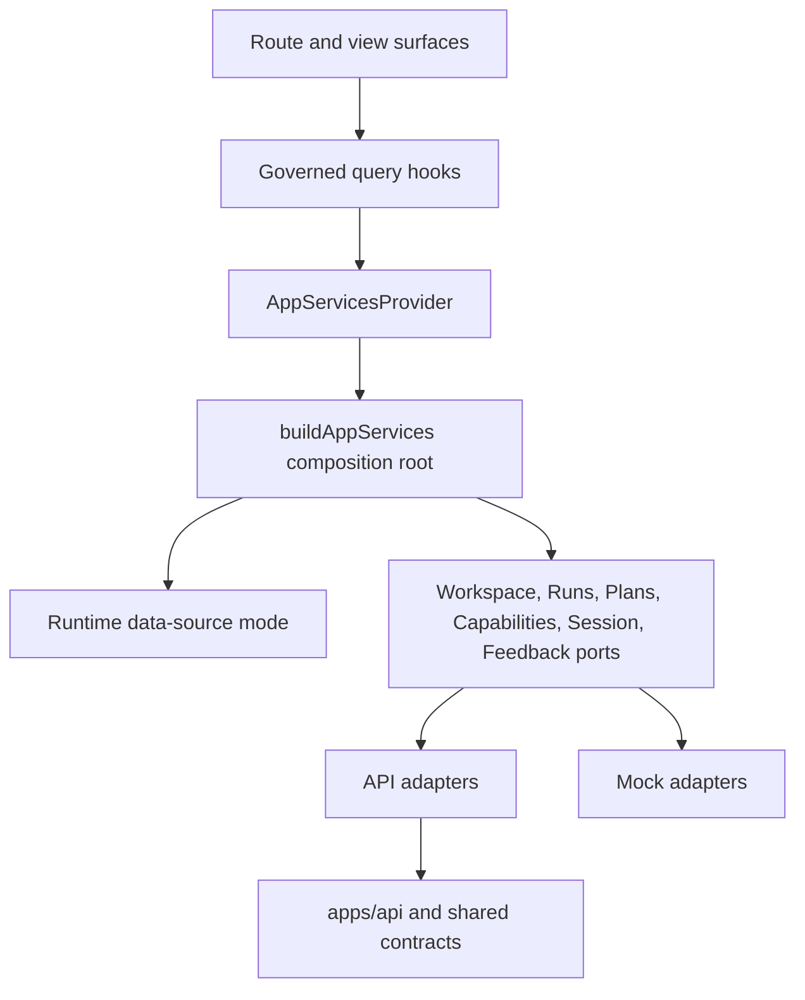

# F-04 Parent Acceptance Closeout

## Scope

This closeout accepts Lane E `F-04` at parent level. It does not add a new
frontend behavior slice. It consolidates the completed child, risk, and
residual work that converged the frontend data boundary to a
capability-centered hexagonal model.

## Governing Sources

- `AGENTS.md`
- `docs/planning/status/governance-document-rule-inventory.md`
- `docs/guides/ai-work-protocol.md`
- `docs/architecture/command-query-rail-governance.md`
- `docs/planning/proposals/nice-to-have/frontend-and-ux/f-04-frontend-data-boundary-hexagonal-convergence-plan-20260403.md`
- `docs/architecture/components/web/frontend-data-boundary-architecture.md`
- `docs/architecture/components/web/frontend-runtime-modes-user-manual.md`
- `docs/architecture/components/web/f04-frontend-data-boundary-technical-manual-20260404.md`

## Acceptance Matrix

| Requirement                                                  | Evidence                                                                                                                                                       | Result   |
| ------------------------------------------------------------ | -------------------------------------------------------------------------------------------------------------------------------------------------------------- | -------- |
| `F-04-A` through `F-04-F` are closed with evidence           | Planning DB task query shows every child at `done 100%`; closeouts exist for `F-04-D/E` and `F-04-F`.                                                          | Accepted |
| Route and view code no longer owns data-source mode directly | Architecture guard `src/app/queries/queryKeyPolicy.architecture.test.ts` passes and scan found `resolveDataSource()` only in composition/config/test surfaces. | Accepted |
| Service factory construction is composition-root owned       | Architecture guard and scan found service factory construction limited to service/composition modules and service tests.                                       | Accepted |
| Capabilities query uses a governed client boundary           | `F-04-F` closeout documents the `CapabilitiesPort`, provider seam, and query guard.                                                                            | Accepted |
| Hard QA risk chain is closed                                 | `F-04-RISK`, `F-04-RISK-A`, `F-04-RISK-A-QA-03`, and `F-04-RISK-B` are `done 100%`.                                                                            | Accepted |
| Residual quality chain is closed                             | `F-04-RESIDUAL`, `F-04-RESIDUAL-A`, `F-04-RESIDUAL-B`, and `F-04-RESIDUAL-C` are `done 100%`.                                                                  | Accepted |
| Frontend documentation and roadmap entrypoints are present   | F-04 plan, architecture, runtime manual, technical manual, risk closeouts, and residual closeouts are indexed as evidence refs.                                | Accepted |

## Current Architecture

## Fowler And DDD Result

The accepted pattern is a small frontend hexagonal boundary rather than a broad
dependency-injection container. Route code owns presentation state and user
intent. The composition root owns adapter construction, runtime mode selection,
and outbound port wiring. Query hooks express read-model access and do not
become transport owners.

This is consistent with mature frontend systems that keep plugin or capability
composition near the application shell, keep server-state lifecycle in a
query boundary, and isolate mock/runtime adapters behind explicit ports.

## Drift Closed

- `docs/planning/closeouts/20260404-f04-findings-todo.md` had every checklist
  item completed but still declared `status: In Progress`. This closeout marks
  it accepted so the historical QA finding state matches the actual checklist.
- Older child closeouts correctly described work that remained open at that
  time. This parent closeout is now the superseding acceptance record for the
  full `F-04` chain.

## Out Of Scope

- Broader TanStack Query normalization outside the F-04 capabilities seam
  remains owned by `F-06`.
- Store-domain ownership cleanup remains owned by `F-05`.
- Product route completion and API-backed route expansion remain owned by later
  Lane E tasks.

## Validation Evidence

| Command                                                                                                                           | Result                                                                                                                             |
| --------------------------------------------------------------------------------------------------------------------------------- | ---------------------------------------------------------------------------------------------------------------------------------- | ------------------------------------------------------------- | ------------------------------------------------------------------------ |
| `pnpm planning:db:query tasks --lane E --limit 150`                                                                               | PASS: all F-04 child, risk, and residual tasks are `done 100%`; parent remains the only F-04 acceptance item before this closeout. |
| `pnpm --filter @dvt/web test -- src/app/queries/queryKeyPolicy.architecture.test.ts src/app/services/AppServicesContext.test.tsx` | PASS                                                                                                                               |
| `rg -n 'resolveDataSource\\(' apps/web/src/app -g '*.ts' -g '*.tsx'`                                                              | PASS: hits are limited to composition/config/test surfaces.                                                                        |
| `rg -n 'createWorkspacePorts\\(                                                                                                   | createRunsService\\(                                                                                                               | createPlansService\\(' apps/web/src/app -g '_.ts' -g '_.tsx'` | PASS: hits are limited to service/composition modules and service tests. |

## Debt And Stub Evidence

No debt was introduced. No quality rule was relaxed. No hook was bypassed. No
stub, placeholder, fake adapter, or fake success path was added.
