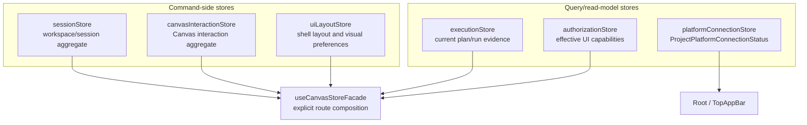

# F-05 Store Domain Ownership Closeout

## Scope

This closeout accepts Lane E `F-05`. The active implementation no longer has a
live `appStore.ts` aggregate, platform connection state is not shell layout
state, and authorization capability display is not runtime evidence.

No new production code was required in this closeout slice. The code hard cuts
already exist and are covered by the F-05 architecture and store tests.

## 2026-05-15 Hard Review Addendum

The 2026-05-15 hard review rechecked the accepted closeout against current
branch truth and found no remaining F-05 implementation drift. The only live
drift was planning-state drift: the planning DB still reported `F-05` as
`in_progress 70%` after the code, docs, component guide, user stories, and
semantic architecture tests already matched the accepted closeout.

The hard review is recorded in
`buzon/20260515-codex-fowler-f05-store-domain-ownership-hard-review.md`.

No production code was added in the hard review. TDD red/green cycles remain the
cycles declared in the accepted F-05 feature mechanization manifest; this
addendum only verifies the resulting green gates and closes the canonical
planning state.

## Governing Sources

- `AGENTS.md`
- `docs/planning/status/governance-document-rule-inventory.md`
- `docs/guides/ai-work-protocol.md`
- `docs/architecture/command-query-rail-governance.md`
- `docs/architecture/fowler-opportunity-planning-governance.md`
- `docs/planning/proposals/mandatory/frontend-and-ux/f05-store-domain-ownership-closure-plan-20260503.md`
- `docs/architecture/components/web/web-store-domain-ownership-component.md`
- `docs/architecture/components/web/web-store-domain-ownership-local-guide.md`
- `docs/architecture/components/web/web-store-domain-ownership-user-stories.md`

## Acceptance Matrix

| Requirement                                                                | Evidence                                                                                                                                                                               | Result   |
| -------------------------------------------------------------------------- | -------------------------------------------------------------------------------------------------------------------------------------------------------------------------------------- | -------- |
| Retired aggregate store remains absent                                     | `canvasStartupAndDraftRecovery.architecture.test.ts` and `queryKeyPolicy.architecture.test.ts` guard against `appStore.ts` return and query imports.                                   | Accepted |
| Every active store has an owned concern                                    | `webStoreDomainOwnership.architecture.test.ts` checks store module docblocks and component docs.                                                                                       | Accepted |
| Platform connection status is not layout state                             | `uiLayoutStore.ts` has no `connectionStatus`; `platformConnectionStore.ts` owns `ProjectPlatformConnectionStatus`; `uiLayoutStore.test.ts` and `platformConnectionStore.test.ts` pass. | Accepted |
| Authorization is not runtime evidence                                      | `executionStore.ts` has only `currentPlan` and `currentRun`; `authorizationStore.ts` owns `userPermissions`; `authorizationStore.test.ts` and architecture guard pass.                 | Accepted |
| Component docs describe public API, invariants, transitions, and consumers | Component map, local guide, user stories, and Fowler mailbox are discoverable and checked by architecture tests.                                                                       | Accepted |
| Feature mechanization is complete                                          | `pnpm docs:feature-mechanization --feature F05-STORE-DOMAIN-OWNERSHIP` passes.                                                                                                         | Accepted |

## Closed Topology

## Fowler Result

The accepted model removes the hidden aggregate-store risk and keeps each store
aligned to one reason to change. The route facade composes stores explicitly for
Canvas, but it is not a replacement monolith: it exposes route-level needs and
does not own unrelated global state.

This matches the mature-system baseline used by the plan: shell layout,
runtime evidence, authorization projection, and platform health are separate
read/write concerns even when a route needs to display them together.

## Validation Evidence

- `pnpm --filter @dvt/web test -- authorizationStore.test.ts
platformConnectionStore.test.ts uiLayoutStore.test.ts
webStoreDomainOwnership.architecture.test.ts`: PASS.
- `pnpm --filter @dvt/web test -- canvasStartupAndDraftRecovery.architecture.test.ts
queryKeyPolicy.architecture.test.ts`: PASS.
- `pnpm docs:feature-mechanization --feature F05-STORE-DOMAIN-OWNERSHIP`:
  PASS.
- `rg -n "appStore|userPermissions|connectionStatus" apps/web/src/app
docs/architecture/components/web
docs/planning/proposals/mandatory/frontend-and-ux/f05-store-domain-ownership-closure-plan-20260503.md
-g "*.ts" -g "*.tsx" -g "*.md"`: PASS. Active hits are owned docs, tests,
  authorization store, platform connection store, or route-level
  user-permission view models; no `executionStore.userPermissions` or
  `uiLayoutStore.connectionStatus` owner remains.

## Debt And Stub Evidence

No debt was introduced. No quality rule was relaxed. No hook was bypassed. No
stub, placeholder, fake adapter, or fake success path was added.
