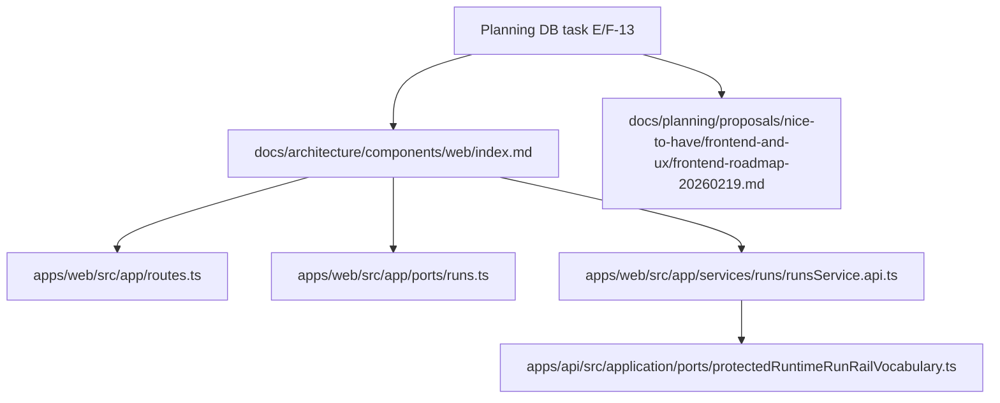

# F-13 Frontend Architecture Documentation Reconciliation Closeout

## Governing Sources

- [Governance Document And Rule Inventory](../status/governance-document-rule-inventory.md)
- [AI Work Protocol](../../guides/ai-work-protocol.md)
- [Planning Control Tower](../state/planning-control-tower.md)
- [Command And Query Rail Governance](../../architecture/command-query-rail-governance.md)
- [Fowler Opportunity Planning Governance](../../architecture/fowler-opportunity-planning-governance.md)
- [Web Architecture Docs Current Runtime Substantiation Plan](../proposals/mandatory/frontend-and-ux/web-architecture-docs-current-runtime-substantiation-plan-20260508.md)

## Think-First Analysis

Problem summary: F-13 was already largely implemented, but the operational task
row still carried one stale evidence reference to the retired frontend roadmap
path. That made the Planning DB evidence set disagree with the active docs even
though the current `web` architecture entrypoint and UX guide already use the
canonical `docs/architecture/components/web/**` and frontend roadmap locations.

Root cause: frontend documentation was moved from older `frontend` and
top-level proposal paths into component-scoped and classified planning paths,
but the task evidence snapshot was not closed through the Planning DB export
rail after that move.

Selected option: keep historical closeouts and reviews as historical context,
update the active `web` component entrypoint with explicit reconciliation
evidence, and close F-13 through the Planning DB with the current roadmap path.

Rejected alternatives:

- bulk-edit historical reviews and closeouts: rejected because those documents
  are dated evidence, not current architecture authority;
- create a new frontend architecture entrypoint: rejected because
  `docs/architecture/components/web/index.md` is already the canonical component
  home;
- change application code: rejected because F-13 is documentation and planning
  reconciliation, not a runtime behavior change.

## Fowler Opportunity Matrix

| Scenario                                               | Opportunity         | Fowler pattern                              | DDD owner                                    | Command/query rail                   | Implementation surfaces                          | Test or guard                         | Out of scope                         |
| ------------------------------------------------------ | ------------------- | ------------------------------------------- | -------------------------------------------- | ------------------------------------ | ------------------------------------------------ | ------------------------------------- | ------------------------------------ |
| Planning evidence points at a retired roadmap path     | Documentation drift | Authoritative source and published language | Planning task evidence read model            | Planning DB task update command      | Planning DB task row and exported lane snapshot  | `planning:db:export:check`            | rewriting historical review evidence |
| Active web docs need an explicit current-truth anchor  | Duplicate semantics | Component boundary and information hiding   | `web` component documentation owner          | none - documentation only            | `docs/architecture/components/web/index.md`      | markdown and docs validation          | changing React routes or services    |
| Runtime docs must not imply client-owned run authority | Hidden authority    | Gateway / port boundary                     | Runtime run read model and run command rails | existing protected runtime run rails | web component docs plus existing port references | source inspection and docs validation | adding new runtime rail behavior     |

## Current-State Diagram

## Work Performed

- Updated `docs/architecture/components/web/index.md` with a current
  reconciliation evidence section.
- Confirmed active `web` architecture docs no longer point at
  `docs/architecture/frontend/**`.
- Confirmed the active UX guide links the frontend roadmap at the classified
  `nice-to-have/frontend-and-ux` path.
- Reconciled F-13 through the Planning DB command rail and exported the lane
  snapshot for review.

## Validation Evidence

Commands run:

- `pnpm planning:db:import -- --if-stale --planning-only`
- `pnpm planning:db:operate task show --lane E --task F-13`
- `rg -n "frontend-roadmap-20260219\.md|docs/architecture/frontend|architecture/frontend" docs/planning docs/architecture -g "*.md" -g "*.yaml"`
- `rg -n "pending backend|mock-only|fixture-only|target state|target-state|planned|future|placeholder|will be|docs/architecture/frontend|docs/planning/proposals/frontend-roadmap-20260219.md|Ã|Â|�" docs/architecture/components/web docs/architecture/domain-ui.md -g "*.md"`

Final validation commands are recorded in the PR closeout after docs indexes,
planning export, governance refresh, and pre-push validation run on the committed
tree.

## No-Debt And No-Stub Evidence

- No runtime behavior changed.
- No command, query, route, adapter, or service was added.
- No rule, hook, lint, type, test, or quality gate was relaxed.
- No stub, placeholder implementation, fake adapter, or TODO was introduced.
- Residual historical `docs/architecture/frontend/**` references remain only in
  dated reviews and closeouts, where they describe past work rather than current
  architecture authority.
