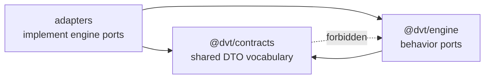

# Closeout: RC-G1 contract ownership closure

## Problem

`RC-G1-B/C/D` moved the main behavior-port families to their owners, but the
parent tracker still had two kinds of drift:

- active planning and risk docs still described remaining live `RC-G1`
  execution;
- `@dvt/contracts` still carried residual physical engine behavior files and a
  tracked legacy root entrypoint that could re-export deleted adapter surfaces.

## Selected Cut

Use a hardcut. No compatibility aliases remain in `@dvt/contracts` for retired
engine-owned behavior ports.

The shared kernel keeps serializable run-state vocabulary in
`RunStateVocabulary.v1.ts`. Engine-owned ports remain in `@dvt/engine`.

## Work Performed

- Added `packages/@dvt/contracts/src/contracts/engine/RunStateVocabulary.v1.ts`
  for shared event, snapshot, metadata, artifact-ref, and idempotency DTOs.
- Removed residual engine behavior files from `@dvt/contracts`:
  `IProviderAdapter.v1.ts`, `IRunStateStore.v1.ts`, and `IProjector.v1.ts`.
- Updated internal contract imports and the root barrel to use the shared
  vocabulary file.
- Rewrote the tracked legacy `packages/@dvt/contracts/index.js` entrypoint so
  it delegates to the canonical source barrel instead of stale adapter paths.
- Hardened contract architecture tests so the guard checks semantic ownership
  without overfitting to prose.
- Updated the RC-G1 proposal and risk register to show parent closure.

## Validation

Targeted red/green:

- `pnpm --filter @dvt/contracts test -- test/provider-adapter.architecture.test.ts`
  failed before the cut because `IProviderAdapter.v1.ts` still existed under
  `@dvt/contracts`; passed after the hardcut.
- `pnpm --filter @dvt/contracts test -- test/run-state-store-maintenance-concurrency.architecture.test.ts`
  failed before the cut because `IRunStateStore.v1.ts` still existed and
  `RunStateVocabulary.v1.ts` did not; passed after the hardcut.

Closeout validation is recorded in
`docs/evidence/ed-20260514-rc-g1-contract-ownership-closure.md`.

## No-Debt Evidence

- No compatibility aliases were added.
- No behavior stubs, fake adapters, TODOs, or temporary bypasses were added.
- No lint, type, test, docs, hook, or ARC rule was relaxed.
- Future ownership drift must open a new task; `RC-G1` is closed.
