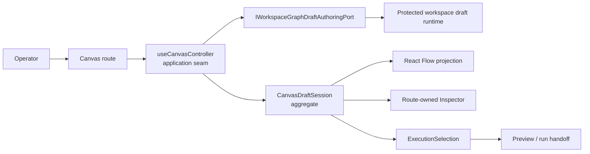

# TF-E2 Parent Closeout

## Outcome

`TF-E2` is closed as the parent Canvas authoring and persistence slice. The
active Canvas authoring route now uses `IWorkspaceGraphDraftAuthoringPort` as
the protected persistence boundary, keeps `IWorkspacePort` on snapshot and
artifact-read concerns, and treats React Flow as a projection rather than a
semantic owner.

Residual long-horizon persisted-version compatibility work is no longer hidden
inside the parent task. It must be opened as a new governed planning DB task
with its own rail, evidence, and validation scope.

## Governing Sources

- `AGENTS.md`
- `docs/planning/status/governance-document-rule-inventory.md`
- `docs/guides/ai-work-protocol.md`
- `docs/architecture/command-query-rail-governance.md`
- `docs/architecture/fowler-opportunity-planning-governance.md`
- `docs/planning/proposals/mandatory/frontend-and-ux/tf-e2-production-node-authoring-and-persistence-plan-20260416.md`
- `docs/planning/proposals/mandatory/frontend-and-ux/tf-e2-canvas-target-architecture-execution-plan-20260417.md`
- `docs/architecture/components/web/graph/graph-canvas-runtime-model.md`

## Fowler Architecture Assessment

The final shape is materially better than the pre-`TF-E2` posture:

- Application Service: `useCanvasController` coordinates route behavior without
  owning backend protocol details.
- Aggregate: Canvas draft session state owns authoring transitions, conflict,
  missing-remote, and projection-gap posture.
- Repository/Port: `IWorkspaceGraphDraftAuthoringPort` is the application
  boundary for protected draft reads and writes.
- Projection: React Flow, toolbars, tabs, and Inspector surfaces render read
  models over authoring truth.
- Runtime invariant: React Flow is a projection, never the semantic source of
  truth.
- Published Language: writable, read-only, forbidden, degraded, conflict, and
  unsupported-format states are named route outcomes instead of incidental UI
  flags.

Compared with mature authoring systems, the route is now closer to a standard
hexagonal frontend: adapters live at composition edges, command decisions are
named, and browser-local state is kept to interaction/layout concerns rather
than product persistence truth.

## Current Component Map



## Drift Removed

- Plan status now reflects implemented parent scope instead of draft posture.
- The runtime model no longer says the parent remains open.
- The execution companion now treats additional compatibility proof as future
  explicit work, not implicit `TF-E2` parent debt.
- Architecture tests now guard this closure state so documentation cannot drift
  back to stale open-work wording without failing the web architecture suite.

## Anti-Patterns Closed Or Reduced

- Dual active authority between projected DTOs and protected draft-authoring
  records.
- Browser-local storage as implicit product persistence.
- React Flow adapter state carrying semantic ownership.
- Tests that prove presentation shortcuts while claiming live protected-runtime
  truth.
- Planning parent tasks staying open after child implementation evidence has
  landed.

## Remaining Opportunities

- Open a separate governed task for multi-version persisted draft reload proof
  if product support policy requires more than the active version.
- Keep reducing literal-heavy architecture tests by moving repeated concepts
  into named helpers when the next slice touches the same files.
- Continue extracting component-local guides when a Canvas subcomponent gains a
  new public API or transition model.

## Validation

The parent closeout added a semantic architecture guard in
`apps/web/src/app/views/canvas/canvasStartupAndDraftRecovery.architecture.test.ts`.

Red result before implementation:

```text
pnpm --filter @dvt/web test -- canvasStartupAndDraftRecovery.architecture.test.ts
```

Failure:

```text
ENOENT: no such file or directory, open
'C:\dvt\docs\planning\closeouts\20260514-tf-e2-parent-closeout.md'
```

Green validation is recorded in the task closeout response after the documents,
planning DB state, and generated indexes are refreshed.
