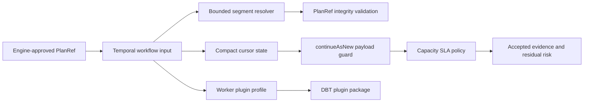

# AR-D PlanRef Workflow Payload Hardening Final Closeout

## Summary

`AR-D-PLAN-POINTER` is closed. Temporal workflow start and rollover payloads now
carry an engine-approved `PlanRef` plus compact cursor state instead of durable
whole-plan input. Segment resolution is bounded, continuation safety is governed,
DBT concrete runtime ownership is outside the generic Temporal adapter package,
and semantic architecture guards keep the component guide, user stories,
docblocks, runtime tests, and module map aligned.

## Governing Sources

- `docs/planning/status/governance-document-rule-inventory.md`
- `docs/guides/ai-work-protocol.md`
- `docs/planning/state/planning-control-tower.md`
- `docs/architecture/fowler-opportunity-planning-governance.md`
- `docs/architecture/command-query-rail-governance.md`
- `docs/adr/adr-0052-planref-continuation-safety.md`
- `docs/architecture/components/engine/adapters/temporal/temporal-planref-workflow-boundary.md`
- `docs/architecture/components/engine/adapters/temporal/temporal-planref-capacity-sla.md`
- `docs/runbooks/temporal-planref-drained-cutover-20260427.md`

## Closure Evidence

| Closure concern                              | Evidence                                                                                                                                                                                                                                     |
| -------------------------------------------- | -------------------------------------------------------------------------------------------------------------------------------------------------------------------------------------------------------------------------------------------- |
| PlanRef plus compact cursor runtime boundary | `docs/architecture/components/engine/adapters/temporal/temporal-planref-workflow-boundary.md`, `docs/planning/closeouts/20260427-ar-d-plan-pointer-qa1-readiness-closeout.md`                                                                |
| Continue-as-new capacity posture             | `docs/planning/closeouts/20260514-ar-d2-temporal-planref-capacity-sla-closeout.md`, `docs/evidence/ed-20260430-ar-d2-temporal-planref-capacity-sla.md`                                                                                       |
| Continuation failure semantics               | `docs/adr/adr-0052-planref-continuation-safety.md`, `docs/planning/closeouts/20260430-ar-d-continuation-safety-closeout.md`, `docs/evidence/ed-20260430-ar-d-continuation-safety.md`                                                         |
| DBT package ownership hardcut                | `docs/planning/closeouts/20260514-ar-d-plan-pointer-dbt-package-extraction-closeout.md`, `docs/evidence/ed-20260514-ar-d-plan-pointer-dbt-package-extraction.md`, `docs/risk-register/quality/R-20260420-TEMPORAL-DBT-BUILTIN-COUPLING.yaml` |
| Semantic component fitness                   | `docs/evidence/ed-20260515-ar-d-plan-pointer-semantic-fitness.md`, `docs/risk-register/quality/R-20260515-AR-D-PLAN-POINTER-SEMANTIC-FITNESS.yaml`                                                                                           |

## Fowler Closure

The parent task started as a scale and determinism problem: provider workflow
history grew with whole-plan payload carriage. The closing architecture applies
Fowler-style boundary clarification and policy extraction:

- Temporal adapter workflow input is a bounded gateway contract, not a plan
  storage surrogate.
- Plan materialization remains behind the PlanRef integrity boundary.
- Capacity posture is a policy object and component guide concern, not an
  implicit adapter default.
- DBT concrete execution is a plugin package concern, not generic Temporal
  adapter semantics.
- Architecture tests validate component semantics instead of testing only thin
  barrels or copied prose.

## Residual Work

No residual item blocks `AR-D-PLAN-POINTER`. Remaining scale work is tracked by
separate tasks and risks:

- tenant-specific Temporal production tuning remains under the accepted AR-D2
  residual risk;
- DBT CLI sandbox and dependency isolation remain plugin-runtime hardening, not
  package-level Temporal adapter coupling;
- broader worker scaling remains under `AR-D3`.

## Validation Baseline

The closing evidence set includes these accepted validation commands:

- `pnpm --filter @dvt/adapter-temporal test`
- `pnpm --filter @dvt/adapter-temporal exec vitest run test/workflow-component-semantics.architecture.test.ts`
- `pnpm --filter @dvt/adapter-temporal exec vitest run test/runPlanWorkflow.layers.order.test.ts`
- `pnpm --filter @dvt/temporal-dbt-plugin test`
- `pnpm --filter @dvt/temporal-dbt-plugin typecheck`
- `pnpm verify:prepush`

This final closeout only reconciles planning truth with already-landed evidence.
No runtime code change is introduced by this document.
