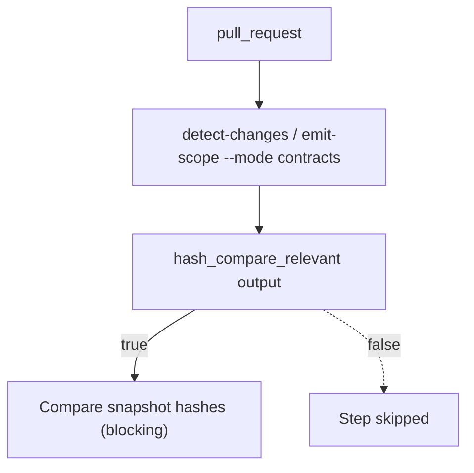

# CI Audit Contracts Scope Closeout

## Scope

This closeout accepts Lane C `CI-AUDIT-CONTRACTS-SCOPE`.

The slice removes workflow-local PR scope logic for hash-compare and reuses the
central scope rail (`tools/ci/scope-config.mjs` via `emit-scope --mode contracts`).

## Governing Sources

- `AGENTS.md`
- `docs/planning/status/governance-document-rule-inventory.md`
- `docs/architecture/command-query-rail-governance.md`
- `docs/guides/testing-and-ci-capabilities.md`
- `.github/workflows/contracts.yml`
- `tools/ci/scope-config.mjs`
- `tools/ci/emit-scope.test.mjs`
- `tools/ci/workflow-pattern-parity.test.mjs`

## Accepted Change

## Acceptance Matrix

| Requirement                                                                 | Evidence                                                                                    | Result   |
| --------------------------------------------------------------------------- | ------------------------------------------------------------------------------------------- | -------- |
| Contracts workflow uses central scope policy output for hash-compare gating | `.github/workflows/contracts.yml` uses `needs.detect-changes.outputs.hash_compare_relevant` | Accepted |
| Inline PR `git diff` scope detector is removed                              | Removed `Detect hash-compare scope (PR only)` step from contracts workflow                  | Accepted |
| Scope semantics are tested                                                  | `tools/ci/emit-scope.test.mjs` includes hash-compare relevant assertions                    | Accepted |
| Workflow pattern parity remains valid                                       | `tools/ci/workflow-pattern-parity.test.mjs` passes                                          | Accepted |

## Validation Evidence

- `node --test tools/ci/emit-scope.test.mjs` (pass)
- `node --test tools/ci/workflow-pattern-parity.test.mjs` (pass)
- `node tools/ci/validate-policy.js tools/ci/policy/workflow-scope.json` (pass)

## Debt / Residual Risk

Open risk: [R-20260515-CI-CONTRACTS-HASH-SCOPE-E2E](../../risk-register/quality/R-20260515-CI-CONTRACTS-HASH-SCOPE-E2E.yaml)

Reason: PR-runtime end-to-end evidence in GitHub Actions for both `true` and
`false` `hash_compare_relevant` paths is still pending.

## No-Stub Evidence

No stub, placeholder, or fake success path was introduced.  
No quality rule was relaxed and no hook bypass was used.
