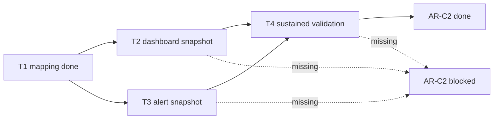

# AR-C2 Operational Evidence Drift Closeout

## Governing Sources

- `AGENTS.md`
- `docs/planning/status/governance-document-rule-inventory.md`
- `docs/guides/ai-work-protocol.md`
- `docs/architecture/command-query-rail-governance.md`
- `docs/planning/state/agent-lane-c.yaml`
- `docs/runbooks/ar-c2-sla-signal-threshold-mapping-20260404.md`
- `docs/runbooks/ar-c2-dashboard-alert-wiring-evidence-20260404.md`
- `docs/runbooks/ar-c2-evidence-generated-latest.md`

## Outcome

`AR-C2` remains blocked, not done.

The source-level SLA and telemetry work is present, but operational closure still
requires immutable dashboard, alert, and sustained-window evidence. The
planning state had drifted by leaving `AR-C2-T4` as `done` even though the
runbook and collector both require `T2/T3` evidence first.

## Evidence

The AR-C2 collector was run in assertion mode with temporary output paths so the
checked-in generated artifact was not rewritten just to record a timestamp.

```bash
$env:AR_C2_EVIDENCE_OUTPUT_PATH="$env:TEMP\ar-c2-evidence-check.md"
pnpm ops:ar-c2:evidence -- --require-dashboard-alert-evidence
```

Result:

- `AR-C2_IMMUTABLE_EVIDENCE_MISSING`
- missing dashboard panels: 9
- missing alert rules: 11

```bash
$env:AR_C2_EVIDENCE_OUTPUT_PATH="$env:TEMP\ar-c2-sustained-check.md"
pnpm ops:ar-c2:evidence -- --require-sustained-validation-windows
```

Result:

- `AR-C2_SUSTAINED_VALIDATION_WINDOWS_MISSING`
- missing sustained windows: 9

## State Correction

- `AR-C2`: `blocked`
- `AR-C2-T2`: `blocked`
- `AR-C2-T3`: `blocked`
- `AR-C2-T4`: `blocked`

This is a truth-preserving correction. It does not add runtime behavior and does
not relax any gate.

## Closure Diagram



## Next Valid Action

Provide real immutable inputs, then rerun the collector:

```bash
$env:AR_C2_DASHBOARD_SNAPSHOT_FILE="<dashboard snapshot json>"
$env:AR_C2_ALERT_SNAPSHOT_FILE="<alert snapshot json>"
$env:AR_C2_METRICS_SNAPSHOT_FILE="<metrics snapshot json>"
pnpm ops:ar-c2:evidence -- --require-dashboard-alert-evidence
pnpm ops:ar-c2:evidence -- --require-sustained-validation-windows
```

## Feature Mechanization

```feature-mechanization
version: 1
featureId: AR-C2-OPERATIONAL-EVIDENCE-DRIFT
mechanizationStatus: implemented
noHumanDecisionsRemaining: true
implementationPlan: docs/planning/closeouts/20260522-ar-c2-operational-evidence-drift-closeout.md
componentGuides:
  - docs/runbooks/ar-c2-dashboard-alert-wiring-evidence-20260404.md
  - docs/runbooks/ar-c2-sla-signal-threshold-mapping-20260404.md
userStories:
  - docs/planning/closeouts/20260404-ar-c2-sla-operational-closure-closeout.md
governingSources:
  - AGENTS.md
  - docs/planning/status/governance-document-rule-inventory.md
  - docs/guides/ai-work-protocol.md
  - docs/architecture/command-query-rail-governance.md
  - docs/planning/state/planning-control-tower.md
  - docs/planning/state/agent-lane-c.yaml
  - docs/runbooks/ar-c2-dashboard-alert-wiring-evidence-20260404.md
allowedImplementationSurfaces:
  - docs/planning/closeouts/20260522-ar-c2-operational-evidence-drift-closeout.md
  - docs/planning/state/agent-lane-c.yaml
  - docs/planning/state/agent-lane-c.md
  - docs/planning/state/execution-workboard.md
  - docs/planning/state/open-task-route.md
  - docs/planning/index.md
  - docs/.manifest.json
  - docs/planning/status/**
forbiddenImplementationSurfaces:
  - apps/**
  - packages/**
  - specs/**
  - .github/**
  - scripts/**
  - tools/**
commandQueryRails:
  - name: ReconcilePlanningTaskOperationalState
    type: command
    dddOwner: PlanningTaskLifecycle
domainObjects:
  - name: AR-C2OperationalEvidenceState
    type: planning read model
    owner: Runtime / SRE / Docs
fowlerSignals:
  - Documentation drift
  - Hidden authority
  - False completion guard
architectureGuards:
  - pnpm docs:feature-mechanization -- --feature AR-C2-OPERATIONAL-EVIDENCE-DRIFT
  - pnpm docs:feature-mechanization:implementation
cypressFlows:
  - N/A - planning state reconciliation only
completionGate:
  - pnpm ops:ar-c2:evidence -- --require-dashboard-alert-evidence
  - pnpm ops:ar-c2:evidence -- --require-sustained-validation-windows
  - pnpm docs:sync
  - pnpm governance:refresh
  - pnpm docs:feature-mechanization -- --feature AR-C2-OPERATIONAL-EVIDENCE-DRIFT
  - pnpm docs:feature-mechanization:implementation
  - pnpm verify:prepush
redGreenCycles:
  - id: ar-c2-operational-evidence-drift
    redTest: pnpm ops:ar-c2:evidence -- --require-sustained-validation-windows
    expectedFailure: AR-C2_T4 cannot honestly remain done while sustained-window evidence is missing.
    patchSurfaces:
      - docs/planning/state/agent-lane-c.yaml
      - docs/planning/closeouts/20260522-ar-c2-operational-evidence-drift-closeout.md
    greenTest: pnpm docs:feature-mechanization -- --feature AR-C2-OPERATIONAL-EVIDENCE-DRIFT
```
