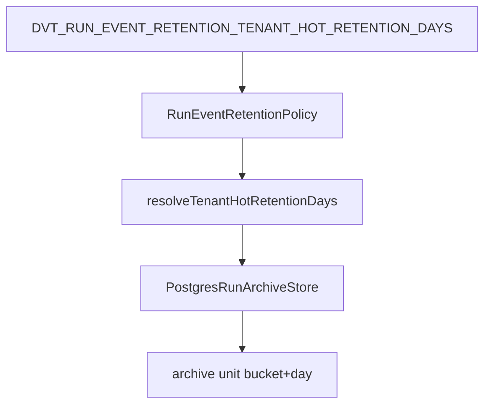

# AR-D5 Tenant Configurable Retention Policy Closeout

## Result

Run-event archival now supports explicit tenant hot-retention overrides while
keeping the ADR-0037 archive-unit model unchanged. The outbox worker can compose
the policy from environment configuration and the Postgres archive store applies
tenant-specific windows before marking archive units eligible.

## Runtime Delta

## Important Semantics

The slice does not introduce partial archive-unit export. Because the physical
unit key remains `tenant_bucket + persisted_at_day`, a shared unit becomes
eligible only when every tenant represented in that unit satisfies its own
resolved retention window and every run has a terminal snapshot.

## Changed Surfaces

- `packages/@dvt/state-store/src/lifecycle/archiveRuntime.ts`
  - adds tenant override entries to `RunEventRetentionPolicy`
  - adds policy validation and tenant retention resolution helpers
- `packages/@dvt/adapter-postgres/src/PostgresRunArchiveStore.ts`
  - resolves tenant-specific cutoffs during archive-unit eligibility
  - prevents partial shared-unit export
- `apps/outbox-worker/src/plugins/env.ts`
  - parses `DVT_RUN_EVENT_RETENTION_TENANT_HOT_RETENTION_DAYS`
- `apps/outbox-worker/src/runtime/buildRunEventRetentionRuntime.ts`
  - passes tenant overrides into the archive coordinator policy
- `apps/outbox-worker/.env.example` and `apps/outbox-worker/README.md`
  - document the tenant override variable and example syntax
- `docs/architecture/components/engine/adapters/state-store/postgres/run-event-retention-policy-component.md`
  - documents public API, invariants, transitions, consumers, and tests
- `docs/architecture/components/engine/adapters/state-store/postgres/run-event-retention-policy-user-stories.md`
  - documents user scenarios and acceptance criteria

## Validation

- `pnpm --filter @dvt/state-store test -- RunEventRetentionPolicy.test.ts`
- `pnpm --filter @dvt/adapter-postgres test -- PostgresRunArchiveStore.tenant-retention.test.ts PostgresRunArchiveStore.tenant-retention.integration.test.ts`
- `pnpm --filter dvt-outbox-worker test -- test/plugins/env.test.ts test/runtime/createOutboxWorkerRuntime.test.ts`

Additional typecheck, docs, ARC, and pre-push validation is recorded in the PR
closeout.

## Residual Risk

Mixed-tenant units can delay aggressive free-tier archival when a longer-retained
tenant shares the same bucket/day. This is recorded in
`R-20260522-AR-D5-TENANT-RETENTION-POLICY`.
