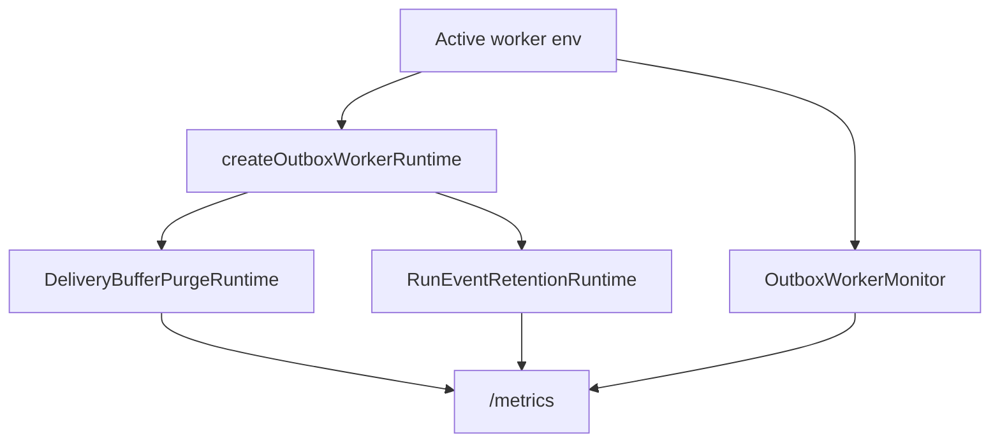

# AR-D8 Default Retention Runtime Baseline Closeout

## Result

`apps/outbox-worker` now treats delivery-buffer purge and run-event retention
archive scheduling as the active-worker default. Operators can still disable
either path explicitly for diagnostics, but disabled posture is now visible in
Prometheus metrics and should alert in production-like deployments.

## Runtime Delta

## Changed Surfaces

- `apps/outbox-worker/src/plugins/env.ts`
  - `DVT_PURGE_ENABLED` defaults to `true`.
  - `DVT_RUN_EVENT_RETENTION_ENABLED` defaults to `true`.
  - production retention still fails fast without explicit filesystem archive
    opt-in.
- `apps/outbox-worker/src/ops/**`
  - retention posture gauges expose configured/disabled state.
- `apps/outbox-worker/.env.example`
  - example environment now shows purge and retention as enabled baseline.
- `apps/outbox-worker/README.md`
  - documents default-on posture and alertable metrics.
- `apps/outbox-worker/test/**`
  - tests cover default-on env, default retention startup, explicit opt-out, and
    posture metrics.

## Validation

- `pnpm --filter dvt-outbox-worker test -- test/plugins/env.test.ts test/runtime/createOutboxWorkerRuntime.test.ts test/ops/OutboxWorkerMonitor.test.ts`

Additional validation is recorded in the PR closeout.

## Remaining Work

- `AR-D5` still owns tenant-configurable retention windows.
- Restore drill cadence remains outside this slice.
