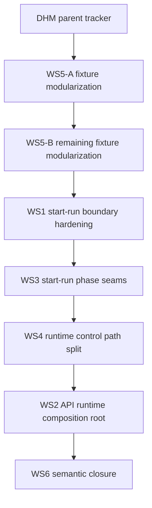

# DHM Modularization Parent Closeout

## Summary

`DHM` is closed as a parent tracker. This closeout reconciles the planning
source of truth with already-merged child work; it does not introduce new
runtime behavior.

The imported Lane A snapshot still described `DHM-WS3`, `DHM-WS4`, `DHM-WS2`,
and `DHM-WS6` as queued even though the repository already contains accepted
closeouts, evidence, component guides, user stories, risk entries, and
architecture guards for those slices.

## Closed Child Slices

| Slice       | Evidence                                                                                     | Guard                                                          |
| ----------- | -------------------------------------------------------------------------------------------- | -------------------------------------------------------------- |
| `DHM-WS5-A` | `docs/evidence/critical/ED-20260330-lane-a-ws5-intent-log-fixture-modularization.md`         | Engine fixture coverage retained through existing engine tests |
| `DHM-WS5-B` | `docs/evidence/critical/ED-20260331-lane-a-ws5-b-engine-test-fixture-modularization.md`      | Engine fixture coverage retained through existing engine tests |
| `DHM-WS1`   | `docs/planning/closeouts/20260401-dhm-ws1-start-run-boundary-residual-hardening-closeout.md` | Start-run boundary and helper tests                            |
| `DHM-WS3`   | `docs/evidence/ed-20260518-dhm-ws3-admission-seam.md`                                        | `workflowEngineStartRunDecomposition.architecture.test.ts`     |
| `DHM-WS4`   | `docs/evidence/ed-20260512-dhm-ws4-runtime-path-decomposition.md`                            | `workflowEngineRuntimePathDecomposition.architecture.test.ts`  |
| `DHM-WS2`   | `docs/evidence/ed-20260512-dhm-ws2-runtime-composition-root.md`                              | `intentReconcilerRuntimeComposition.architecture.test.ts`      |
| `DHM-WS6`   | `docs/evidence/ed-20260512-dhm-ws6-semantic-closure.md`                                      | `workflowEngineSemanticClosure.architecture.test.ts`           |

## Current Architecture State

## Drift Fixed

- `docs/planning/state/agent-lane-a.yaml` now marks `DHM-WS3`, `DHM-WS4`,
  `DHM-WS2`, `DHM-WS6`, and the parent `DHM` as `done`.
- The task evidence references now point at the accepted evidence and closeout
  records instead of the pre-implementation audit review.
- The parent task no longer advertises WS3 as the next modularization slice.

## Command And Query Rail Impact

No new externally observable command or query rail is introduced. This is a
planning-state reconciliation over already-merged architecture and runtime
composition slices.

## Validation Baseline

The closeout baseline is:

- `pnpm --filter @dvt/engine test -- test/architecture/workflowEngineStartRunDecomposition.architecture.test.ts test/architecture/workflowEngineRuntimePathDecomposition.architecture.test.ts test/architecture/workflowEngineSemanticClosure.architecture.test.ts`
- `pnpm --filter dvt-api test -- test/architecture/intentReconcilerRuntimeComposition.architecture.test.ts`
- `pnpm --filter @dvt/engine typecheck`
- `pnpm --filter dvt-api typecheck`
- `pnpm docs:sync`
- `pnpm governance:refresh`
- `pnpm verify:prepush`

## No Debt

No stubs, placeholders, compatibility fallbacks, TODO markers, or rule
downgrades are introduced by this reconciliation.
