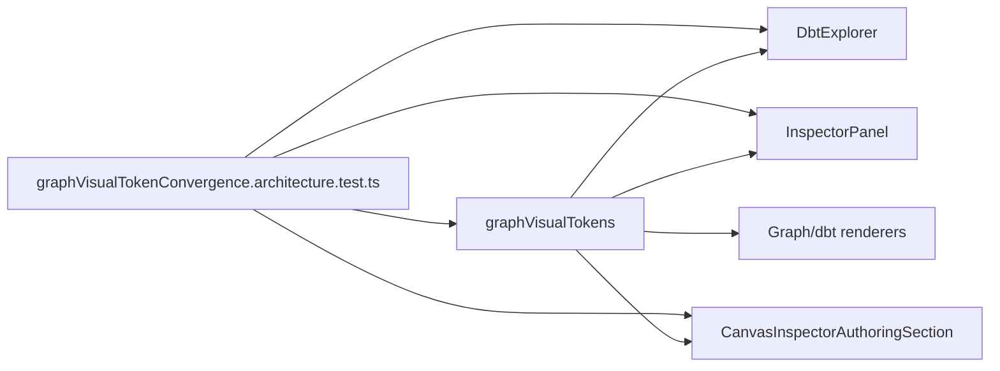

# F-24 Context Panel Token Convergence Closeout

## Summary

The Canvas/dbt graph context panels now consume the F-24 React Flow visual token
component instead of owning local `slate-*` and `gray-*` presentation classes.

## Changed Surfaces

- `apps/web/src/app/plugins/graph/graphVisualTokens.ts`
- `apps/web/src/app/plugins/graph/graphVisualTokenConvergence.architecture.test.ts`
- `apps/web/src/app/components/DbtExplorer.tsx`
- `apps/web/src/app/components/InspectorPanel.tsx`
- `apps/web/src/app/views/canvas/CanvasInspectorAuthoringSection.tsx`
- `docs/architecture/components/web/graph/react-flow-visual-token-component.md`

## Architecture Result

## Validation

- Red: `pnpm --filter @dvt/web test -- src/app/plugins/graph/graphVisualTokenConvergence.architecture.test.ts`
  failed because graph context panels did not import `graphVisualTokens`.
- Green: `pnpm --filter @dvt/web test -- src/app/plugins/graph/graphVisualTokenConvergence.architecture.test.ts`
  passed after routing context-panel chrome through graph tokens.

## Remaining Scope

Monaco editor theme hardening and shell-global token convergence remain outside
this context-panel sub-slice.
