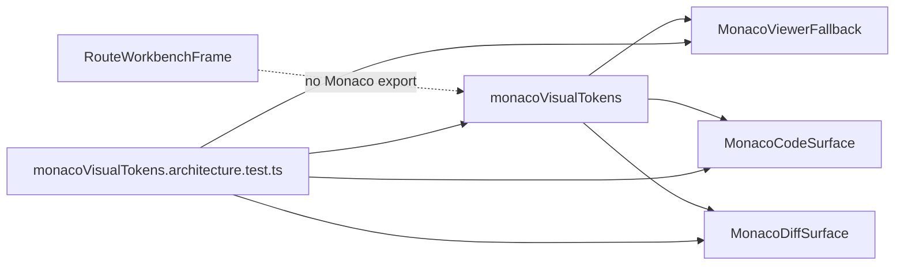

# F-24 Monaco Visual Token Convergence Closeout

## Summary

The embedded Monaco code and diff surfaces now consume a Monaco-owned visual
token component for container chrome, loading fallback chrome, theme selection,
and editor option presets.

## Changed Surfaces

- `apps/web/src/app/components/monaco/monacoVisualTokens.ts`
- `apps/web/src/app/components/monaco/monacoVisualTokens.architecture.test.ts`
- `apps/web/src/app/components/monaco/MonacoViewerFallback.tsx`
- `apps/web/src/app/components/monaco/MonacoCodeSurface.tsx`
- `apps/web/src/app/components/monaco/MonacoDiffSurface.tsx`
- `apps/web/src/app/components/workbench/RouteWorkbenchFrame.tsx`
- `docs/architecture/components/web/monaco/monaco-visual-token-component.md`
- `docs/architecture/components/web/monaco/monaco-visual-token-user-stories.md`

## Architecture Result

## Validation

- Red: `pnpm --filter @dvt/web test -- src/app/components/monaco/monacoVisualTokens.architecture.test.ts`
  failed because `monacoVisualTokens.ts` did not exist and Monaco surfaces still
  owned local visual literals.
- Green: `pnpm --filter @dvt/web test -- src/app/components/monaco/monacoVisualTokens.architecture.test.ts`
  passed after routing Monaco container, theme, and option presets through
  `monacoVisualTokens.ts`.

## Remaining Scope

Broader shell-global token convergence and route toolbar extraction remain
outside this Monaco visual-token sub-slice.
