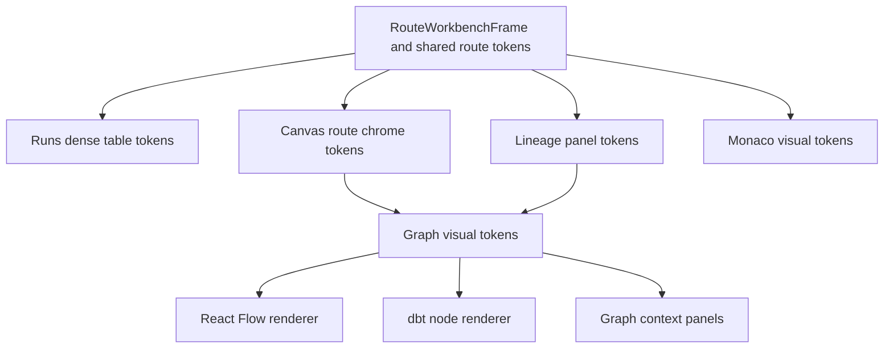
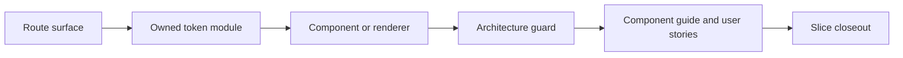

# F-24 Parent Visual Token Convergence Closeout

## Governing Sources

- `docs/planning/status/governance-document-rule-inventory.md`
- `AGENTS.md`
- `docs/guides/ai-work-protocol.md`
- `docs/architecture/command-query-rail-governance.md`
- `docs/architecture/fowler-opportunity-planning-governance.md`
- `docs/architecture/components/web/workbench-ui-contract-and-component-inventory.md`
- `docs/planning/proposals/dvt-product-ux-professionalization-bundle-20260409/docs/04-visual-system-and-style-guide.md`

## Scope

`F-24` owns the operator-workbench visual system and token-convergence path. The
parent remained `in_progress` after the route and component token slices had
landed. This closeout reconciles the parent state with accepted implementation
evidence.

No new UI behavior, route command, API call, persistence behavior, or runtime
contract is introduced by this closeout.

## Completed Surfaces

| Surface                   | Evidence                                                                                       |
| ------------------------- | ---------------------------------------------------------------------------------------------- |
| Runs dense table          | `routeWorkbenchTableTokens`, component guide, user stories, architecture guard, and closeout.  |
| Canvas route chrome       | `canvasChromeTokens`, Canvas route posture guard, component guide, user stories, and closeout. |
| Lineage route panels      | `lineageChromeTokens`, panel component guide, user stories, architecture guard, and closeout.  |
| React Flow graph renderer | `graphVisualTokens`, graph visual token guide, user stories, architecture guard, and closeout. |
| dbt node renderer         | dbt renderer token plan, guard coverage, and closeout.                                         |
| Graph context panel       | shared graph visual token adoption, guard coverage, and closeout.                              |
| Monaco surfaces           | `monacoVisualTokens`, component guide, user stories, architecture guard, and closeout.         |

## Current Token Topology

## Fowler Analysis

The accepted F-24 shape removes visual Primitive Obsession and Shotgun Surgery
from the main operator-workbench surfaces. Route and renderer components no
longer own scattered color families or ad hoc hex values for these bounded
surfaces. The applied patterns are:

- Shared Kernel for workbench-level visual vocabulary.
- Presentation Model for route-owned token modules.
- Component Boundary for each visual token family.
- Architecture Fitness Function for local color drift.
- Documentation as Published Language for token ownership and consumers.

## Remaining Work Classification

The parent task is closed. Any future color drift outside the completed token
families must be tracked as a new scoped task, naming the owning route or
component and its token boundary. It must not keep `F-24` open as a catch-all
bucket.

## Validation Baseline

- `pnpm docs:feature-mechanization -- --feature F24-RUNS-DENSE-TABLE-TOKEN-CONVERGENCE-20260518`
- `pnpm docs:feature-mechanization -- --feature F24-CANVAS-ROUTE-CHROME-TOKEN-CONVERGENCE-20260522`
- `pnpm docs:feature-mechanization -- --feature F24-LINEAGE-PANEL-TOKEN-CONVERGENCE-20260522`
- `pnpm docs:feature-mechanization -- --feature F24-REACT-FLOW-TOKEN-CONVERGENCE-20260522`
- `pnpm docs:feature-mechanization -- --feature F24-DBT-NODE-RENDERER-TOKEN-CONVERGENCE-20260522`
- `pnpm docs:feature-mechanization -- --feature F24-CONTEXT-PANEL-TOKEN-CONVERGENCE-20260522`
- `pnpm docs:feature-mechanization -- --feature F24-MONACO-VISUAL-TOKEN-CONVERGENCE-20260522`
- `pnpm --filter @dvt/web test -- src/app/views/runs/runsDomainBoundary.architecture.test.ts src/app/views/canvas/canvasRoutePosturePriority.architecture.test.ts src/app/views/lineage/lineagePanelTokenConvergence.architecture.test.ts src/app/plugins/graph/graphVisualTokenConvergence.architecture.test.ts src/app/components/monaco/monacoVisualTokens.architecture.test.ts`
- `pnpm docs:feature-mechanization:implementation`
- `pnpm governance:refresh`
- `pnpm verify:prepush`

## No-Debt And No-Stub Evidence

- No placeholder visual system is introduced.
- No route receives a local color-family exception.
- No lint, type, test, docs, CI, hook, or governance rule is relaxed.
- No ADR is required because this closeout reconciles accepted frontend
  presentation boundaries and does not change runtime contracts.
