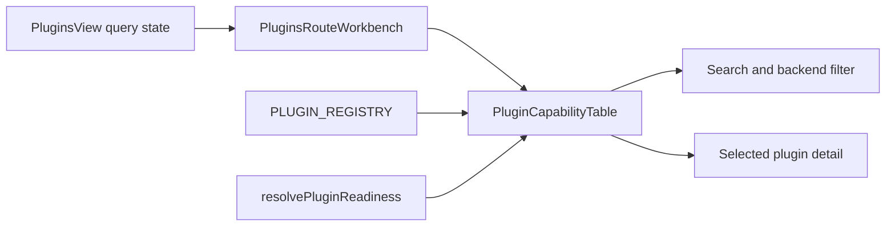

# F-25 Plugin Capability Table Closeout

## Summary

The Plugins route now exposes a dense capability table with search,
backend-state filtering, selected-plugin detail, and explicit readiness
projection. The route keeps data fetching in `PluginsView`, route slot
composition in `PluginsRouteWorkbench`, and catalog UX in
`PluginCapabilityTable`.

## Changed Surfaces

- `apps/web/src/app/views/plugins/PluginCapabilityTable.tsx`
- `apps/web/src/app/views/plugins/PluginsRouteWorkbench.tsx`
- `apps/web/src/app/views/plugins/pluginsViewModel.ts`
- `apps/web/src/app/views/plugins/pluginsCapabilityTable.architecture.test.ts`
- `apps/web/src/app/views/PluginsView.test.tsx`
- `docs/architecture/components/web/plugins/plugin-capability-table-component.md`
- `docs/architecture/components/web/plugins/plugin-capability-table-user-stories.md`

## Architecture Result

## Validation

- Red: `pnpm --filter @dvt/web test -- src/app/views/PluginsView.test.tsx`
  failed because the Plugins route had no searchable capability table or
  backend-state filter.
- Green: `pnpm --filter @dvt/web test -- src/app/views/PluginsView.test.tsx`
  passed after adding `PluginCapabilityTable`.

## Remaining Scope

Broader governed docks such as command-palette contributions and bottom
diagnostics remain outside this table sub-slice.
