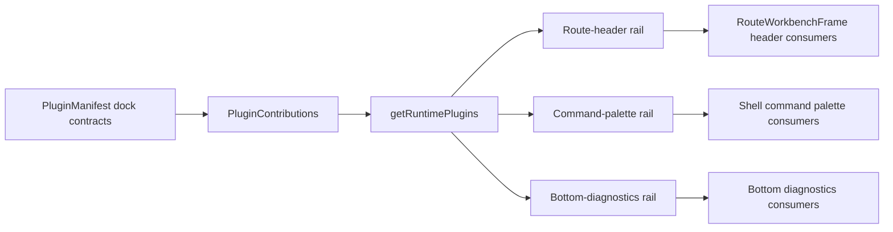

# F-25 Plugin UX Integration Contract Closeout

## Summary

`F-25` is closed as a governed plugin UX contract slice. The earlier plugin
capability table supplied the dense readiness catalog; this final slice adds
the missing plugin dock rails for route-header contributions, command-palette
contributions, and bottom-diagnostics contributions.

No backend plugin execution path, command palette renderer, or bottom drawer tab
renderer is introduced here. The slice formalizes the contract and runtime
projection rails that future visible surfaces must consume.

## Changed Surfaces

- `apps/web/src/app/plugins/contracts/PluginManifest.ts`
- `apps/web/src/app/plugins/registry.ts`
- `apps/web/src/app/plugins/monitoring/monitoringContributions.ts`
- `apps/web/src/app/plugins/registry.test.ts`
- `apps/web/src/app/plugins/pluginRuntimeProjection.architecture.test.ts`
- `docs/architecture/components/web/plugins/plugin-ux-integration-contract.md`
- `docs/architecture/components/web/workbench-ui-contract-and-component-inventory.md`
- `docs/planning/proposals/mandatory/frontend-and-ux/f25-plugin-ux-contract-docks-plan-20260522.md`

## Architecture Result

## Fowler Analysis

The final F-25 shape replaces primitive plugin extension fields with explicit
Published Interfaces and named query rails. That prevents future Shotgun Surgery
where each route or shell widget scans `PLUGIN_REGISTRY` differently. It also
keeps the shell grammar stable: plugin contributions are projected into governed
docks instead of injecting arbitrary local chrome.

## Red / Green Evidence

- Red: `pnpm --filter @dvt/web test -- src/app/plugins/registry.test.ts`
  failed because `getRouteHeaderContributions` was not a function.
- Green: the same registry test passed after adding explicit dock types, query
  rails, and Monitoring seed contributions.
- Red: `pnpm --filter @dvt/web test -- src/app/plugins/pluginRuntimeProjection.architecture.test.ts`
  failed because the plugin UX integration component guide did not exist.
- Green: the same architecture test passed after adding the component guide and
  guard expectations.

## Validation Baseline

- `pnpm --filter @dvt/web test -- src/app/plugins/registry.test.ts src/app/plugins/pluginRuntimeProjection.architecture.test.ts`
- `pnpm --filter @dvt/web typecheck`
- `pnpm --filter @dvt/web lint`
- `pnpm docs:feature-mechanization -- --feature F25-PLUGIN-CAPABILITY-TABLE-20260522`
- `pnpm docs:feature-mechanization -- --feature F25-PLUGIN-UX-CONTRACT-DOCKS-20260522`
- `pnpm docs:feature-mechanization:implementation`
- `pnpm docs:sync`
- `pnpm docs:status:generate`
- `pnpm verify:prepush`

## No-Debt And No-Stub Evidence

- No fake renderer, fake command palette, or fake bottom drawer UI is added.
- No plugin bypasses backend runtime availability projection.
- No lint, type, test, docs, CI, hook, or governance rule is relaxed.
- Future visible rendering remains separate work and must consume these rails
  instead of creating parallel plugin semantics.
