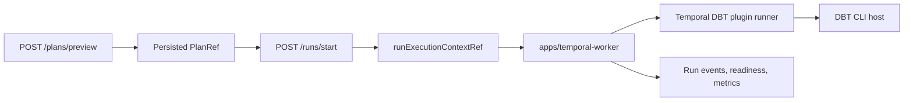

# TF-C3 Plugin-Backed DBT Parent Closeout

## Summary

`TF-C3` is closed. The phase-2 DBT execution path now stays behind the same
preview-persist-run boundary and remains outside engine-kernel semantics.

## Completed Slices

| Slice     | Result                                                                                     |
| --------- | ------------------------------------------------------------------------------------------ |
| `TF-C3-A` | DBT plugin-backed execution mode preserved the same `PlanRef` and run boundary.            |
| `TF-C3-B` | Artifact-backed execution-context and DBT bundle readers converged under `@dvt/artifacts`. |
| `TF-C3-C` | `apps/temporal-worker` became the canonical standalone worker composition root.            |
| `TF-C3-D` | DBT runs through the adapter-owned CLI plugin runner instead of engine semantics.          |
| `TF-C3-E` | Runbook and DBT-enabled local Docker canary evidence are accepted.                         |

## Architecture Result

## Fowler Analysis

The accepted shape applies Ports and Adapters around DBT execution. The engine
keeps lifecycle ownership, the Temporal adapter owns provider execution, the
DBT plugin runner owns DBT-local CLI behavior, and the worker composition root
owns deployment/runtime wiring. This avoids a Parallel Inheritance or second
product loop for DBT.

## Validation Baseline

- `pnpm docs:feature-mechanization -- --feature TF-C3-E-TEMPORAL-WORKER-RUNBOOK-TRUTH`
- `pnpm docs:feature-mechanization:implementation`
- `pnpm docs:sync`
- `pnpm governance:refresh`
- `pnpm verify:prepush`

## No-Debt And No-Stub Evidence

- No new runtime stub is introduced.
- No engine DBT semantics are added.
- No rollout checklist is deleted; environment-specific rollout checks remain
  in the runbook.
- Open regression risk remains tracked separately as
  `R-20260514-TEMPORAL-WORKER-DBT-CANARY`.
