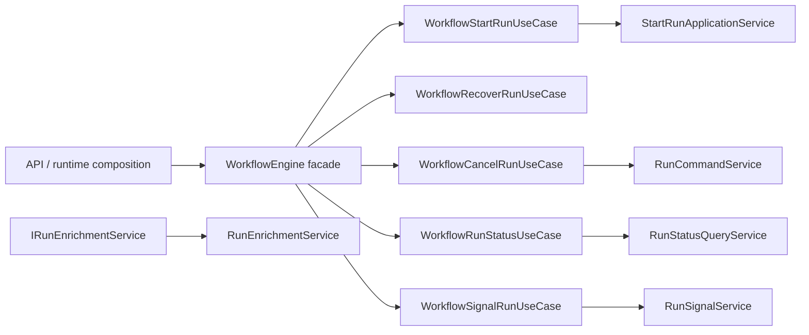
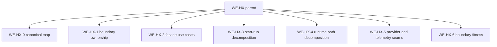

# WE-HX Parent Hardcut Closeout

## Governing Sources

- `docs/planning/status/governance-document-rule-inventory.md`
- `AGENTS.md`
- `docs/guides/ai-work-protocol.md`
- `docs/architecture/command-query-rail-governance.md`
- `docs/architecture/fowler-opportunity-planning-governance.md`
- `docs/architecture/reference-architecture.md`
- `docs/planning/proposals/mandatory/runtime-and-contracts/workflow-engine-hexagonal-derivation-plan-20260403.md`
- `docs/architecture/components/engine/architecture/workflow-engine-subsystem-context.md`
- `docs/architecture/components/engine/architecture/workflow-engine-target-architecture.v1.md`

## Scope

`WE-HX` was the umbrella task for deriving the `WorkflowEngine` subsystem to a
hardcut hexagonal architecture. The parent remained `in_progress` after the
execution waves had been accepted, so this closeout reconciles planning state
with the implemented and documented architecture.

No new runtime behavior, command, query, contract, adapter, persistence schema,
or public API is introduced by this closeout.

## Completion Evidence

The parent target is satisfied by the accepted child waves:

| Wave      | Evidence                                                                                                                                               |
| --------- | ------------------------------------------------------------------------------------------------------------------------------------------------------ |
| `WE-HX-0` | Canonical subsystem context, target architecture, user manual, hardcut architecture guard, ARC evidence, and closeout.                                 |
| `WE-HX-1` | Boundary ownership component, user stories, Fowler review, architecture guard, ARC evidence, and risk entry.                                           |
| `WE-HX-2` | Facade use-case component, user stories, mailbox analysis, closeout, ARC evidence, and facade architecture guard.                                      |
| `WE-HX-3` | Start-run application decomposition services, docs guard, implementation guard, closeout, ARC evidence, and risk entry.                                |
| `WE-HX-4` | Runtime command/signal/query decomposition and the `AR-A3` facade-purity convergence.                                                                  |
| `WE-HX-5` | Provider resolver and start/success telemetry seams with component guide, stories, closeout, ARC evidence, and guard.                                  |
| `WE-HX-6` | Boundary-fitness component, stories, mailbox analysis, fixture ownership headers, shared architecture-test support, closeout, ARC evidence, and guard. |

Related modularization waves also support the parent target:

- `DHM-WS2` names the API runtime composition root.
- `DHM-WS4` decomposes runtime command and signal paths.
- `DHM-WS6` records semantic component ownership across API composition and
  engine runtime seams.
- `AR-A12-C` removes residual facade-width drift by cutting enrichment out of
  `IWorkflowEngine` and routing it through `IRunEnrichmentService`.

## Current Architecture

## Fowler Analysis

The accepted shape moves the subsystem away from God Facade, Responsibility
Overload, Hidden Authority, and Documentation Drift. The implemented pattern
set is now:

- Narrow Facade for `WorkflowEngine`.
- Use Case Interactor for facade-facing operations.
- Role Interface for command, signal, status, enrichment, and runtime seams.
- Policy Object for admission, context provenance, failure, and telemetry.
- Adapter/Port for provider, state, intent, artifact, and composition-root
  seams.
- Architecture Fitness Function for docs, owned-concern headers, package
  boundaries, forbidden imports, and feature mechanization.

## No Remaining Parent Work

The original parent target was to publish canonical subsystem architecture,
replace stale navigation, and track executable `WE-HX-0..6` waves. That is now
done. Remaining or future engine work must be represented by independent tasks
with their own command/query rail, Fowler analysis, component guide, user
stories, ARC evidence when package paths are touched, and verification.

## Validation Baseline

Parent closeout verification should include:

- `pnpm docs:feature-mechanization -- --feature WE-HX-0-HARDCUT-CANONICAL-MAP`
- `pnpm docs:feature-mechanization -- --feature WE-HX-3-START-RUN-DECOMPOSITION`
- `pnpm docs:feature-mechanization -- --feature DHM-WS4-RUNTIME-PATH-DECOMPOSITION`
- `pnpm docs:feature-mechanization -- --feature WE-HX-5-PROVIDER-TELEMETRY-SEAMS`
- `pnpm docs:feature-mechanization -- --feature WE-HX-6-BOUNDARY-FITNESS`
- `pnpm --filter @dvt/engine test -- test/architecture/workflowEngineCanonicalMapHardcut.architecture.test.ts test/architecture/workflowEngineFacadeUseCases.architecture.test.ts test/architecture/workflowEngineRuntimePathDecomposition.architecture.test.ts test/architecture/workflowEngineProviderTelemetrySeams.architecture.test.ts test/architecture/workflowEngineBoundaryFitness.architecture.test.ts`
- `pnpm docs:feature-mechanization:implementation`
- `pnpm governance:refresh`
- `pnpm verify:prepush`

## No-Debt And No-Stub Evidence

- No compatibility posture is added.
- No runtime shortcut, stub, placeholder, fake adapter, or fake success path is
  introduced.
- No lint, type, test, docs, ARC, CI, or hook rule is relaxed.
- No new ADR is required because this closeout reconciles accepted child work
  under existing engine ownership and bounded-context decisions.
