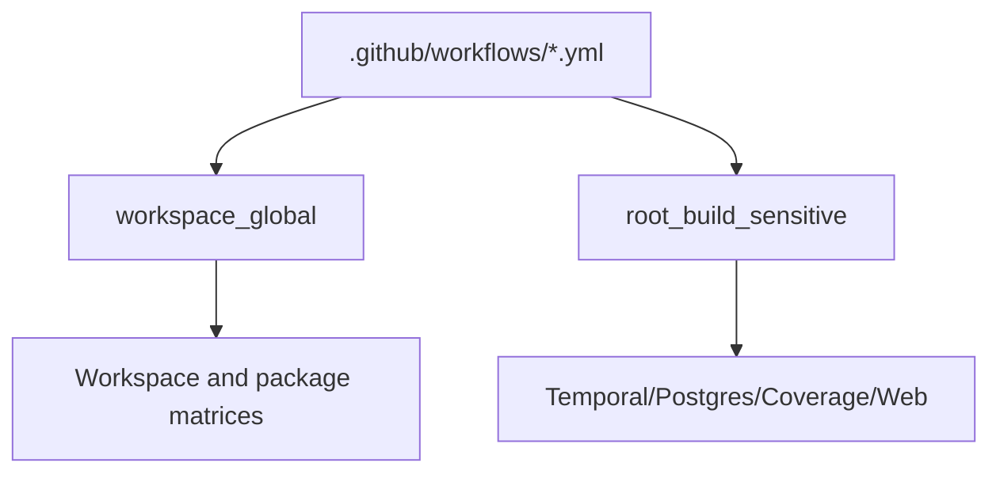
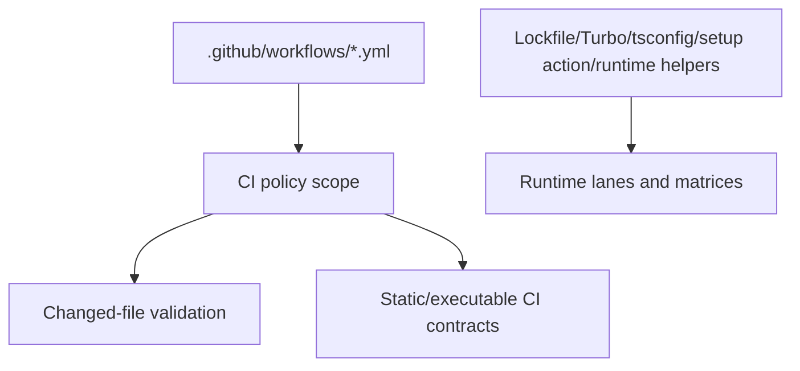

# 20260601 CI Workflow Policy Fanout Trim Closeout

## Think-First Analysis

Problem summary:
workflow-only PRs were being treated as runtime/root-build changes. A change to
`.github/workflows/ci.yml` opened the full workspace matrix, and a change to
`.github/workflows/test.yml` opened the workspace matrix, package test matrix,
web frontend tests, determinism/replay, coverage, and adapter-postgres scope.

Root cause:
the shared CI scope policy put `.github/workflows/**` in `workspace_global`, and
the test/pr-quality scope patterns included workflow YAML in root-build and
runtime capability lanes. That conflated CI policy wiring with runtime build
inputs.

Constraints and invariants:

- `AGENTS.md` requires real validation, no hidden skip, and no rule relaxation.
- `docs/guides/testing-and-ci-capabilities.md` is the command capability map.
- `docs/planning/proposals/mandatory/governance-and-docs/ci-scope-optimization-plan-20260508.md`
  owns the shared CI scope rail.
- `tools/ci/ci-tool-test-suite.mjs` keeps static CI workflow contracts always on
  and executable CI contracts conditional for install-backed CI tooling.

Options considered:

- Keep workflow YAML as root-build: rejected because it preserves broad CI cost
  for orchestration-only changes.
- Add ad hoc workflow `if:` conditions: rejected because it would duplicate the
  shared scope rail.
- Narrow workflow YAML to CI policy scope only: selected because mature CI
  systems validate pipeline policy with workflow contracts and changed-file
  checks, while runtime tests remain keyed to runtime inputs.

Selected option and rationale:
workflow YAML remains `any_code` and changed-file-validation relevant, and
selected CI workflows still activate CI tool executable contracts. Workflow YAML
no longer implies runtime workspace fan-out, package tests, web tests,
determinism/replay, coverage, Temporal capability lanes, or adapter-postgres
integration by filename alone.

Fowler opportunity matrix:

| Scenario                                                 | Opportunity         | Fowler pattern                        | DDD owner                  | Rail                                 | Guard                                    |
| -------------------------------------------------------- | ------------------- | ------------------------------------- | -------------------------- | ------------------------------------ | ---------------------------------------- |
| Workflow-only PR opens runtime CI                        | Duplicate semantics | Replace Conditional With Polymorphism | Repository CI scope policy | `ClassifyChangedCiScope` query       | `workflow-scope-classification.test.mjs` |
| Test workflow change opens package/web/coverage lanes    | Feature envy        | Move Function                         | Repository CI scope policy | `EmitWorkflowCapabilityScopes` query | `emit-test-matrix.test.mjs`              |
| PR quality workflow opens Temporal/Postgres integrations | Primitive obsession | Replace Primitive With Object         | Repository CI scope policy | `EmitWorkflowCapabilityScopes` query | `path-matcher.test.mjs`                  |

## Current State

## Target State

## Pre-Implementation Brief

Mode: Slim.

Scope:
CI scope classification only. No application runtime, package, adapter,
contract, or branch-protection behavior changes.

Touched surfaces:

- `tools/ci/scope-config.mjs`
- `tools/ci/repository-change-scope.mjs`
- `tools/ci/policy/workflow-scope.json`
- `tools/ci/policy/adapter-postgres-relevance.json`
- CI scope contract tests under `tools/ci/**`
- `docs/guides/testing-and-ci-capabilities.md`

Expected outcome:
workflow-only CI policy PRs keep CI contract coverage and changed-file
validation while avoiding runtime fan-out.

Validation plan:

- Focused `node --test` scope contract tests.
- `pnpm test:ci-tools:static`.
- `pnpm governance:refresh`.
- `pnpm verify:prepush`.

Command/query rail impact:
No product command or query changes. The existing repository CI query rail
`ClassifyChangedCiScope` is narrowed.

Out of scope:
changing branch protection, skipping static CI contracts, changing runtime test
commands, or altering root-build inputs such as lockfiles, Turbo config, setup
actions, TypeScript config, or runtime orchestration helpers.
