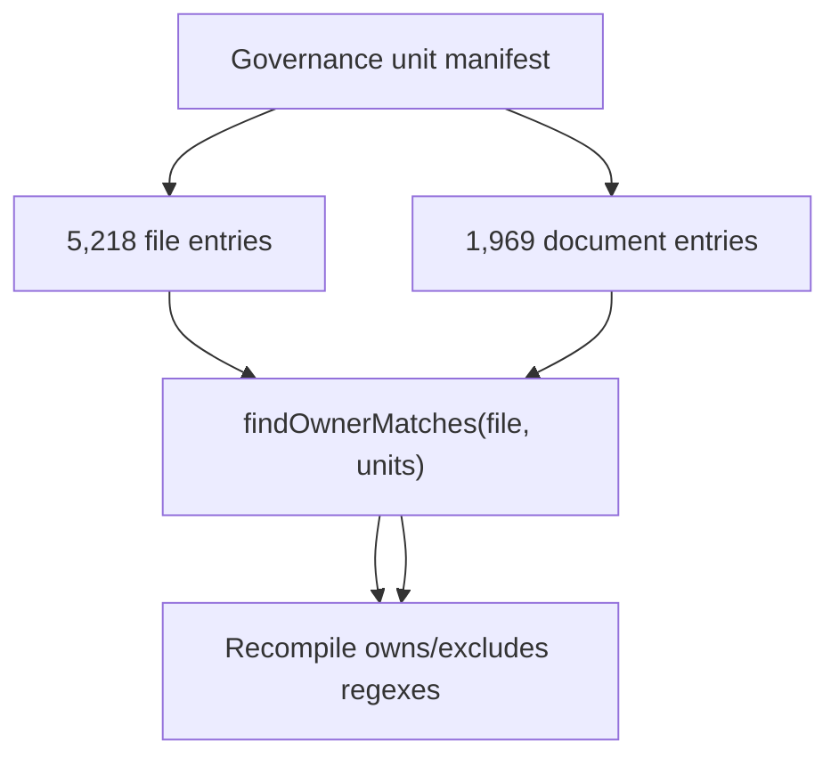
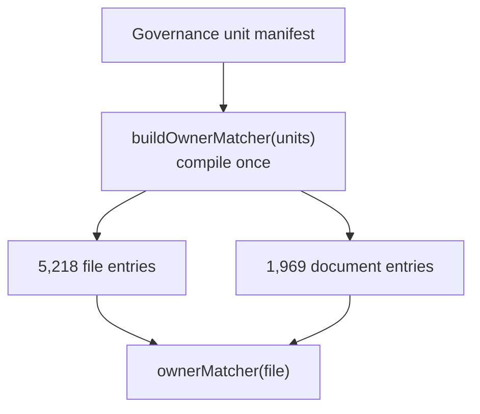

# Governance Owner Matcher Precompile Closeout

## Think-First Analysis

- Problem summary: after the planning DB import fixture reuse slice, the first
  governance input build remains the local CI bottleneck. Baseline profiling
  measured `buildGovernanceGeneratedInputs()` at 11.097s, with
  `buildFileComponentOutputs()` taking 8.540s and
  `buildDocumentUnitOutputs()` taking 2.578s.
- Root cause: both generated-input builders call `findOwnerMatches()` for each
  tracked file or document. `findOwnerMatches()` recompiles every unit `owns`
  and `excludes` glob into regular expressions on each call, so one manifest
  scan repeats the same matcher construction thousands of times.
- Constraints and invariants: ownership semantics must remain manifest-owned,
  exact, and conservative. The production generators must still read current
  files from git/worktree state; this slice must not add production snapshot
  caching, skip generated surfaces, or relax governance drift gates.
- Options considered:
  - Cache complete generated outputs in production. Rejected because generators
    must reflect current repository state on each run.
  - Narrow the file set in tests only. Rejected because the user asked to move
    toward DB-first and reduce real pipeline inefficiency, not hide it.
  - Precompile ownership glob matchers once per manifest scan and reuse them
    across file/document entries. Selected because it removes duplicated local
    computation without changing the manifest, generated output shape, or import
    authority.
- Selected option and rationale: add a reusable owner matcher builder in the
  governance unit coverage rail, then pass the precompiled matcher through file
  and document generated-input builders. This is a local CI and governance
  generator optimization with no externally observable product rail change.
- Rejected alternatives: production memoization, test-only filtering, removing
  ownership checks, or accepting stale generated YAML as DB import authority.

## Fowler Opportunity Matrix

<!-- markdownlint-disable MD060 -->

| Scenario                                                       | Opportunity                  | Fowler pattern                        | DDD owner                         | Rail                                        | Allowed surfaces                                                                                                                                                  | Tests                                                                                                                                                                          | Out of scope                          |
| -------------------------------------------------------------- | ---------------------------- | ------------------------------------- | --------------------------------- | ------------------------------------------- | ----------------------------------------------------------------------------------------------------------------------------------------------------------------- | ------------------------------------------------------------------------------------------------------------------------------------------------------------------------------ | ------------------------------------- |
| Governance generators rebuild ownership regexes for each file  | Duplicate semantics          | Preserve Whole Object / Extract Query | Repository CI tool contract tests | `ValidateCiScopeOptimizationContract` query | `scripts/check-governance-unit-coverage.cjs`, `scripts/generate-governance-file-component-index.cjs`, `scripts/generate-governance-document-unit-map.cjs`         | `node --test scripts/check-governance-unit-coverage.test.cjs scripts/generate-governance-file-component-index.test.cjs scripts/generate-governance-document-unit-map.test.cjs` | Production generated-output caching   |
| DB-first import waits on governance generated-input projection | Responsibility overload cost | Parameterize Method / Gateway reuse   | Planning query-store import tests | `ValidateCiScopeOptimizationContract` query | `scripts/planning-db-import.cjs` through existing calls to governance generated-output builders, with ownership matcher reuse inside the owning generator modules | `pnpm test:planning:db`                                                                                                                                                        | Database schema or import SQL changes |

<!-- markdownlint-enable MD060 -->

## Current State Diagram

## Target State Diagram

## Pre-Implementation Brief

- Mode: Slim.
- Scope: governance ownership matcher reuse for generated file/component and
  document-unit map builders used by DB-first local validation.
- Touched files or paths:
  - `docs/planning/proposals/mandatory/governance-and-docs/ci-scope-optimization-plan-20260508.md`
  - `docs/planning/closeouts/20260601-governance-owner-matcher-precompile-closeout.md`
  - `scripts/check-governance-unit-coverage.cjs`
  - `scripts/check-governance-unit-coverage.test.cjs`
  - `scripts/generate-governance-document-unit-map.cjs`
  - `scripts/generate-governance-document-unit-map.test.cjs`
  - `scripts/generate-governance-file-component-index.cjs`
  - `scripts/generate-governance-file-component-index.test.cjs`
- Expected outcome: full governance generated-input construction is materially
  faster while preserving identical file ownership and generated output
  semantics.
- Risks and mitigations:
  - Risk: matcher precompilation could change exclude precedence. Mitigation:
    add tests for supplied matcher behavior and existing exclude assertions.
  - Risk: generated file/document builders could ignore the matcher and keep the
    old cost. Mitigation: add regression tests that inject a supplied matcher
    and assert the builders consume it.
- Out-of-scope items: production output caching, database schema changes,
  GitHub workflow changes, branch-protection changes, and app/package runtime
  behavior.
- Validation plan:
  - `node --test scripts/check-governance-unit-coverage.test.cjs scripts/generate-governance-file-component-index.test.cjs scripts/generate-governance-document-unit-map.test.cjs`
  - `pnpm test:planning:db`
  - `pnpm docs:sync`
  - `pnpm docs:feature-mechanization -- --feature CI-SCOPE-OPTIMIZATION-20260508`
  - `pnpm docs:feature-mechanization:implementation`
  - `pnpm governance:refresh`
  - `pnpm verify:prepush`
- Test coverage plan: keep existing real-manifest ownership tests; add matcher
  builder behavior coverage, file-entry matcher injection coverage, and
  document-entry matcher injection coverage.
- Libraries evaluated: none evaluated - this is a local Node generator
  optimization.
- Command/query rail impact: no product rail change. The existing
  `ValidateCiScopeOptimizationContract` query rail governs local CI tool and
  governance generator behavior.
- Fowler planning impact: removes duplicate matcher construction, keeps
  authority in the manifest-owned ownership rail, and reduces DB-first import
  setup time without hiding integration impact.

## Baseline Measurement

- `node -e "... buildOutputs from generate-governance-file-component-index ..."`
  before implementation: 8.540s for 5,218 files and 58 components.
- `node -e "... buildOutputs from generate-governance-document-unit-map ..."`
  before implementation: 2.578s for 1,969 docs.
- `node -e "... buildGovernanceGeneratedInputs ..."` before implementation:
  11.097s for 5,218 file entries and 1,969 document entries.

## Implementation Notes

- Added `buildOwnerMatcher()` to
  `scripts/check-governance-unit-coverage.cjs`.
- Kept `findOwnerMatches()` as the existing one-shot API, now backed by the
  reusable matcher builder.
- Reused one precompiled owner matcher inside `validateFileOwnership()` instead
  of recompiling manifest ownership globs per tracked file.
- Routed `buildFileEntries()` through a supplied or internally built
  `ownerMatcher`.
- Routed `buildDocumentEntries()` through a supplied or internally built
  `ownerMatcher`.
- Added regression tests proving matcher exclude precedence and proving both
  file and document generated-entry builders consume an injected matcher.

## Validation Evidence

- Red run:
  `node --test scripts/check-governance-unit-coverage.test.cjs scripts/generate-governance-file-component-index.test.cjs scripts/generate-governance-document-unit-map.test.cjs`
  failed 3/37 as expected before implementation because
  `buildOwnerMatcher()` did not exist and the file/document generators ignored
  supplied matchers.
- Green run:
  `node --test scripts/check-governance-unit-coverage.test.cjs scripts/generate-governance-file-component-index.test.cjs scripts/generate-governance-document-unit-map.test.cjs`
  passed 37/37 tests after implementation.
- `node -e "... buildOutputs from generate-governance-file-component-index ..."`
  after implementation: 2.971s for 5,219 files and 58 components. The file
  count includes this new closeout document, which was untracked during the
  measurement.
- `node -e "... buildOutputs from generate-governance-document-unit-map ..."`
  after implementation: 0.254s for 1,969 docs.
- `node -e "... buildGovernanceGeneratedInputs ..."` after implementation:
  3.862s for 5,219 file entries and 1,969 document entries.
- Measured improvement: full governance generated-input construction dropped
  from 11.097s to 3.862s, about 65.2% less wall time for the remaining
  DB-first setup hotspot.
- `pnpm docs:sync` passed; documentation indexes and generated lane pages were
  already up to date.
- `pnpm test:planning:db` passed 250/250 tests, `duration_ms 5865.7022`.
  The previous post-fixture-reuse run was 13.240s, so the DB-first planning
  suite dropped by about 55.7% in this iteration.
- `pnpm lint:md:changed` passed with 0 markdownlint errors.
- `pnpm docs:feature-mechanization -- --feature CI-SCOPE-OPTIMIZATION-20260508`
  passed.
- `pnpm docs:feature-mechanization:implementation` initially failed because
  the manifest declared the new `buildOwnerMatcher` symbol but not the touched
  `findOwnerMatches` and `buildDocumentEntries` symbols. The manifest was
  corrected, and the rerun passed.
- `pnpm governance:refresh` passed. Generated governance surfaces stabilized
  after 2 passes; planning DB checks, planning export, governance DB import,
  governance DB check, and governance DB export check all passed. The governance
  DB import reported 5,219 governance files, 58 governance components, and 39
  remediation tasks.

## No-Debt Position

- No production cache will be added.
- No generated ownership check will be skipped.
- No lint, test, CI, hook, or governance rule will be disabled or relaxed.
- No new risk/debt entry is planned because the slice removes duplicate local
  computation without accepting residual debt.

## No-Stub Position

- No stub, placeholder, fake adapter, fake success path, or unfinished branch is
  planned.

## Follow-Up Routing Iteration

- Problem summary: after committing the owner matcher optimization,
  `pnpm verify:prepush` passed but did not select the focused
  `check-governance-unit-coverage`, `generate-governance-file-component-index`,
  or `generate-governance-document-unit-map` tests through `verify:changed`.
- Root cause: `scripts/local-validation-plan.cjs` only mapped coverage-report
  and remediation-queue generators in `PLANNING_WORKFLOW_SCRIPT_TESTS`; the
  ownership/index generators were absent from that route table.
- Selected option and rationale: extend the existing local validation plan map
  instead of adding another command or broad suite. This keeps IA validation
  cheap and ensures future generator changes select the tests that own their
  behavior.
- Validation plan:
  - `node --test scripts/verify-changed.test.cjs`
  - `node --test scripts/check-governance-unit-coverage.test.cjs scripts/generate-governance-file-component-index.test.cjs scripts/generate-governance-document-unit-map.test.cjs`
  - `pnpm docs:feature-mechanization:implementation`
  - `pnpm verify:prepush`
- Red run:
  `node --test scripts/verify-changed.test.cjs` failed 1/15 as expected
  because ownership/index generator changes selected no focused tests.
- Green run:
  `node --test scripts/verify-changed.test.cjs` passed 15/15 after adding the
  local validation map entries.
- Regression coverage:
  `node --test scripts/check-governance-unit-coverage.test.cjs scripts/generate-governance-file-component-index.test.cjs scripts/generate-governance-document-unit-map.test.cjs`
  passed 37/37 after the routing change.
- `pnpm lint:md:changed`,
  `pnpm docs:feature-mechanization -- --feature CI-SCOPE-OPTIMIZATION-20260508`,
  and `pnpm docs:feature-mechanization:implementation` passed after the routing
  plan update.

## Heavy Governance Import Batching Iteration

- Problem summary: a stale `pnpm governance:db:import -- --if-stale` still took
  76.508s after the generator optimization. Inspection showed the import path
  performs one `client.query` per row for the largest governance tables.
- Root cause: `insertGovernanceSnapshot()` writes `governance_files`,
  `governance_component_files`, and `governance_fingerprints` row by row. At
  current repository size those three tables alone create about 15k database
  round trips per stale import.
- Selected option and rationale: add a shared parameterized insert helper and
  use it only for the three largest governance tables in this slice. This keeps
  behavior, transaction boundaries, and table clearing unchanged while removing
  the dominant round-trip cost.
- Rejected alternatives: rewrite every planning/governance import table at
  once, use untyped string-concatenated SQL values, or defer batching behind a
  separate migration. Those options either expand blast radius or weaken query
  safety.
- Validation plan:
  - `node --test scripts/planning-db-import.test.cjs`
  - stale `pnpm governance:db:import -- --if-stale` timing after forcing a
    changed governance source hash
  - fresh `pnpm governance:db:import -- --if-stale` timing after the import
  - `pnpm governance:refresh`
  - `pnpm verify:prepush`
- First batching measurement: after batching `governance_files`,
  `governance_component_files`, and `governance_fingerprints`, stale
  `pnpm governance:db:import -- --if-stale` took 69.432s versus the 76.508s
  baseline. The result confirmed a real but incomplete improvement, so the
  same helper was extended to auxiliary governance tables in the next step.
- Auxiliary batching measurement: after also batching repository command, docs
  disposition, and knowledge-document imports, stale
  `pnpm governance:db:import -- --if-stale` took 55.844s. The fresh path after
  that import took 5.783s and reported `skipped fresh scopes: governance`.
- Net measurement: stale governance import improved from 76.508s to 55.844s
  for this iteration, a 20.664s reduction on the local DB-first path. The
  improvement is direct CI/local-command pipeline time, not cosmetic routing.

## Stale Freshness Fast-Fail Iteration

- Problem summary: 55.844s remained too slow for `pnpm governance:db:import --
--if-stale`. Profiling showed direct governance-only `importContent()` took
  25.735s, while the stale command path took 55.844s.
- Root cause: `isScopeFresh()` treated source freshness failure as a reason to
  run full governance or auxiliary projection checks before importing. Those
  checks rebuild expensive expected snapshots and then the import rebuilds the
  same content again.
- Selected option and rationale: when core governance source freshness or
  auxiliary source freshness reports stale, return `false` immediately from the
  freshness decision and let the import replace the read model. A stale source
  signal is already sufficient evidence that the selected scope is not fresh.
- Rejected alternatives: remove the source freshness checks entirely, weaken
  freshness comparison fields, or skip auxiliary projection import. Those would
  lose functionality or hide drift.
- Red/green evidence: `node --test scripts/planning-db-import.test.cjs` first
  failed when the tests asserted that full projection checks are not invoked
  after stale source freshness. After the `isScopeFresh()` change, the same
  suite passed.
- Measurement: stale `pnpm governance:db:import -- --if-stale` improved from
  55.844s to 29.448s. The fresh path after the import took 5.106s and still
  reported `skipped fresh scopes: governance`.

## Docs Disposition Reference Scan Iteration

- Problem summary: after removing stale freshness duplication, direct
  governance-only `importContent()` still took 27.749s. The largest remaining
  pure build phase was `buildDocsDispositionSnapshot()` at 10.038s.
- Root cause: `extractTaskLikeReferences()` scanned each document once for the
  broad task-like reference pattern and then scanned the same document once per
  planning task id. With the current corpus this multiplies work across about
  1970 docs and 337 planning task ids.
- Selected option and rationale: compile the planning task ids into one
  case-insensitive bounded regex per extraction and aggregate matches by
  normalized task id. This preserves registered planning task detection and
  casing while replacing hundreds of per-document regex passes with one.
- Validation evidence: `node --test scripts/planning-db-import.test.cjs` passes
  with an added regression for mixed-case planning task references.
- Measurement: `buildDocsDispositionSnapshot()` improved from 10.038s to
  5.384s. Direct governance-only `importContent()` improved from 27.749s to
  21.799s. Stale `pnpm governance:db:import -- --if-stale` improved from the
  prior 29.448s to 24.971s. The fresh path after the import took 5.192s and
  still reported `skipped fresh scopes: governance`.
