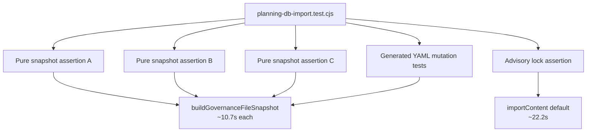
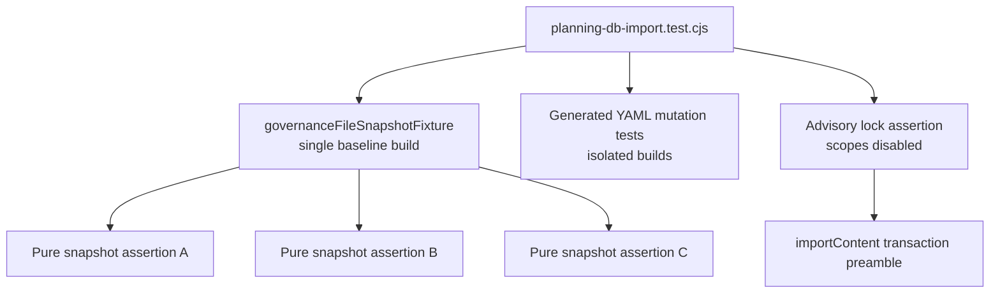

# Planning DB Import Test Fixture Reuse Closeout

## Think-First Analysis

- Problem summary: `scripts/planning-db-import.test.cjs` is a single local CI
  test file, but it currently takes 76.865s. Five subtests rebuild the complete
  governance snapshot and one advisory-lock assertion enters the default full
  import path before checking the lock query.
- Root cause: the test file treats pure assertions and mutation-sensitive
  assertions the same. Pure assertions reconstruct the same DB-first governance
  read model repeatedly, while the advisory-lock assertion pays for planning and
  governance snapshot construction even though the assertion only needs the
  transaction preamble.
- Constraints and invariants: the CI scope optimization manifest owns local CI
  validation routing and test command behavior. `AGENTS.md` and the AI work
  protocol require doc-driven changes, no hidden debt, no skipped checks, and
  `pnpm verify:prepush` before the slice is ready. No product command/query rail
  changes are in scope.
- Options considered:
  - Split the test file into smaller files. Rejected for this pass because it
    adds file inventory churn and does not remove duplicated snapshot work.
  - Cache the production snapshot globally in `planning-db-import.cjs`.
    Rejected because production imports must reflect current generated files and
    should not gain test-only cache semantics.
  - Reuse a test-local snapshot fixture for pure assertions and keep
    mutation-sensitive tests isolated. Selected because it removes repeated
    local CI work while preserving the same production code path for snapshot
    construction.
  - Call `importContent` with both import scopes disabled for the advisory-lock
    assertion. Selected because it keeps coverage on the public import path and
    avoids building irrelevant planning/governance snapshots.
- Selected option and rationale: introduce a test-local
  `governanceFileSnapshotFixture()` and use it only in pure snapshot assertions;
  leave tests that rewrite generated YAML on direct `buildGovernanceFileSnapshot`
  calls. Narrow the lock test input to the transaction path it validates.
- Rejected alternatives: production caching, broad test split, reducing
  assertions, or marking expensive tests as skipped.

## Fowler Opportunity Matrix

<!-- markdownlint-disable MD060 -->

| Scenario                                                                 | Opportunity                                       | Fowler pattern                                                 | DDD owner                              | Rail                                        | Allowed surfaces                      | Tests                | Out of scope                          |
| ------------------------------------------------------------------------ | ------------------------------------------------- | -------------------------------------------------------------- | -------------------------------------- | ------------------------------------------- | ------------------------------------- | -------------------- | ------------------------------------- |
| Repeated pure snapshot assertions rebuild the same governance read model | Duplicate semantics and test-only confidence cost | Extract Function / Consolidate Duplicate Conditional Fragments | Repository CI tool contract tests      | `ValidateCiScopeOptimizationContract` query | `scripts/planning-db-import.test.cjs` | Focused spec profile | Production import caching             |
| Advisory-lock assertion pays for full import content                     | Feature envy on a broad integration path          | Substitute Algorithm in tests by narrowing fixture inputs      | Planning query-store import validation | `ValidateCiScopeOptimizationContract` query | `scripts/planning-db-import.test.cjs` | Focused spec profile | Changing DB schema or import behavior |

<!-- markdownlint-enable MD060 -->

## Current State Diagram

## Target State Diagram

## Pre-Implementation Brief

- Mode: Slim.
- Scope: local CI test performance for the planning/governance DB import test
  file.
- Touched files or paths:
  - `docs/planning/proposals/mandatory/governance-and-docs/ci-scope-optimization-plan-20260508.md`
  - `docs/planning/closeouts/20260601-planning-db-import-test-fixture-reuse-closeout.md`
  - `scripts/planning-db-import.test.cjs`
- Expected outcome: the focused `planning-db-import` test file remains green and
  materially faster, with no assertions removed.
- Risks and mitigations:
  - Risk: shared snapshot fixture could hide generated-file mutation behavior.
    Mitigation: only pure assertions use the fixture; tests that modify
    generated YAML still build fresh snapshots.
  - Risk: lock test could stop proving the import path uses the advisory lock.
    Mitigation: keep calling `importContent`, but disable planning/governance
    scopes so only the transaction preamble is exercised.
- Out-of-scope items: production query-store caching, database schema changes,
  GitHub workflow changes, and branch-protection changes.
- Validation plan:
  - `node --test --test-reporter=spec scripts/planning-db-import.test.cjs`
  - `node --test scripts/verify-changed.test.cjs`
  - `pnpm docs:sync`
  - `pnpm docs:feature-mechanization:implementation`
  - `pnpm governance:refresh`
  - `pnpm verify:prepush`
- Test coverage plan: prove all existing planning DB import tests still pass;
  compare the focused spec profile before and after the refactor; keep mutation
  tests isolated from the shared fixture.
- Libraries evaluated: none evaluated - this is a local Node test refactor.
- Command/query rail impact: no product rail changes. The existing
  `ValidateCiScopeOptimizationContract` query rail governs local CI test
  behavior.
- Fowler planning impact: removes repeated expensive fixture construction and
  narrows a broad integration assertion to the behavior it validates.

## Baseline Measurement

- `node --test --test-reporter=spec scripts/planning-db-import.test.cjs` passed
  31/31 tests before implementation and took 76.865s.
- Expensive subtests before implementation:
  - `governance file snapshot preserves every file entry declared by the index`
    took 11.168s.
  - `governance snapshot preserves component, fingerprint, coverage, and
remediation content` took 10.791s.
  - `governance snapshot builds DB import sources from in-memory generator
projections` took 10.664s.
  - `governance snapshot imports DB-backed coverage and remediation generated
artifacts` took 10.798s.
  - `governance snapshot does not use stale generated YAML as structured import
input` took 10.785s.
  - `importContent serializes destructive read-model replacement with an
advisory lock` took 22.187s.

## Implementation Notes

- Added `governanceFileSnapshotFixture()` in
  `scripts/planning-db-import.test.cjs`.
- Routed three pure governance snapshot assertions through the shared fixture:
  file-index cardinality, component/fingerprint/coverage/remediation
  preservation, and in-memory generated source metadata.
- Left generated-artifact mutation tests on direct
  `buildGovernanceFileSnapshot()` calls so stale-file and DB-backed generated
  YAML behavior remains isolated.
- Changed the advisory-lock assertion to call `importContent` with
  `includePlanning: false` and `includeGovernance: false`, preserving coverage
  of the public import transaction preamble without building unrelated
  snapshots.

## Validation Evidence

- `node --test --test-reporter=spec scripts/planning-db-import.test.cjs`
  before implementation: passed 31/31 tests, `duration_ms 76865.314`.
- `node --test --test-reporter=spec scripts/planning-db-import.test.cjs`
  after implementation: passed 31/31 tests, `duration_ms 33574.2426`.
- Measured improvement: 43.291s faster for the focused test file, about 56.3%
  less wall time.
- The advisory-lock subtest dropped from 22.187s to 18.809ms while still
  asserting the `begin` and `pg_advisory_xact_lock` sequence emitted through
  `importContent`.

## No-Debt Evidence

- No production cache was added.
- No assertion was removed or skipped.
- No lint, test, CI, hook, or governance rule was disabled or relaxed.
- No new risk/debt entry was required because this is a test-only local CI
  performance refactor with no residual accepted debt.

## No-Stub Evidence

- No stub, placeholder, fake adapter, fake success path, or unfinished branch
  was added.
