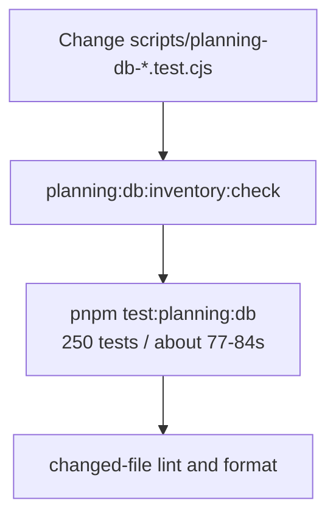
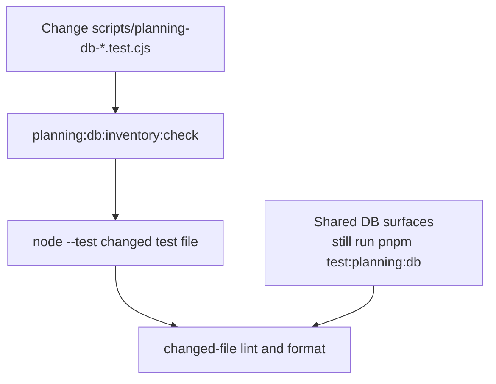

# Planning DB Test File Routing Closeout

## Think-First Analysis

- Problem summary: after splitting migration SQL routing, edits to planning DB
  test files such as `scripts/planning-db-surface-inventory-check.test.cjs`
  still escalated `verify:changed` to the full `pnpm test:planning:db` suite.
  The suite is valuable as a closeout control, but it is a poor first feedback
  loop for test-only changes because it runs 250 tests and repeatedly exercises
  heavy governance snapshot paths.
- Root cause: `hasPlanningDbFullSuiteChange` treated every
  `scripts/planning-db-*.test.cjs` and `scripts/governance-db-*.test.cjs` file
  as a full-suite trigger. The adjacent-test router already existed for the
  owning production scripts, but most DB test files were not registered as
  direct changed-file routes.
- Constraints and invariants: local changed-slice routing must keep
  `planning:db:inventory:check`, docs gates, feature-mechanization checks,
  changed-file lint/format, and forbidden-file checks. Broad DB implementation
  surfaces such as `infra/planning-db/`, `tools/planning-db/knowledge/`, and
  `tools/governance-db/` must remain conservative and can still use the full
  suite.
- Options considered:
  - Keep the full suite for all DB test-file edits. Rejected because it leaves
    the known 76-84 second loop in the most common AI edit path.
  - Add package scripts for every DB sub-suite. Rejected for now because the
    existing `node --test <file>` route is already explicit and avoids package
    script sprawl.
  - Register DB test files in the adjacent-test router and reserve
    `pnpm test:planning:db` for shared implementation surfaces. Selected
    because it removes duplicate semantics and keeps each test file accountable
    for its own changed-file feedback.
- Selected option and rationale: extend `PLANNING_WORKFLOW_SCRIPT_TESTS` so DB
  test files route to themselves, then remove the broad DB-test-file regex from
  full-suite routing. This keeps source and test-file edits on the same focused
  local path while preserving full-suite coverage for shared DB surfaces and
  final branch validation.
- Rejected alternatives: no new bypass, no skipped governance gates, no
  hidden `continue-on-error`, no weakening of `pnpm test:planning:db`.

## Current State

## Target State

## Pre-Implementation Brief

- Mode: Slim.
- Scope: local changed-slice validation routing for planning/governance DB test
  files, testing guide documentation, and closeout evidence.
- Touched files or paths:
  - `scripts/local-validation-plan.cjs`
  - `scripts/verify-changed.test.cjs`
  - `docs/guides/testing-and-ci-capabilities.md`
  - `docs/planning/closeouts/20260601-planning-db-test-file-routing-closeout.md`
- Expected outcome: changing a DB test file runs `planning:db:inventory:check`
  and the changed test file directly, without invoking
  `pnpm test:planning:db`.
- Risks and mitigations: shared DB surfaces could be under-tested if routed too
  narrowly; mitigation is to keep full-suite routing for shared DB implementation
  directories and retain final `pnpm verify:prepush` in closeout.
- Out-of-scope items: changing GitHub workflow branch protection, changing
  planning DB product command/query behavior, or replacing the full planning DB
  suite.
- Validation plan: red/green `node --test scripts/verify-changed.test.cjs`,
  targeted changed DB test file runs, `pnpm docs:sync`,
  `pnpm docs:feature-mechanization:implementation`, `pnpm governance:refresh`,
  and final `pnpm verify:prepush`.
- Test coverage plan: prove two negative routing cases: a changed planning DB
  test file and a changed governance DB test file must not include
  `pnpm test:planning:db`; shared DB surfaces remain covered by existing full
  suite tests.
- Libraries evaluated: none. This is repository validation routing, not a new
  implementation domain.
- Command/query rail impact: no product rail impact. The existing
  `ValidateCiScopeOptimizationContract` query rail owns CI routing behavior.
- Fowler planning impact: addresses shotgun validation fan-out and duplicate
  scope semantics between adjacent changed-file tests and the full DB suite.

## Closeout Evidence

### Implementation

- Registered planning/governance DB test files in
  `PLANNING_WORKFLOW_SCRIPT_TESTS` so changed test files run their exact
  `node --test <file>` command.
- Removed the broad DB-test-file regex from `hasPlanningDbFullSuiteChange`.
- Kept full-suite routing for shared DB implementation surfaces:
  `infra/planning-db/`, `tools/planning-db/knowledge/`, and
  `tools/governance-db/`.
- Updated the Testing and CI Capabilities guide with the focused test-file
  routing rule.

### Validation

- `node --test scripts/verify-changed.test.cjs`
  - First run failed as expected: changed DB test-file plans did not include the
    adjacent `node --test` command.
  - Final targeted run passed, 14/14 tests.
- `node --test scripts/planning-db-surface-inventory-check.test.cjs` passed,
  4/4 tests, `duration_ms` 212.073.
- `node --test scripts/governance-db-import.test.cjs` passed, 2/2 tests,
  `duration_ms` 213.4076.
- Router proof:
  - `scripts/planning-db-surface-inventory-check.test.cjs` plans
    `node --test scripts/planning-db-surface-inventory-check.test.cjs` and not
    `pnpm test:planning:db`.
  - `scripts/governance-db-import.test.cjs` plans
    `node --test scripts/governance-db-import.test.cjs` and not
    `pnpm test:planning:db`.
  - Shared `tools/governance-db/**` and `tools/planning-db/knowledge/**`
    changes still plan `pnpm test:planning:db`.
- `node --test scripts/verify-changed.test.cjs scripts/planning-db-surface-inventory-check.test.cjs scripts/governance-db-import.test.cjs`
  passed, 20/20 tests.
- `pnpm docs:sync` passed.
- `pnpm docs:feature-mechanization:implementation` passed, 169 manifests
  checked.
- `pnpm governance:refresh` passed: generated surfaces stabilized after two
  passes, planning DB check/export passed, `governance:db:import` imported
  5217 governance files and 58 components, `governance:db:check` passed, and
  `governance:db:export:check` passed.

### No-Debt / No-Stub Evidence

- No validation command, hook, or governance check was removed or relaxed.
- No stub, placeholder, fake success path, TODO, or debt entry was added.
- No product command/query rail changed; this is local validation routing only.
