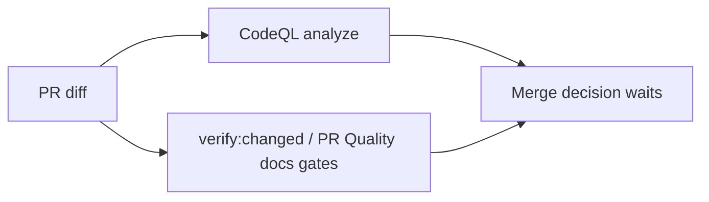
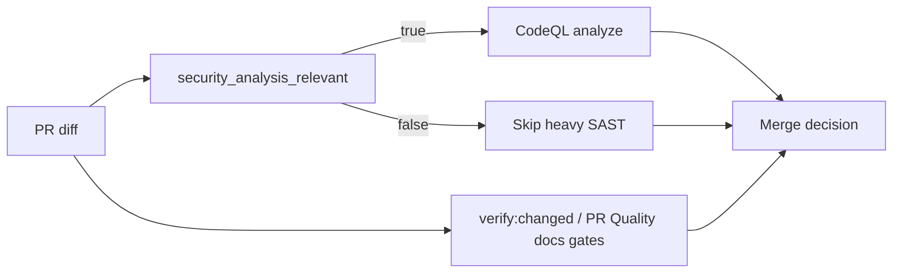

# CI Security Analysis Scope Closeout

## Think-First Analysis

- Problem summary: a one-file `buzon/**` Markdown PR waited on the full remote
  CodeQL JavaScript/TypeScript analysis even though the diff had no executable
  code, dependency manifest, workflow action, or security configuration surface.
- Root cause: repository-owned CI/test/quality workflows already route by
  changed scope, but the GHAS-backed security workflows still treated every
  reviewable PR as equally analysis-relevant. That created a remote-only
  duplicate gate for docs-only or analysis-only slices while local
  `verify:changed` and PR Quality docs gates already covered the actual diff.
- Constraints and invariants: GitHub workflows remain authoritative merge
  gates; CodeQL must still run for code, dependency, workflow, action,
  script/tooling, and root configuration changes; `push` to `main`, scheduled,
  and manual CodeQL runs remain full posture; public/GHAS availability and draft
  guards stay intact; branch protection must not depend on a workflow being
  entirely skipped by `paths-ignore`.
- Options considered:
  - Keep current behavior: rejected because docs-only PR latency remains
    dominated by a security scan with no analyzable diff.
  - Use workflow-level `paths-ignore`: rejected because required checks can be
    left absent or pending depending on repository branch-protection settings.
  - Add a lightweight PR security-scope detector before CodeQL: selected
    because it preserves an auditable workflow result, fails closed for
    executable/security-sensitive surfaces, and skips only the heavy analysis
    job for non-executable docs and mailbox analysis.
- Selected option and rationale: extend the existing workflow scope rail with a
  `security_analysis_relevant` read model and make CodeQL analysis depend on
  that output for pull requests. This keeps the rule in the repo-owned scope
  policy instead of scattering path logic in YAML.

## Current State

## Target State

## Fowler Opportunity Matrix

| Scenario                            | Opportunity                         | Fowler signal                         | DDD owner                  | Rail                           | Surfaces                                              | Tests                                       | Out of scope                |
| ----------------------------------- | ----------------------------------- | ------------------------------------- | -------------------------- | ------------------------------ | ----------------------------------------------------- | ------------------------------------------- | --------------------------- |
| Docs/mailbox-only PR waits on SAST  | Remove remote-only duplicate work   | Duplicate Work / Over-eager Resource  | Repository CI scope policy | `EmitWorkflowCapabilityScopes` | `.github/workflows/codeql.yml`, workflow scope policy | Workflow scope and parity tests             | Removing docs quality gates |
| Code or dependency PR changes scope | Keep security coverage fail-closed  | Hidden Coverage Gap                   | Repository CI scope policy | `EmitWorkflowCapabilityScopes` | `tools/ci/scope-config.mjs`, workflow scope policy    | `tools/ci/emit-scope.test.mjs`              | Replacing CodeQL            |
| Required-check posture varies       | Keep workflow present and auditable | Primitive Obsession / YAML scattering | Repository CI scope policy | `EmitWorkflowCapabilityScopes` | `codeql.yml` detector job instead of `paths-ignore`   | `tools/ci/workflow-pattern-parity.test.mjs` | Branch protection           |

## Pre-Implementation Brief

- Mode: Slim.
- Scope: add security-analysis scope classification and wire CodeQL heavy
  analysis to that scope for pull requests.
- Touched paths: `.github/workflows/codeql.yml`,
  `tools/ci/policy/workflow-scope.json`, `tools/ci/scope-config.mjs`,
  `tools/ci/validate-policy.js`, `tools/ci/emit-scope.test.mjs`,
  `tools/ci/workflow-scope-classification.test.mjs`,
  `tools/ci/workflow-pattern-parity.test.mjs`,
  `docs/guides/testing-and-ci-capabilities.md`, and this closeout.
- Expected outcome: docs-only and `buzon/**` PRs avoid the two-minute CodeQL
  analysis job; code and security-sensitive PRs keep CodeQL coverage.
- Risks and mitigations: scope drift is mitigated through workflow pattern and
  scope classification tests; workflow-level `paths-ignore` is avoided so the
  workflow can still report an auditable status.
- Out of scope: changing Dependency Review, branch protection settings, or
  reducing package/test coverage for code changes.

## Validation Plan

- `node --test tools/ci/emit-scope.test.mjs tools/ci/workflow-scope-classification.test.mjs tools/ci/workflow-pattern-parity.test.mjs`
- `pnpm verify:changed`
- `pnpm docs:sync`
- `pnpm governance:refresh`
- `pnpm verify:prepush`

## No-Debt And No-Stub Evidence

- No CodeQL coverage is removed for code, dependency, workflow, action, script,
  tooling, or root configuration diffs.
- No hook or validation shortcut is required.
- No placeholder, TODO, fake success path, or new debt item is introduced.
