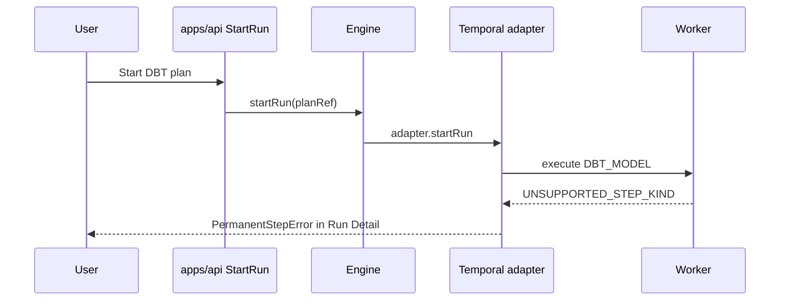
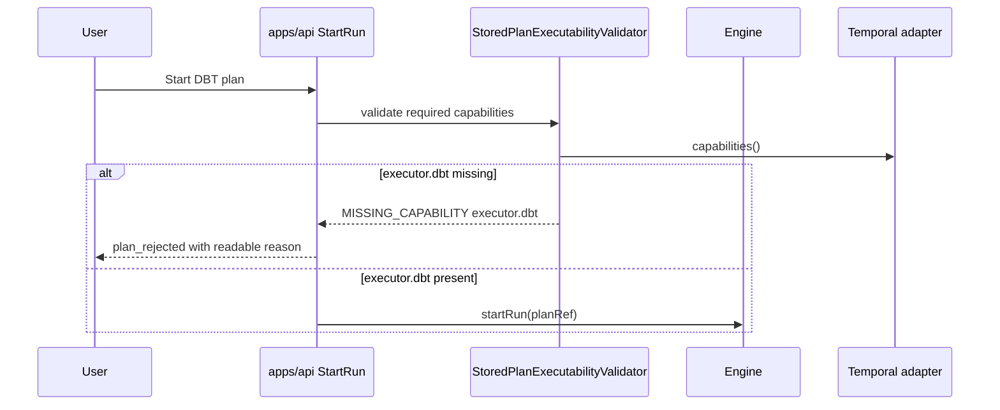

# DBT Step Capability Admission Closeout

**Plan-driven. Outcome-agnostic.**

## Think-First Analysis

### Problem Summary

The user reported a failed run where `dbt-model-2` reached Temporal execution
and failed with:

```text
UNSUPPORTED_STEP_KIND:DBT_MODEL:dbt-model-2
```

The failure appears in Run Detail as a `PermanentStepError`. That is too late
for the product workflow: the user already started a run and receives a worker
diagnostic rather than an admission/readiness explanation.

### Root Cause

DBT support is intentionally optional at the worker profile boundary. The
worker registers DBT step activities only when `DVT_TEMPORAL_DBT_ENABLED=true`.
The contract step registry, however, treats `DBT_MODEL`, `DBT_TEST`, and
`DBT_SNAPSHOT` as default steps with no runtime capability requirement. The API
therefore validates and dispatches a DBT plan even when the Temporal adapter
does not advertise DBT executor support.

### Constraints And Invariants

- `StartRun` is the governing command rail.
- ADR-0057 keeps routing capability-owned and states that routing to a queue
  without the matching activity must fail closed.
- `@dvt/adapter-temporal` must remain plugin-agnostic and must not import
  concrete DBT plugin symbols.
- DBT support remains optional and is absent when
  `DVT_TEMPORAL_DBT_ENABLED=false`.
- Missing DBT executor support must be surfaced as `MISSING_CAPABILITY`.
- The planning DB creation-intent check returned recovery mode, so this slice
  records the reuse of `StartRun` without adding a parallel rail.

### Options Considered

| Option                                                                     | Result   | Rationale                                                                               |
| -------------------------------------------------------------------------- | -------- | --------------------------------------------------------------------------------------- |
| Require `executor.dbt` for DBT step kinds and expose it only when enabled. | Selected | Moves the decision to the canonical execution profile and provider capability boundary. |
| Add DBT activity registration to default worker runtime.                   | Rejected | Reintroduces DBT coupling into the core worker profile.                                 |
| Add only better Run Detail text for `UNSUPPORTED_STEP_KIND`.               | Rejected | Leaves a run accepted when it should be rejected before dispatch.                       |
| Add a DBT-specific API pre-check.                                          | Rejected | Duplicates capability semantics outside the registry/adapter policy.                    |

### Selected Option

Use the existing contract executability mechanism:

1. DBT step kinds require `executor.dbt`.
2. Temporal adapter capabilities include `executor.dbt` only when the API
   runtime profile is configured with DBT support.
3. Engine missing-capability errors map back to canonical `plan_rejected`
   responses.
4. The dev stack propagates the DBT runtime flag consistently to API and worker.

## Fowler Planning Matrix

| Scenario                                            | Opportunity         | Fowler pattern                  | DDD owner                  | Command/query rail | Implementation surfaces          | Unit or package test     | Architecture test                | User-flow test                 | Out of scope                 |
| --------------------------------------------------- | ------------------- | ------------------------------- | -------------------------- | ------------------ | -------------------------------- | ------------------------ | -------------------------------- | ------------------------------ | ---------------------------- |
| DBT plan starts against a non-DBT Temporal runtime. | Hidden authority    | Policy plus explicit capability | Start-run admission policy | `StartRun`         | contracts, API, adapter Temporal | contracts/API tests      | DBT decoupling architecture test | Existing Run Detail reproducer | DBT CLI execution behavior   |
| DBT runtime flag is enabled.                        | Primitive obsession | Capability value object         | Temporal provider adapter  | `StartRun`         | API env and provider factory     | API env/factory tests    | feature mechanization guard      | Later live demo slice          | Worker deployment automation |
| Engine throws missing capability.                   | Duplicate semantics | Gateway mapper                  | Start-run engine bridge    | `StartRun`         | API bridge                       | engine bridge error test | start-run component docs         | Later readiness UI slice       | New command rail             |

## Current And Target Flow





## Pre-Implementation Brief

- mode: `Full`
- scope:
  - contracts step execution profile
  - planner capability aggregation tests
  - Temporal adapter capability declaration
  - API environment/provider composition and engine error mapping
  - dev stack DBT flag propagation
  - docs, ARC evidence, and risk surfaces
- expected outcome: a DBT plan cannot be dispatched to a runtime that does not
  declare `executor.dbt`; when DBT is enabled, the adapter can declare that
  capability without importing the DBT plugin.
- risks and mitigations:
  - risk: static adapter capability docs drift from dynamic runtime posture;
    mitigation: document dynamic plugin capability in the start-run and worker
    guides.
  - risk: DBT capability constant leaks into the Temporal core adapter;
    mitigation: use string capability at config/composition boundary and keep
    concrete DBT imports out of adapter Temporal.
  - risk: rejection appears as generic error;
    mitigation: add bridge mapping test for `CapabilitiesNotSupportedError`.
- out-of-scope items:
  - DBT sandboxing and CLI execution internals.
  - Frontend readiness panel changes.
  - Worker deployment automation.
  - A new command or query rail.
- validation plan:
  - `pnpm docs:feature-mechanization -- --feature DBT-STEP-CAPABILITY-ADMISSION-20260603`
  - targeted contract, planner, API, adapter, and dev stack tests
  - ARC check and docs sync when required
  - `pnpm verify:prepush`
- test coverage plan:
  - negative test for DBT step profile requiring `executor.dbt`
  - planner aggregation test for DBT required capability
  - API env/factory test for DBT capability posture
  - engine bridge test for missing capability mapping
  - adapter capability test for static plus additional capabilities
- libraries evaluated: none; this is contract and admission policy alignment
  over existing package boundaries.

## Validation Evidence

### Red Results

- `pnpm --filter @dvt/contracts test -- test/step-registry.test.ts`
  - Failed as expected because DBT steps did not require `executor.dbt`.
- `pnpm --filter @dvt/planner test -- test/unit/step-registry-integration.test.ts`
  - Failed as expected because default DBT plans did not project required
    capabilities into `executionPolicy`.
- `pnpm --filter dvt-api test -- test/application/services/engineStartRunUseCase.errorMapping.test.ts test/modules/providerAdapters/createTemporalProviderAdapterFactory.test.ts test/plugins/env.test.ts`
  - Failed as expected because API env did not parse `DVT_TEMPORAL_DBT_ENABLED`,
    provider factory did not declare DBT capabilities, and the engine bridge
    rethrew `CapabilitiesNotSupportedError`.
- `pnpm --filter @dvt/adapter-temporal test -- test/TemporalAdapter.startRun.test.ts`
  - Failed as expected because `TemporalAdapter.capabilities()` ignored
    runtime-declared plugin capabilities.
- `node scripts/run-dev-stack.test.cjs`
  - Passed before implementation; the dev stack already preserved
    `DVT_TEMPORAL_DBT_ENABLED` through `buildApiEnv`, so no additional script
    implementation was required.

### Green Results

- `pnpm --filter @dvt/contracts test -- test/step-registry.test.ts`
  - Passed: 1 file, 18 tests.
- `pnpm --filter @dvt/planner test -- test/unit/step-registry-integration.test.ts`
  - Passed: 1 file, 11 tests.
- `pnpm --filter @dvt/adapter-temporal test -- test/TemporalAdapter.startRun.test.ts`
  - Passed: 29 files, 244 tests.
- `pnpm --filter dvt-api test -- test/application/services/engineStartRunUseCase.errorMapping.test.ts test/modules/providerAdapters/createTemporalProviderAdapterFactory.test.ts test/plugins/env.test.ts`
  - Passed: 3 files, 17 tests.
- `pnpm --filter dvt-api test -- test/application/services/StoredPlanExecutabilityValidator.test.ts`
  - Passed: 1 file, 10 tests.
- `pnpm --filter dvt-api typecheck`
  - Passed: API source and test TypeScript projects compiled with `--noEmit`.
- `pnpm --filter dvt-api test`
  - Passed: 140 files, 697 tests; 1 integration file and 19 tests skipped by
    its configured integration guard.
- `pnpm --filter dvt-api lint`
  - Passed with `--max-warnings 0`.
- `pnpm docs:feature-mechanization -- --feature DBT-STEP-CAPABILITY-ADMISSION-20260603`
  - Passed.
- `pnpm docs:feature-mechanization:implementation -- --feature DBT-STEP-CAPABILITY-ADMISSION-20260603`
  - Passed after declaring the API executability and observability test
    surfaces that were touched by the final contract alignment.

## Implementation Summary

- Added `executor.dbt` as the required capability for built-in DBT step kinds.
- Preserved planner capability aggregation so persisted DBT plans carry the
  capability requirement into start-run validation.
- Added `TemporalAdapterDeps.additionalCapabilities` so runtime composition can
  declare plugin executor capabilities without importing plugin packages into
  the core adapter.
- Added API env parsing for `DVT_TEMPORAL_DBT_ENABLED`.
- Changed the Temporal provider adapter factory to declare `executor.dbt` only
  when the API runtime profile enables DBT.
- Mapped engine `CapabilitiesNotSupportedError` into `plan_rejected` with
  `MISSING_CAPABILITY` and the missing capability as `cause`.
- Aligned stored-plan executability fixtures so DBT-backed plans declare
  `executor.dbt` when a test is asserting some other required capability.
- Updated component docs, capability schema, ARC evidence, and risk register.
