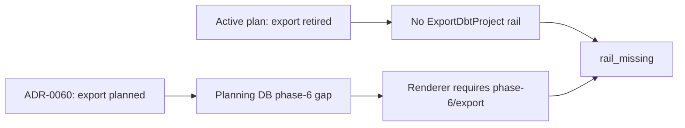
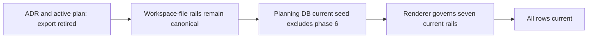

# ExportDbtProject capability retirement closeout

Issue: [#2745](https://github.com/dunay2/dvt/issues/2745)

## Think-First Analysis

### Problem summary

`pnpm governance:refresh` fails because the DBT round-trip capability renderer
still governs `phase-6/ExportDbtProject`, while the command/query catalog has no
such rail. The current DBT round-trip contract already declares that former
intent retired and uses the existing workspace-file rails.

### Root cause

The product decision was updated without retiring all of its governance
projections atomically. The active plan says `ExportDbtProject` is retired, but
ADR-0060 still lists it as planned, the Planning DB seed retains a phase-6 gap,
and the renderer and tests require that obsolete row. The fail-closed generator
therefore reports `rail_missing` correctly.

### Governing constraints and invariants

- `AGENTS.md` and command/query rail governance prohibit inventing a rail merely
  to satisfy a gate.
- ADR-0060 gives authoritative DBT projects one file-backed authoring authority
  and reuses workspace-file mutation rails.
- The active DBT round-trip plan explicitly retires `ExportDbtProject`.
- Planning DB owns current capability and rail posture. Its current-state seed
  must not preserve retired delivery history as a live capability gap.
- `ProjectDbtRoundtripCapabilityStatus` remains the sole query for this
  governance read model.
- No API, web, package, adapter, or product runtime behavior is in scope.

### Current state

### Options considered

1. Restore `ExportDbtProject` as a new command. Rejected because no distinct
   product mutation or application port exists; workspace-file commands already
   own the behavior.
2. Keep the retired phase-6 row and weaken validation for absent rails. Rejected
   because it would mix historical intent into a current-state projection and
   silently relax a fail-closed gate.
3. Remove phase 6 from the current governed capability set and reconcile
   ADR-0060, the seed, renderer, and focused tests. Selected because it preserves
   one command vocabulary and one current-state authority.

No external library is relevant; this is reconciliation of repository-owned
governance data and validation.

### Target state and rationale

### Fowler opportunity matrix

| Scenario                                     | Opportunity                           | Pattern                                         | DDD owner                                        | Rail                                                           | Allowed surfaces                                                                             | Required proof                                                                                   |
| -------------------------------------------- | ------------------------------------- | ----------------------------------------------- | ------------------------------------------------ | -------------------------------------------------------------- | -------------------------------------------------------------------------------------------- | ------------------------------------------------------------------------------------------------ |
| Retired export remains a live capability gap | Hidden authority and duplicated truth | Single Source of Truth; fail-closed query model | DBT project workspace / Architecture Planning DB | Reuse `ProjectDbtRoundtripCapabilityStatus`; no export command | ADR-0060, mandatory round-trip plan, Planning DB capability seed, renderer and focused tests | Red test rejects phase 6; query returns seven current rows; generator, refresh and pre-push pass |

## Pre-Implementation Brief

- **Mode:** Slim governance bug fix; no new API, artifact type, or external
  product behavior.
- **Scope:** Complete the accepted retirement of `ExportDbtProject` across the
  normative ADR and current DBT round-trip capability projection.
- **Touched paths:** ADR-0060, the mandatory DBT round-trip proposal, Planning DB
  capability state, the status renderer, focused generator/query tests, derived
  documentation indexes/manifests, and this closeout.
- **Expected outcome:** The capability query contains only the seven current
  phase 2-4 rails and `governance:refresh` no longer fails on a retired export
  intent.
- **Risks:** Removing legitimate evidence or accidentally weakening detection of
  unexpected rows.
- **Mitigations:** Remove only the explicitly retired phase-6 seed/key; retain
  exact-set validation and add negative proof that a reintroduced phase-6 row is
  rejected as unexpected.
- **Out of scope:** New export UI/API behavior, DBT project serialization,
  workspace-file semantics, and changes to runtime packages.
- **Libraries evaluated:** None; no custom implementation is introduced.
- **Command/query rail impact:** `ExportDbtProject` remains retired and absent.
  `ProjectDbtRoundtripCapabilityStatus` is reused unchanged. Workspace file
  round-trip continues through `SaveWorkspaceFileContent` and
  `GetWorkspaceFileContent`.
- **Validation plan:** focused Node tests, Planning DB import/query, capability
  generation/check, feature mechanization, docs sync, governance refresh, and
  `pnpm verify:prepush`.

## Implementation Evidence

- ADR-0060 now declares `ExportDbtProject` retired and binds file-backed reads
  and writes to the existing workspace-file rails.
- Removed the obsolete phase-6 capability and evidence row from
  `tools/planning-db/state/dbt-project-roundtrip-capabilities.json`.
- Removed `phase-6/ExportDbtProject` from the renderer's exact governed key set.
- Updated focused catalog and renderer tests to expect seven current rails.
- Added negative proof that a reintroduced phase-6 export row is rejected as an
  unexpected governed capability.
- No product command, route, port, adapter, or runtime behavior was introduced.

## Validation Evidence

- Red: the two focused suites reported `8` passing and `7` failing tests after
  expectations were changed first. Failures were the obsolete required phase-6
  key, the retained seed row, and acceptance of the retired export row.
- Green: `node --test
scripts/generate-dbt-project-roundtrip-capability-status.test.cjs
scripts/planning-db-dbt-roundtrip-capability-status.test.cjs
scripts/planning-db-query-tests/dbt-roundtrip-capabilities.test.cjs` passed
  all `21` tests.
- `node --test
scripts/planning-db-dbt-roundtrip-capability-mechanization.test.cjs` passed.
- `pnpm planning:db:import` passed with the corrected current-state seed.
- `pnpm planning:db:query dbt-roundtrip-capabilities --limit 20` returned seven
  phase 2-4 rows, all with projection state `current`, and no phase 6 row.
- `pnpm docs:dbt-roundtrip-capabilities:generate` passed.
- `pnpm docs:dbt-roundtrip-capabilities:check` passed.
- `pnpm docs:feature-mechanization:implementation` passed across `187` Planning
  DB manifests.
- `pnpm governance:refresh` and final `pnpm verify:prepush` remain.

## Closeout Evidence

- **Governing sources:** governance inventory, command/query rail governance,
  ADR-0060, the active DBT round-trip plan, Planning DB capability query, and
  GitHub Issue #2745.
- **Real work performed:** normative ADR, mandatory proposal, Planning DB
  current capability seed, governed status renderer, focused tests, and this
  closeout.
- **No-debt evidence:** no debt or rule relaxation is approved for this slice.
- **No-stub evidence:** no stub, placeholder, fake rail, or unfinished runtime
  branch is permitted.
- **Final status:** implementation and focal validation are complete; governance
  refresh and the final pre-push gate remain.
