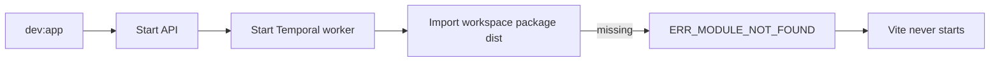
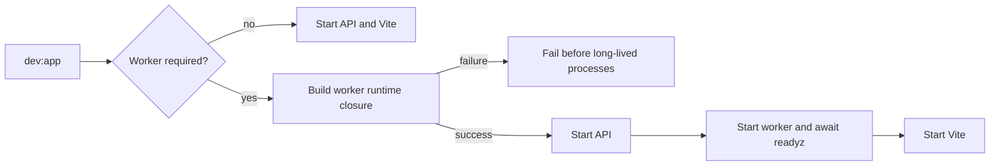

# Closeout: Dev-stack worker runtime build

Issue: [#2746](https://github.com/dunay2/dvt/issues/2746)

## Think-First Analysis

### Problem summary

On a clean checkout, `pnpm dev:app` starts PostgreSQL, local authentication,
Temporal, and the API, then fails before Vite starts. The Temporal worker imports
workspace packages whose `dist` output does not exist; the observed first failure
is `@dvt/temporal-http-json-plugin/dist/index.js` with
`ERR_MODULE_NOT_FOUND`.

### Root cause

`scripts/run-dev-stack.cjs` starts the worker with
`pnpm --filter dvt-temporal-worker dev`, but the coordinated stack does not
prepare the worker's runtime workspace closure first. Dependencies introduced
after the original bootstrap therefore rely on stale build output left by prior
developer activity.

This contradicts ADR-0001's explicit build-precondition rule and makes startup
dependent on machine history.

### Governing constraints and invariants

- `AGENTS.md`: diagnose root causes, keep docs/code/tests aligned, and do not
  present partial wiring as complete.
- ADR-0001: runtime dependencies require an explicit build precondition; the
  caller must not rely on implicit package lifecycle hooks.
- `docs/runbooks/backend-mvp-control-plane-runbook-20260329.md`: `dev:app` owns
  the canonical local API, worker, and web bootstrap.
- `scripts/build-workspace-runtime-deps.cjs`: owns workspace runtime-closure
  discovery and build ordering; this slice must reuse it.
- Protected-runtime readiness remains fail-closed: Vite must not be presented
  as a ready full stack until the required Temporal worker is ready.
- This is operational bootstrap behavior. No product command/query rail is
  added, renamed, or changed.

### Current state

### Options considered

1. Add only an implicit `predev` hook to `dvt-temporal-worker`.
   Rejected because ADR-0001 requires the coordinating caller to own explicit
   runtime preparation.
2. Start Vite before the worker or treat worker readiness as optional.
   Rejected because that would create a fake-success local stack.
3. Explicitly prepare the worker runtime closure in `run-dev-stack.cjs` before
   starting long-lived processes.
   Selected because it reuses the canonical closure helper, fails before
   exposing a partial stack, and makes clean-checkout startup deterministic.

### Target state and rationale

### Fowler opportunity matrix

| Scenario                                | Opportunity                             | Pattern               | DDD owner                 | Rail                                       | Allowed implementation surfaces                              | Required proof                                                     |
| --------------------------------------- | --------------------------------------- | --------------------- | ------------------------- | ------------------------------------------ | ------------------------------------------------------------ | ------------------------------------------------------------------ |
| Worker imports unbuilt workspace output | Hidden dependency and temporal coupling | Explicit precondition | Local dev-stack bootstrap | Operational; no product command/query rail | `scripts/run-dev-stack.cjs`, adjacent test, operational docs | build ordering, skip path, failure path, clean-start browser proof |

## Pre-Implementation Brief

- **Mode:** Slim bug fix.
- **Scope:** Explicitly build the Temporal worker runtime dependency closure
  when the coordinated protected-runtime stack requires the worker.
- **Touched paths:** `scripts/run-dev-stack.cjs`,
  `scripts/run-dev-stack.test.cjs`, `scripts/README.md`, the backend MVP
  runbook, and this closeout.
- **Expected outcome:** A clean dependency installation followed by
  `pnpm dev:app` reaches API, worker, and web readiness without a manual build.
- **Risks:** Longer first startup and accidental runtime builds in degraded
  mode.
- **Mitigations:** Use the existing closure helper, build once before process
  startup, and cover both worker-required and worker-absent paths.
- **Out of scope:** Product endpoints, Temporal workflow semantics, Canvas UI
  behavior, and the separate `/version` documentation drift.
- **Libraries evaluated:** None; the repository already has the required
  runtime-closure builder.
- **Command/query rail impact:** None. This change affects only the operational
  launcher.
- **Test plan:** First add red unit proofs for required/skip/failure behavior,
  then run the adjacent Node test, script/CI validation, clean startup, browser
  verification, governance refresh, and pre-push gate.

## Implementation Evidence

Pending implementation.

## Validation Evidence

Pending implementation.

## Closeout Evidence

Pending implementation.
