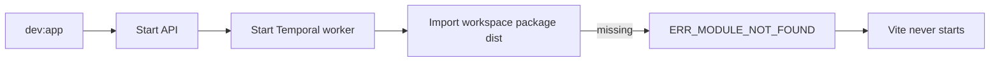
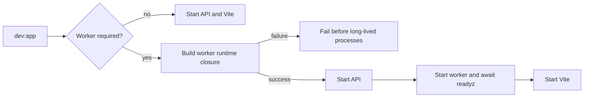

# Closeout: Dev-stack worker runtime build

Issue: [#2746](https://github.com/dunay2/dvt/issues/2746)

## Think-First Analysis

### Problem summary

On a clean checkout, `pnpm dev:app` starts PostgreSQL, local authentication,
Temporal, and the API, then fails before Vite starts. The Temporal worker imports
workspace packages whose `dist` output does not exist; the observed first failure
is `@dvt/temporal-http-json-plugin/dist/index.js` with
`ERR_MODULE_NOT_FOUND`.

### Root cause

`scripts/run-dev-stack.cjs` starts the worker with
`pnpm --filter dvt-temporal-worker dev`, but the coordinated stack does not
prepare the worker's runtime workspace closure first. Dependencies introduced
after the original bootstrap therefore rely on stale build output left by prior
developer activity.

This contradicts ADR-0001's explicit build-precondition rule and makes startup
dependent on machine history.

### Governing constraints and invariants

- `AGENTS.md`: diagnose root causes, keep docs/code/tests aligned, and do not
  present partial wiring as complete.
- ADR-0001: runtime dependencies require an explicit build precondition; the
  caller must not rely on implicit package lifecycle hooks.
- `docs/runbooks/backend-mvp-control-plane-runbook-20260329.md`: `dev:app` owns
  the canonical local API, worker, and web bootstrap.
- `scripts/build-workspace-runtime-deps.cjs`: owns workspace runtime-closure
  discovery and build ordering; this slice must reuse it.
- Protected-runtime readiness remains fail-closed: Vite must not be presented
  as a ready full stack until the required Temporal worker is ready.
- This is operational bootstrap behavior. No product command/query rail is
  added, renamed, or changed.

### Current state

### Options considered

1. Add only an implicit `predev` hook to `dvt-temporal-worker`.
   Rejected because ADR-0001 requires the coordinating caller to own explicit
   runtime preparation.
2. Start Vite before the worker or treat worker readiness as optional.
   Rejected because that would create a fake-success local stack.
3. Explicitly prepare the worker runtime closure in `run-dev-stack.cjs` before
   starting long-lived processes.
   Selected because it reuses the canonical closure helper, fails before
   exposing a partial stack, and makes clean-checkout startup deterministic.

### Target state and rationale

### Fowler opportunity matrix

| Scenario                                | Opportunity                             | Pattern               | DDD owner                 | Rail                                       | Allowed implementation surfaces                              | Required proof                                                     |
| --------------------------------------- | --------------------------------------- | --------------------- | ------------------------- | ------------------------------------------ | ------------------------------------------------------------ | ------------------------------------------------------------------ |
| Worker imports unbuilt workspace output | Hidden dependency and temporal coupling | Explicit precondition | Local dev-stack bootstrap | Operational; no product command/query rail | `scripts/run-dev-stack.cjs`, adjacent test, operational docs | build ordering, skip path, failure path, clean-start browser proof |

## Pre-Implementation Brief

- **Mode:** Slim bug fix.
- **Scope:** Explicitly build the Temporal worker runtime dependency closure
  when the coordinated protected-runtime stack requires the worker.
- **Touched paths:** `scripts/run-dev-stack.cjs`,
  `scripts/run-dev-stack.test.cjs`, `scripts/README.md`, the backend MVP
  runbook, and this closeout.
- **Expected outcome:** A clean dependency installation followed by
  `pnpm dev:app` reaches API, worker, and web readiness without a manual build.
- **Risks:** Longer first startup and accidental runtime builds in degraded
  mode.
- **Mitigations:** Use the existing closure helper, build once before process
  startup, and cover both worker-required and worker-absent paths.
- **Out of scope:** Product endpoints, Temporal workflow semantics, Canvas UI
  behavior, and the separate `/version` documentation drift.
- **Libraries evaluated:** None; the repository already has the required
  runtime-closure builder.
- **Command/query rail impact:** None. This change affects only the operational
  launcher.
- **Test plan:** First add red unit proofs for required/skip/failure behavior,
  then run the adjacent Node test, script/CI validation, clean startup, browser
  verification, governance refresh, and pre-push gate.

## Implementation Evidence

- Added `prepareTemporalWorkerRuntimeDependencies()` to
  `scripts/run-dev-stack.cjs`.
- The precondition reuses `scripts/build-workspace-runtime-deps.cjs` for the
  `dvt-temporal-worker` runtime closure.
- The build runs only when protected-runtime posture requires the worker and
  runs before API, worker, or web processes are spawned.
- Non-zero build status is surfaced as an explicit startup error; no partial web
  success is presented.
- Added adjacent unit proofs for the required build, the worker-absent skip
  path, and build failure.

## Validation Evidence

- Red: `node --test scripts/run-dev-stack.test.cjs` failed only the three new
  tests because `prepareTemporalWorkerRuntimeDependencies` did not exist
  (`29` passed, `3` failed).
- Green: the same command passed all `32` tests after implementation.
- Clean-artifact proof: immediately before `pnpm dev:app`, all three worker
  plugin `dist/index.js` checks returned `False`. The wrapper emitted
  `Building Temporal worker runtime workspace dependencies` and built the
  closure without a manual build command.
- The first post-build startup attempt reached the API but encountered a `401`
  because orphaned API/worker/Vite processes from the previous worktree still
  owned ports `3000`, `9468`, and `5173`. After identifying those exact PIDs by
  command line and stopping only that prior stack, the same command completed.
- Live probes on the corrected stack: API `/healthz` `200`, API `/db/ready`
  `200`, worker `/readyz` `200` with state `running`, and web `/` `200`.
- Browser verification on `http://127.0.0.1:5173/`: meaningful Canvas content
  (`1001` text characters), no Vite/framework overlay, no captured console
  errors, and interactive graph nodes and controls present.
- `pnpm exec eslint scripts/run-dev-stack.cjs scripts/run-dev-stack.test.cjs`
  passed.
- `pnpm exec markdownlint-cli2` over the three touched Markdown files passed
  with `0` issues.
- `git diff --check` passed.
- The implementation commit ran the repository pre-commit hook successfully;
  lint-staged applied the canonical formatter and no hook was bypassed.
- `pnpm dev:app:test` passed from the committed implementation. It built the
  worker runtime closure, reached API, worker, and web readiness, emitted
  `Test-only mode complete, shutting down`, and exited with status `0`.
- After test-only shutdown, ports `3000`, `5173`, and `9468` were all free.
- The first `pnpm verify:prepush` run failed at
  `docs:feature-mechanization:implementation` because the pre-implementation
  route allowed the affected script but omitted the two new top-level symbols.
  This was a planning deviation, not a product failure. The canonical
  `E-CANVAS-WORKFLOW-E2E-USABILITY-20260601` manifest was corrected with both
  symbols and their owner, `StartRun` rail, Fowler signal, and unit proof.
- `pnpm docs:feature-mechanization -- --feature
E-CANVAS-WORKFLOW-E2E-USABILITY-20260601` passed, followed by the global
  `pnpm docs:feature-mechanization:implementation` check across `187` Planning
  DB manifests.
- `pnpm governance:refresh` converged all generated surfaces in two passes,
  indexed `6244` files, and then failed only at the inherited #2745 blocker:
  `DBT round-trip capability ExportDbtProject is rail_missing`. This slice does
  not touch DBT round-trip authority.
- `pnpm verify:prepush` remains for final closeout.

## Closeout Evidence

- **Governing sources:** `AGENTS.md`, ADR-0001,
  `docs/guides/ai-work-protocol.md`, the backend MVP runbook, and the canonical
  runtime-closure helper.
- **Real work performed:** coordinated launcher, adjacent Node tests, script
  reference, backend MVP runbook, and this closeout.
- **No-debt evidence:** no rule was relaxed, no hook was bypassed, and no
  separate runtime dependency graph was introduced.
- **No-stub evidence:** no placeholder, fake success path, TODO, or unfinished
  branch was added.
- **Final status:** implementation, committed formatting, test-only shutdown,
  and live browser proof are complete; the final pre-push gate remains, with
  governance refresh externally blocked by #2745 after successful convergence.
