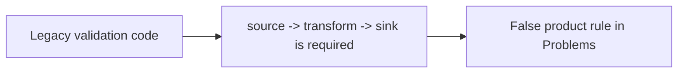
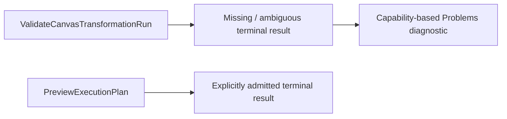

# Closeout: GH-2889 — describe Preview terminal results without a fixed topology

## Governing sources

- `AGENTS.md`
- `docs/planning/status/governance-document-rule-inventory.md`
- `docs/guides/ai-work-protocol.md`
- `docs/planning/state/github-mvp-issue-workflow.md`
- `docs/architecture/command-query-rail-governance.md`
- `docs/architecture/components/web/graph/graph-frontend-architecture.md`
- `docs/architecture/components/web/frontend-command-query-rail-inventory.md`
- `docs/planning/studies/planner-source-first-study-20260828.md`
- GitHub issues `#2524`, `#2784`, and `#2889`

Planning DB returned `reuse-existing-rail` for `ValidateCanvasTransformationRun` and a duplicate
warning for `PreviewExecutionPlan`. This slice changes their human-facing diagnostic projection;
it does not add another command, query, readiness model, or execution profile.

## Think-First analysis

- **Problem:** the Problems panel states that Preview universally requires a connected
  `source -> transform -> sink` path.
- **Root cause:** presentation copy exposes the legacy validator's currently admitted shape as a
  product invariant, although the canonical graph architecture names that shape as only one
  supported example.
- **Constraints and invariants:** Preview remains fail-closed; canonical Substrait plus the DVT
  sidecar remains semantic authority; terminal behavior depends on explicit result or
  materialization intent; source cards and relational operators do not become fake workloads;
  `ValidateCanvasTransformationRun` and `PreviewExecutionPlan` remain the only relevant rails.
- **Selected option:** describe missing or ambiguous terminal results without prescribing node
  kinds. Keep the current admission logic unchanged until its already-owned increments land.
- **Rejected alternatives:** changing only the screenshot's one Spanish sentence leaves the same
  false claim in other diagnostics and English; accepting every Source as executable would invent
  materialization; implementing terminal Transform here would duplicate `#2784`.
- **Fowler opportunity:** remove leaky abstraction and duplicate semantics by separating current
  validator capability from the product's heterogeneous graph model.

## Current and corrected projection

## Pre-Implementation brief

- **Mode:** Slim bug fix; no API, contract, runtime, or persistence change.
- **Scope:** transformation validation copy in both locales and behavioral copy coverage.
- **Expected outcome:** Problems never teaches a fixed three-card topology as the product model;
  incomplete and ambiguous selections remain explicit.
- **Risks and mitigation:** neutral wording must not imply unsupported execution. It refers only to
  an admitted terminal result and leaves validation fail-closed.
- **Out of scope:** implementing terminal Transform (`#2784`), Source consolidation/runtime,
  publication, workload lowering (`#2524`), or PostgreSQL materialization (`#2523`).
- **Libraries:** none evaluated; this is an existing read-model projection correction.
- **Validation:** focused red/green behavioral test, Web tests/typecheck/lint, visible-browser proof,
  governance refresh, final commit, and `pnpm verify:prepush`.

## Work performed

Pending implementation.

## Validation evidence

Pending implementation.

## Debt and stubs

Pending implementation. No debt or incomplete runtime behavior is authorized by this plan.
