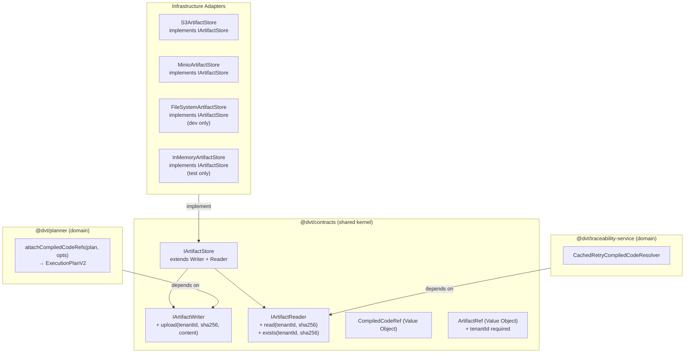

# DVT+ Artifact Store — Architectural Review & Implementation Spec

```
Status:          In Progress — Partially Implemented
Date:            2026-03-06
Completeness:    ~42%
Remaining effort: ~18 days
Review lens:     Fowler / DDD / Hexagonal / SOLID
```

---

## 1. Current State — What Exists in Code

### 1.1 Inventory

| Component                               | Package                     | File                                         | Status                         |
| --------------------------------------- | --------------------------- | -------------------------------------------- | ------------------------------ |
| `ICompiledCodeStorage` port             | `@dvt/planner`              | `src/ports/ICompiledCodeStorage.ts`          | ✅ exists — **wrong location** |
| `ICompiledCodeReader` port              | `@dvt/traceability-service` | `src/lineage/contracts.ts`                   | ✅ exists — **wrong location** |
| `ICompiledCodeResolver` port            | `@dvt/traceability-service` | `src/lineage/contracts.ts`                   | ✅ exists — **wrong location** |
| `S3CompiledCodeStorage` adapter         | `@dvt/planner`              | `src/compiledCode/adapters/S3...`            | ✅ write-only                  |
| `MinioCompiledCodeStorage` adapter      | `@dvt/planner`              | `src/compiledCode/adapters/Minio...`         | ✅ write-only                  |
| `FileSystemCompiledCodeStorage` adapter | `@dvt/planner`              | `src/compiledCode/adapters/FS...`            | ✅ write-only, dev only        |
| `InMemoryCompiledCodeStorage` adapter   | `@dvt/planner`              | `src/compiledCode/adapters/InMemory...`      | ✅ write-only, test only       |
| `NoopCompiledCodeStorage` adapter       | `@dvt/planner`              | `src/compiledCode/adapters/Noop...`          | ✅                             |
| `attachCompiledCodeRefs()`              | `@dvt/planner`              | `src/compiledCode/attachCompiledCodeRefs.ts` | ✅ solid                       |
| `CachedRetryCompiledCodeResolver`       | `@dvt/traceability-service` | `src/lineage/resolver/...`                   | ✅ solid                       |
| `CompositeCompiledCodeReader`           | `@dvt/traceability-service` | `src/lineage/readers/...`                    | ✅                             |
| `InMemoryCompiledCodeCache`             | `@dvt/traceability-service` | `src/lineage/cache/...`                      | ✅                             |
| `CompiledCodeRef` type                  | `@dvt/contracts`            | `src/engine/IRunStateStore.v1.ts`            | ✅ correct location            |
| `ArtifactRef` type                      | `@dvt/contracts`            | `src/types/artifacts.ts`                     | ⚠️ missing `tenantId`          |
| `IArtifactStore` formal port            | —                           | —                                            | ❌ does not exist              |
| Tenant isolation at port level          | —                           | —                                            | ❌ does not exist              |
| `get()` / retrieval method              | —                           | —                                            | ❌ does not exist              |
| SQL migration in `infra/db/migrations/` | —                           | —                                            | ❌ does not exist              |
| TTL / retention enforcement             | —                           | —                                            | ❌ does not exist              |

### 1.2 Exact current signatures

```typescript
// @dvt/planner/src/ports/ICompiledCodeStorage.ts
export interface ICompiledCodeStorage {
  upload(sha256: string, content: Buffer): Promise<string>;
}

// @dvt/traceability-service/src/lineage/contracts.ts
export interface ICompiledCodeReader {
  read(ref: CompiledCodeRef): Promise<CompiledCodeBlob>;
}
export interface ICompiledCodeResolver {
  resolve(ref: CompiledCodeRef): Promise<CompiledCodeBlob>;
}

// @dvt/contracts/src/types/artifacts.ts
export interface ArtifactRef {
  uri: string;
  kind: string; // open string — no enum
  sha256?: string; // optional
  sizeBytes?: number;
  expiresAt?: string;
  // tenantId: MISSING
}
```

---

## 2. Architectural Analysis (Fowler / DDD / Hexagonal / SOLID)

### 2.1 What is architecturally sound

**`attachCompiledCodeRefs()` — excellent domain function.**
Pure transformation: receives `ExecutionPlanV2`, returns `ExecutionPlanV2`. No side effects except storage upload (injected). Dedup cache, in-flight coalescing, fail-open with hook — all correct. This is a textbook _Extract Method_ applied well.

**`CachedRetryCompiledCodeResolver` — excellent SRP composition.**
Three concerns (cache lookup, retry, integrity validation) are each minimal and composed rather than tangled. `validateResolvedBlob` is isolated. Retry policy is injected. This is Fowler's _Introduce Parameter Object_ + _Decompose Conditional_ applied correctly.

**`CompiledCodeRef` — proper Value Object.**
Immutable, identity by `sha256`, carries `storageUri` + `sizeBytes` + `encoding`. Lives in `@dvt/contracts` (correct layer). No business logic embedded.

**`ICompiledCodeStorage` — proper write port.**
Single method, infrastructure-agnostic, idempotency contract documented. Correct Hexagonal intent.

---

### 2.2 Architectural violations

---

#### VIOLATION 1 — Port Location (Hexagonal Architecture)

**Severity: Critical**

`ICompiledCodeStorage` lives in `@dvt/planner/src/ports/`. `ICompiledCodeReader` and `ICompiledCodeResolver` live in `@dvt/traceability-service/src/lineage/`.

**Why this is wrong:**
In Hexagonal Architecture, ports belong to the _application core_ — the domain. They define what the domain _needs_. Adapters (infrastructure) implement those ports. When a port lives inside a feature package (`@dvt/planner`), any other package that needs to depend on the port must import `@dvt/planner`. This inverts the dependency rule: infrastructure ends up depending on a domain package that itself depends on planner internals.

```
Current (wrong):
  @dvt/planner (domain) owns ICompiledCodeStorage (port)
  @dvt/traceability-service (domain) owns ICompiledCodeReader (port)
  → Two packages each own half a port for the same storage concern

Correct:
  @dvt/contracts (shared kernel) owns IArtifactStore (unified port)
  @dvt/planner implements: write path, attaches refs
  @dvt/traceability-service implements: read path, resolves refs
  Both depend on @dvt/contracts — dependency points inward
```

**Fowler prescription:** _Move Interface to Shared Kernel_ — promote both port interfaces to `@dvt/contracts/src/ports/artifact-store.ts`.

---

#### VIOLATION 2 — Split Port (Interface Segregation + missing unification)

**Severity: High**

The write concern (`ICompiledCodeStorage`) and the read concern (`ICompiledCodeReader`) are completely disconnected interfaces in different packages with no common abstraction. This means:

- A new consumer needing both read and write must import from two packages
- The 5 write adapters (S3, MinIO, FS, InMemory, Noop) have **no corresponding read adapters** — the traceability service builds its own read infrastructure from scratch via `CompositeCompiledCodeReader`
- The same S3 configuration will need to be instantiated twice for write and read paths

**This is duplicated infrastructure** masked as separation of concerns.

**Fowler prescription:** _Extract Interface_ — define `IArtifactStore` with both read and write methods. Apply ISP: split into `IArtifactWriter` + `IArtifactReader` if consumers genuinely need only one side. Let adapters implement both (or delegate).

```typescript
// Target: @dvt/contracts/src/ports/IArtifactStore.ts

export interface IArtifactWriter {
  upload(tenantId: string, sha256: string, content: Buffer): Promise<ArtifactStorageUri>;
}

export interface IArtifactReader {
  read(tenantId: string, sha256: string): Promise<Buffer>;
  exists(tenantId: string, sha256: string): Promise<boolean>;
}

// Adapters implement both:
// S3ArtifactStore implements IArtifactWriter, IArtifactReader
```

---

#### VIOLATION 3 — Missing Tenant Isolation (DDD Bounded Context / Multi-tenancy)

**Severity: Critical**

`ICompiledCodeStorage.upload(sha256, content)` — no `tenantId`.

All 5 adapters write to a **shared namespace**:

- S3: `Key = sha256` — one tenant can read another tenant's compiled SQL if they know the hash
- InMemory: single `Map<string, Buffer>` — no tenant boundary at all

In a multi-tenant system, content-addressing alone does not provide tenant isolation. Two tenants CAN have the same SQL (same model, same logic) — identical hash but different tenants. With shared namespace, tenant A's artifact IS tenant B's artifact. This creates:

1. Cross-tenant data leakage at storage layer
2. Incorrect retention: deleting tenant A's artifacts deletes tenant B's shared content
3. No tenant-scoped billing / quota enforcement

**Fowler prescription:** _Introduce Parameter Object_ — add `tenantId` to the port signature. Each adapter enforces tenant prefix:

```typescript
// S3: Key = `tenants/${tenantId}/${sha256}`
// InMemory: key = `${tenantId}:${sha256}`
// FS: path = `${dir}/tenants/${tenantId}/${sha256}`
```

---

#### VIOLATION 4 — Side Effect in Domain Function (SRP / Pure Function)

**Severity: Medium**

In `attachCompiledCodeRefs.ts`:

```typescript
function metricUploadFailure(stepId: string, error: unknown): void {
  console.warn('dvt.planner.compiled_code_upload_failed_total', { stepId, message });
}
```

A domain function (`attachCompiledCodeRefs`) emits observability via `console.warn`. This:

- Couples the planner domain to `console` (an I/O side effect)
- Cannot be tested or suppressed in unit tests without mocking globals
- Bypasses the `IObservability` port that exists for exactly this purpose

The domain already has `IObservability` — use it. The `onUploadFailure` hook is correctly injected, but the default fallback logs directly.

**Fowler prescription:** _Replace Magic Literal with Symbol_ / _Introduce Null Object_ — inject an `IObservability` default that is a no-op, or remove the default and make the hook required.

---

#### VIOLATION 5 — Exposed Internal State (Encapsulation)

**Severity: Low**

```typescript
// InMemoryCompiledCodeStorage
public readonly store: Map<string, Buffer>;
```

`store` is `public`. This is a test backdoor — it exists so tests can inspect what was uploaded. But it breaks encapsulation and signals that the adapter needs a proper test API.

**Fowler prescription:** _Introduce Query Method_ — add `getContent(sha256: string): Buffer | undefined` as an explicit test-support method, or expose a `has(sha256: string): boolean` method. Mark `store` as `private`.

---

#### VIOLATION 6 — `stepTypeConfig` is Untyped (Type Safety / Domain Model)

**Severity: Medium**

```typescript
return {
  ...step,
  stepTypeConfig: {
    ...(step.stepTypeConfig ?? {}),
    compiledCodeRef,
  },
};
```

`step.stepTypeConfig` is spread without a formal type. This means `compiledCodeRef` is attached to an `any`-like record — no schema enforcement, no compile-time guarantee that the final shape is valid. This is a gap in the domain model: `StepTypeConfig` should be a discriminated union per step kind.

**Fowler prescription:** _Replace Implicit with Explicit_ — model `StepTypeConfig` as a typed discriminated union:

```typescript
type StepTypeConfig =
  | { kind: 'DBT_MODEL'; compiledCodeRef?: CompiledCodeRef; modelPath: string }
  | { kind: 'DBT_TEST'; compiledCodeRef?: CompiledCodeRef; testName: string }
  | { kind: 'GATE'; condition: DslExpression };
```

---

#### VIOLATION 7 — No Formal `IArtifactStore` Domain Port (Hexagonal gap)

**Severity: High**

The architecture map explicitly marks `IArtifactStore port — ❌ port not formal`. The underlying implementations exist but there is no domain-level contract that the engine or planner can depend on through a stable interface. This means:

- The engine cannot formally declare "I need artifact storage" in its dependencies
- Swapping the storage backend (S3 → GCS) requires touching the planner package, not just adapters
- The hexagonal boundary is incomplete: the domain cannot be tested in isolation for the artifact concern

---

### 2.3 SOLID Evaluation

| Principle                     | Assessment                                                                                                                                                                                                                                               |
| ----------------------------- | -------------------------------------------------------------------------------------------------------------------------------------------------------------------------------------------------------------------------------------------------------- |
| **S** — Single Responsibility | ✅ `ICompiledCodeStorage`, `attachCompiledCodeRefs`, `CachedRetryCompiledCodeResolver` each have clear single responsibilities. ⚠️ `metricUploadFailure` is a SRP violation in the domain function.                                                      |
| **O** — Open/Closed           | ✅ New storage backends are added by implementing `ICompiledCodeStorage` — no existing code changes. Write path is open for extension. ❌ Read path is not open — there is no `IArtifactReader` port to extend without modifying traceability internals. |
| **L** — Liskov Substitution   | ✅ All 5 write adapters are interchangeable — idempotency contract is documented and expected by callers.                                                                                                                                                |
| **I** — Interface Segregation | ⚠️ Correctly separated write/read intents but split across wrong packages. A unified `IArtifactStore` that callers must fully implement would violate ISP — keep `IArtifactWriter` / `IArtifactReader` as segregated ports.                              |
| **D** — Dependency Inversion  | ❌ Port lives in `@dvt/planner` (high-level module), not in `@dvt/contracts` (abstraction layer). Dependency arrow points wrong direction.                                                                                                               |

---

## 3. What Must Be Built — Prioritized Implementation Plan

### P0 — Unblock correctness (before any multi-tenant use)

---

#### P0-1: Promote ports to `@dvt/contracts`

**Fowler pattern:** _Move Interface to Shared Kernel_

Create `packages/@dvt/contracts/src/ports/artifact-store.ts`:

```typescript
export type ArtifactStorageUri = string;

export interface IArtifactWriter {
  /**
   * Upload artifact. Returns canonical storageUri.
   * MUST be idempotent: same (tenantId, sha256) uploaded twice MUST NOT throw.
   */
  upload(tenantId: string, sha256: string, content: Buffer): Promise<ArtifactStorageUri>;
}

export interface IArtifactReader {
  /**
   * Retrieve artifact bytes by content hash.
   * Throws ArtifactNotFoundError if not present.
   */
  read(tenantId: string, sha256: string): Promise<Buffer>;

  /** Returns true if artifact exists for this tenant. */
  exists(tenantId: string, sha256: string): Promise<boolean>;
}

/** Combined port for adapters that implement both concerns. */
export interface IArtifactStore extends IArtifactWriter, IArtifactReader {}
```

Export from `@dvt/contracts/src/index.ts`.

**Effort:** 0.5 days
**Impact:** Fixes DI rule, enables symmetric read/write adapters, unblocks all downstream work.

---

#### P0-2: Add `tenantId` to `ICompiledCodeStorage` (or migrate to `IArtifactWriter`)

**Fowler pattern:** _Introduce Parameter Object_

If keeping `ICompiledCodeStorage` as a planner-specific alias:

```typescript
// @dvt/planner/src/ports/ICompiledCodeStorage.ts
export interface ICompiledCodeStorage {
  upload(tenantId: string, sha256: string, content: Buffer): Promise<string>;
}
```

Update all adapters:

```typescript
// S3CompiledCodeStorage
Key: `tenants/${tenantId}/${sha256}`;
return `s3://${this.bucket}/tenants/${tenantId}/${sha256}`;

// InMemoryCompiledCodeStorage
this.store.set(`${tenantId}:${sha256}`, content);
return `mem://${tenantId}/${sha256}`;
```

Update `attachCompiledCodeRefs` to accept and forward `tenantId`:

```typescript
export interface AttachCompiledCodeRefsOptions {
  tenantId: string; // ADD
  compiledCodeByNodeId: ReadonlyMap<string, string>;
  storage: ICompiledCodeStorage;
  uploadCache?: Map<string, string>;
  onUploadFailure?: (stepId: string, error: unknown) => void;
}
```

**Effort:** 2 days (interface + 5 adapters + attachCompiledCodeRefs + tests)
**Impact:** Closes critical multi-tenancy gap.

---

#### P0-3: Add `read()` / `exists()` to write adapters

**Fowler pattern:** _Extract Interface_ — grow adapters to implement `IArtifactReader`

```typescript
// S3CompiledCodeStorage (updated)
async read(tenantId: string, sha256: string): Promise<Buffer> {
  const { Body } = await this.client.send(new GetObjectCommand({
    Bucket: this.bucket,
    Key: `tenants/${tenantId}/${sha256}`,
  }));
  return Buffer.from(await Body.transformToByteArray());
}

async exists(tenantId: string, sha256: string): Promise<boolean> {
  try {
    await this.client.send(new HeadObjectCommand({
      Bucket: this.bucket,
      Key: `tenants/${tenantId}/${sha256}`,
    }));
    return true;
  } catch { return false; }
}
```

With `IArtifactReader` in adapters, the `CompositeCompiledCodeReader` in traceability-service can be replaced with an injected `IArtifactReader` — eliminating duplicated read infrastructure.

**Effort:** 2 days
**Impact:** Eliminates parallel read infrastructure duplication; enables `ICompiledCodeResolver` to use the same adapter.

---

### P1 — Domain model and migrations

---

#### P1-1: Fix `ArtifactRef` type — add `tenantId`, enforce `kind`

```typescript
// @dvt/contracts/src/types/artifacts.ts
export interface ArtifactRef {
  tenantId: string; // ADD — required for INV-ART-003
  uri: string;
  kind: ArtifactKind; // change from string to enum
  sha256?: string;
  sizeBytes?: number;
  expiresAt?: string;
}

export type ArtifactKind =
  | 'execution-plan'
  | 'compiled-sql'
  | 'dbt-manifest'
  | 'dbt-catalog'
  | 'dbt-run-results'
  | 'lineage';
```

Update `ArtifactRefSchema` in `schemas.ts` to use `z.enum([...])` for `kind` and add `tenantId: z.string().min(1)`.

**Effort:** 0.5 days

---

#### P1-2: Add SQL migration to production

Copy and extend the spec DDL to `infra/db/migrations/YYYY-MM-DD_artifact_store.sql`:

```sql
create table if not exists artifacts (
  tenant_id        text        not null,
  artifact_type    text        not null
    check (artifact_type in (
      'execution-plan','compiled-sql','dbt-manifest',
      'dbt-catalog','dbt-run-results','lineage'
    )),
  artifact_hash    text        not null
    check (artifact_hash ~ '^[0-9a-f]{64}$'),
  artifact_uri     text        not null
    check (length(artifact_uri) > 0),
  size_bytes       bigint      check (size_bytes >= 0),
  encoding         text        default 'utf-8',
  schema_version   text,
  created_at       timestamptz not null default now(),
  expires_at       timestamptz,
  primary key (tenant_id, artifact_hash)
);

create index if not exists idx_artifacts_tenant_type
  on artifacts (tenant_id, artifact_type);

create index if not exists idx_artifacts_expires_at
  on artifacts (expires_at) where expires_at is not null;
```

**Effort:** 1 day
**Note:** Table metadata layer is separate from blob storage (S3). Both are needed.

---

#### P1-3: Fix `console.warn` in domain function

**Fowler pattern:** _Introduce Null Object_ for `IObservability`

Remove `metricUploadFailure` default. Inject observability through `AttachCompiledCodeRefsOptions`:

```typescript
export interface AttachCompiledCodeRefsOptions {
  tenantId: string;
  compiledCodeByNodeId: ReadonlyMap<string, string>;
  storage: ICompiledCodeStorage;
  observability?: IObservability; // ADD — replaces console.warn default
  uploadCache?: Map<string, string>;
  onUploadFailure?: (stepId: string, error: unknown) => void;
}
```

**Effort:** 0.5 days

---

#### P1-4: Fix `InMemoryCompiledCodeStorage.store` visibility

**Fowler pattern:** _Introduce Query Method_

```typescript
private readonly store: Map<string, Buffer>;  // make private

// Test-support method
getContent(tenantId: string, sha256: string): Buffer | undefined {
  return this.store.get(`${tenantId}:${sha256}`);
}

has(tenantId: string, sha256: string): boolean {
  return this.store.has(`${tenantId}:${sha256}`);
}
```

**Effort:** 0.5 days

---

### P2 — Complete the hexagonal boundary

---

#### P2-1: `IArtifactStore` as formal domain port

After P0-1 and P0-3, create a formal `IArtifactStore` that the engine can declare as a dependency:

```typescript
// @dvt/contracts/src/ports/IArtifactStore.ts
export interface IArtifactStore extends IArtifactWriter, IArtifactReader {
  // Unified port — adapters implement both sides
}
```

Wire into `WorkflowEngine` constructor as optional dependency (engine only needs the read path for verifying `PlanRef` existence — write path belongs to planner). This closes the hexagonal gap identified in the architecture map.

**Effort:** 2 days

---

#### P2-2: `StepTypeConfig` discriminated union

**Fowler pattern:** _Replace Implicit with Explicit_

Define `StepTypeConfig` as a discriminated union keyed by `kind`. This makes `attachCompiledCodeRefs` type-safe:

```typescript
export type StepTypeConfig = DbtModelStepConfig | DbtTestStepConfig | GateStepConfig;

export interface DbtModelStepConfig {
  kind: 'DBT_MODEL';
  modelPath: string;
  compiledCodeRef?: CompiledCodeRef;
}
```

**Effort:** 2 days (type changes propagate through plan-interpreter and engine)

---

#### P2-3: `canonical artifact://` URI normalization (optional — future)

Define an `ArtifactUriBuilder` utility:

```typescript
// @dvt/contracts/src/ports/artifact-store.ts
export function buildArtifactUri(tenantId: string, kind: ArtifactKind, sha256: string): string {
  return `artifact://${tenantId}/${kind}/${sha256}`;
}
```

Migrate adapter URIs to use canonical format. Only needed if cross-adapter URI portability becomes a requirement.

**Effort:** 2 days

---

#### P2-4: TTL / retention job

Add a scheduled cleanup that enforces `expires_at`:

```sql
DELETE FROM artifacts WHERE expires_at < now();
```

Plus corresponding object storage cleanup via `IArtifactWriter.delete()` (extend the port). Default TTL: 90 days for compiled-sql, indefinite for execution-plan.

**Effort:** 3 days

---

## 4. Target Architecture (after all P0–P2 work)



**Dependency rule:** all arrows point toward `@dvt/contracts`. No domain package imports infrastructure.

---

## 5. Remaining Work Summary

| Item                                               | Priority | Fowler Pattern                    | Days         |
| -------------------------------------------------- | -------- | --------------------------------- | ------------ |
| Promote ports to `@dvt/contracts`                  | P0       | Move Interface to Shared Kernel   | 0.5          |
| `tenantId` in upload + all adapters                | P0       | Introduce Parameter Object        | 2            |
| `read()` / `exists()` on write adapters            | P0       | Extract Interface                 | 2            |
| `ArtifactRef.tenantId` + `ArtifactKind` enum       | P1       | Replace Magic Literal with Symbol | 0.5          |
| SQL migration in `infra/db/migrations/`            | P1       | —                                 | 1            |
| Remove `console.warn` from domain                  | P1       | Introduce Null Object             | 0.5          |
| Fix `InMemoryCompiledCodeStorage.store` visibility | P1       | Introduce Query Method            | 0.5          |
| `IArtifactStore` formal port wired to engine       | P2       | Extract Interface                 | 2            |
| `StepTypeConfig` discriminated union               | P2       | Replace Implicit with Explicit    | 2            |
| `artifact://` URI normalization                    | P2       | —                                 | 2            |
| TTL / retention job                                | P2       | —                                 | 3            |
| Tenant isolation tests + integration tests         | P1       | —                                 | 2            |
| **Total**                                          | -        | -                                 | **~18 days** |

---

## 6. Strengths — What to Keep

- `attachCompiledCodeRefs()` — pure domain transformation, excellent in-flight dedup, fail-open pattern. **Do not refactor the logic, only inject `tenantId` and observability.**
- `CachedRetryCompiledCodeResolver` — clean composition of cache, retry, integrity check. **Keep exactly as is; only replace `ICompiledCodeReader` dependency with `IArtifactReader`.**
- `CompiledCodeRef` as Value Object — correct location, correct fields, correct invariants. No change needed.
- 5 write adapters — correctly implement the port contract, correctly idempotent. Only change: add `tenantId` prefix and `read()` / `exists()` methods.
- `@dvt/canonical` — JCS + SHA-256 in shared kernel. Correct.

---

## 7. ADRs Pending

| ADR            | Title                                                                     | Blocks   |
| -------------- | ------------------------------------------------------------------------- | -------- |
| New            | `IArtifactStore` formal hexagonal port                                    | P0, P2-1 |
| New            | Artifact Retention Strategy (TTL, archival, deletion safety)              | P2-4     |
| Update ADR-030 | Supersede with P0 work and canonical URI                                  | P2-3     |
| ADR-0032       | Already accepted — only needs cross-reference to new `IArtifactStore` ADR | —        |
