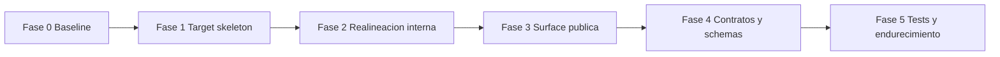

---

title: Engine Migration Plan: Current Gap to Target Blueprint v0.6
status: Draft
owner: docs
last_reviewed: 2026-03-04
planning_type: proposal

---

# Engine Migration Plan: Current Gap to Target Blueprint v0.6

## 1. Contexto

El estado actual de [`@dvt/engine`](packages/@dvt/engine/package.json:1) no sigue al 100% la plantilla objetivo definida en [`DVT_Blueprint_v0.6_MASTER.md`](docs/vision/DVT_Docs_Pack_v0.6/docs/DVT_Blueprint_v0.6_MASTER.md:100), especialmente en la estructura interna de [`src/`](packages/@dvt/engine/src/index.ts:1).

Objetivo de este plan: migrar por fases **sin mover archivos todavía** y sin romper surface pública, CI ni tests.

---

## 2. Gap analysis (actual vs target)

### 2.1 Estructura objetivo esperada

Según blueprint, un módulo estándar debe tender a:

- `docs/`
- `schemas/` (envelope/commands/events)
- `src/{generated,domain,application,ports,adapters,composition}`
- `test/{unit,contract,integration}`
- `cli/src/{smoke,validate-schemas,codegen}`

Referencia: [`DVT_Blueprint_v0.6_MASTER.md`](docs/vision/DVT_Docs_Pack_v0.6/docs/DVT_Blueprint_v0.6_MASTER.md:100)

### 2.2 Estado actual observado en engine

En [`packages/@dvt/engine/src`](packages/@dvt/engine/src/index.ts:1) hoy existen carpetas mixtas:

- `core/`, `state/`, `security/`, `outbox/`, `utils/`, `metrics/`, `workers/`, `contracts/`, `application/`, `adapters/`, `ports/`

Principales desalineaciones:

1. Falta `domain/` y `composition/` explícitos.
2. Existe mezcla de runtime + contratos dentro del paquete engine (`src/contracts/*`) en paralelo a [`@dvt/contracts`](packages/@dvt/contracts/index.ts:1).
3. Barrel root muy ancho en [`src/index.ts`](packages/@dvt/engine/src/index.ts:1), exportando internals y stubs juntos.
4. No hay `schemas/` y `cli/` propios de engine según plantilla objetivo.
5. Estructura de tests no está normalizada a `unit/contract/integration` al 100%.

---

## 3. Principios de migración

1. **No breaking changes** en surface pública durante fases iniciales.
2. **Strangler pattern**: crear target layout y redirigir gradualmente.
3. **Compatibilidad de imports** vía barrels de transición/deprecación.
4. **CI verde por fase** con rollback fácil.
5. **Cambios pequeños por PR**, foco único.

---

## 4. Estrategia por fases

### Fase 0: Baseline y contratos de no-rotura

- Congelar surface actual en [`src/index.ts`](packages/@dvt/engine/src/index.ts:1).
- Inventariar exports consumidos por otros paquetes.
- Definir matriz de compatibilidad por rutas de import.

**Salida**: snapshot de API pública + criterios de aceptación por fase.

### Fase 1: Crear skeleton target (sin mover lógica)

Crear carpetas vacías/documentadas:

- `src/domain/`
- `src/composition/`
- `src/generated/`
- `schemas/{envelope,commands,events}`
- `cli/src/`

**Nota**: no se mueve código aún; solo estructura objetivo y README por carpeta.

### Fase 2: Realineación interna incremental

- Mapear `core/*` y semántica de negocio a `domain/*`.
- Mantener wrappers en ubicación antigua (`core/*`) que re-exporten desde `domain/*`.
- Llevar wiring/orquestación técnica a `composition/*`.
- Delimitar `application/*` para casos de uso (sin lógica infra).

**Regla**: cada movimiento con re-export de compatibilidad + tests.

### Fase 3: Surface pública controlada

- Definir `public API` mínima en [`src/index.ts`](packages/@dvt/engine/src/index.ts:1).
- Marcar exports legacy como deprecated en comentarios JSDoc.
- Evitar exportar stubs/adapters internos desde root cuando no sean API estable.

### Fase 4: Contratos y schemas

- Decidir frontera definitiva entre [`@dvt/contracts`](packages/@dvt/contracts/index.ts:1) y contratos locales engine.
- Migrar contratos runtime a package canónico de contratos cuando aplique.
- Añadir/normalizar `schemas/` + validación.

### Fase 5: Tests y endurecimiento

- Normalizar pruebas en `test/unit`, `test/contract`, `test/integration`.
- Añadir checks de boundaries/layering.
- Cerrar deprecaciones legacy en una última fase controlada.

---

## 5. Riesgos y mitigación

1. **Ruptura de imports internos**
   - Mitigación: re-exports de transición + búsqueda global previa.

2. **Ambigüedad de ownership de contratos**
   - Mitigación: ADR específica de ownership antes de Fase 4.

3. **PRs demasiado grandes**
   - Mitigación: cortar por submódulo y por capa.

4. **Regresión en determinismo**
   - Mitigación: ejecutar suites actuales + determinism tests por fase.

---

## 6. Backlog ejecutable (siguiente modo code)

- [ ] Crear skeleton target en engine (`domain`, `composition`, `generated`, `schemas`, `cli`).
- [ ] Añadir docs cortas de propósito/ownership por carpeta.
- [ ] Definir lista de exports públicos permitidos en root.
- [ ] Implementar primera migración piloto: `core/WorkflowEngine` → `domain/workflow` con wrapper legacy.
- [ ] Validar tests + type-check + lint.
- [ ] Repetir patrón con `core/SnapshotProjector`.
- [ ] Proponer ADR de ownership de contratos engine vs `@dvt/contracts`.

---

## 7. Criterios de aceptación del plan

1. Existe roadmap por fases con zero-downtime de imports.
2. Cada fase puede ejecutarse en PR independiente.
3. No se requiere big-bang refactor.
4. Se preserva compatibilidad con consumidores actuales.
