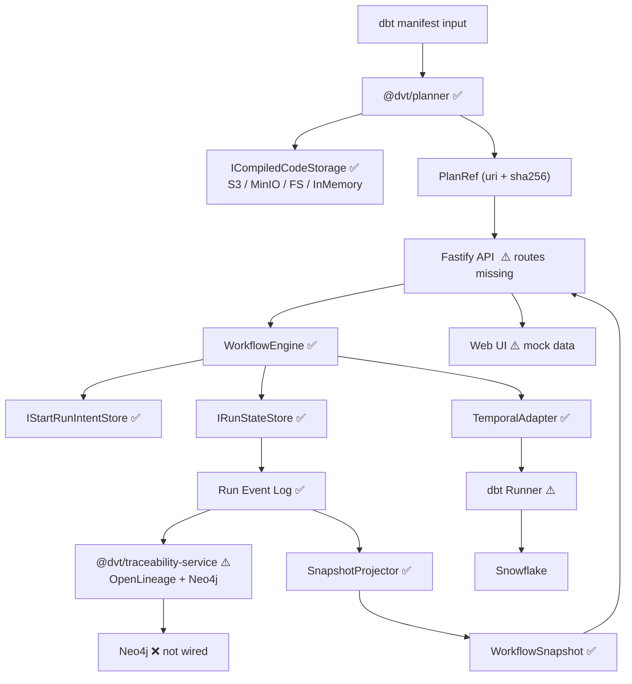
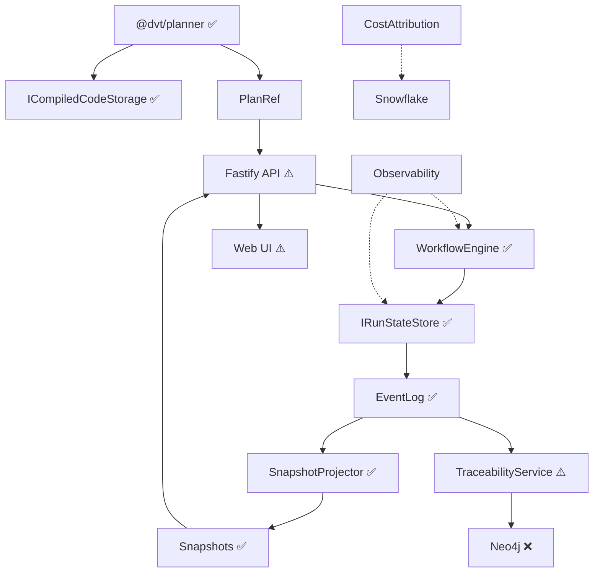

# DVT+ Dependency Risk Map

Date: 2026-03-06
Last updated: 2026-03-05 — full codebase audit; critical path and risk matrix revised
Status: Architecture planning document

This document identifies:

- dependency relationships between core modules
- critical-path components
- modules that block others
- modules that can be developed fully in parallel

The goal is to **minimize team collisions** and **enable parallel
development streams**.

> **Status legend:** ✅ Implemented · ⚠️ Partial · ❌ Not yet built

---

# 1. High-Level Dependency Graph

> **Key correction vs previous version:** The Planner does NOT depend on
> ArtifactStore to generate plans. It is a pure function over manifest inputs.
> It writes to `ICompiledCodeStorage` as an output. The engine does NOT depend
> on the Planner — they are orthogonal services that share zero imports.

---

# 2. Critical Path

```mermaid
flowchart LR

ManifestInput --> Planner
Planner --> CompiledCodeStorage
CompiledCodeStorage --> PlanRef
PlanRef --> APIEngineRoutes
APIEngineRoutes --> Engine
Engine --> StateStore
StateStore --> EventLog
EventLog --> Projector
Projector --> Snapshots
Snapshots --> APIReadRoutes
APIReadRoutes --> UI
```

The end-to-end path exists but has **two broken links** today:

Gap Status Impact

---

API engine routes ❌ Engine cannot be invoked externally
UI → API wiring ❌ UI runs on mock data, not real engine state
JwtAuthorizer ❌ API cannot be safely exposed

**Previously blocked (now resolved):**

Module Was listed as Reality

---

Planner Critical blocker ✅ 75% — GraphBuilder, Planner.ts, stepFactory
Execution Engine Critical blocker ✅ 90% — all lifecycle methods implemented
State Store Ordering risk ✅ 90% — Postgres + InMemory, monotonic runSeq
Projector Blocks UI ✅ SnapshotProjector implemented
ICompiledCodeStorage Blocks Planner ✅ 5 adapters (S3/MinIO/FS/InMemory/Noop)

---

# 3. Real Blockers Today (Priority Order)

Priority Blocker Blocks Effort

---

1 API engine routes UI real data; any external consumer 1 week
2 JwtAuthorizer real Safe external API exposure 2–3 weeks
3 UI → API wiring End-to-end visible system 1–2 weeks
4 dbt step result mapping Step-level analytics and diagnostics 1–2 weeks
5 IArtifactStore formal port Hexagonal replaceability of storage 4–5 days
6 TraceabilityService → Neo4j Lineage in production 1–2 weeks
7 catalog.json + run_results parser Complete artifact ingestion pipeline 1–2 weeks

---

# 4. Parallelizable Streams — Current State

```mermaid
flowchart TB

StreamUX["Stream 1\nRead Side / UX  ⚠️"]
StreamExec["Stream 2\nExecution  ✅"]
StreamState["Stream 3\nState / Platform  ✅ / ⚠️"]
StreamCross["Stream 4\nCross-Cutting  ✅ / ⚠️"]

StreamUX --> GraphCanvas["GraphCanvas  ⚠️ mock"]
StreamUX --> LineageView["LineageView  ⚠️ mock"]
StreamUX --> RunsView["RunsView  ⚠️ mock"]
StreamUX --> APIWiring["UI → API wiring  ❌"]

StreamExec --> WorkflowEngine["WorkflowEngine  ✅"]
StreamExec --> TemporalAdapter["TemporalAdapter  ✅"]
StreamExec --> DbtResultMapping["dbt result mapping  ⚠️"]
StreamExec --> APIRoutes["API engine routes  ❌"]

StreamState --> StateStore["StateStore  ✅"]
StreamState --> CompiledCodeStorage["ICompiledCodeStorage  ✅"]
StreamState --> AuthZ["JwtAuthorizer  ❌"]
StreamState --> ArtifactPort["IArtifactStore port  ❌"]

StreamCross --> Observability["OTel Observability  ✅"]
StreamCross --> TraceabilityService["TraceabilityService  ⚠️"]
StreamCross --> EngineInstrumentation["Engine metrics  ❌"]
StreamCross --> CostAttribution["Cost Attribution  ❌"]
```

Streams 2 and 3 (core) are largely complete. Active work is in
Stream 1 (wiring UI to API) and Stream 4 (completing cross-cutting concerns).

---

# 5. Dependency Risk Matrix (Revised)

Module Depends On Blocks Status

---

API engine routes WorkflowEngine (ready) UI real data; external ❌
JwtAuthorizer IAuthorizer contract (ready) API external exposure ❌
UI → API wiring API engine routes End-to-end system ❌
dbt result mapping stepActivities (partial) Step analytics ⚠️
IArtifactStore port compiledCode adapters (ready) Hexagonal replaceability ❌
TraceabilityService→Neo4j traceability-service (⚠️) Production lineage ⚠️
SSE/WS streaming API routes + UI wiring Real-time UI updates ❌
Plugin Runtime All above Extensibility ❌
WorkflowEngine — API routes ✅
IRunStateStore — Engine, Projector ✅
SnapshotProjector EventLog API read routes ✅
@dvt/planner manifest input PlanRef generation ✅
ICompiledCodeStorage — Planner output ✅
TemporalAdapter WorkflowEngine contract dbt execution ✅
OtelObservability IObservability port Metrics/traces ✅

---

# 6. Low-Risk Parallel Areas (Updated)

Area Reason Status

---

Engine instrumentation Port exists; pattern in API worker ❌ easy
SnapshotRebuildService API exists; operational tooling ❌ easy
IRetryPolicy port logicalAttemptId exists ❌ easy
catalog.json parser Planner already has manifest.ts ❌ medium
run_results.json parser Same pipeline ❌ medium
Cost Attribution reads Snowflake metadata ❌ future

---

# 7. Medium-Risk Areas

Area Dependency Status

---

dbt result mapping stepActivities.ts (partial) ⚠️
TraceabilityService Neo4j wiring + compiled code ⚠️
UI → API wiring API engine routes (blocker 1) ❌
SSE/WS streaming API routes + UI wiring ❌
JwtAuthorizer OIDC/JWT library + IAuthorizer ❌

---

# 8. High-Risk Core Modules (Revised)

Previously the high-risk modules were State Store, Engine, and Planner.
All three are now substantially implemented. The risk profile has shifted:

Module Risk Status

---

JwtAuthorizer Security correctness; tenant boundary ❌
API engine routes Contract surface; request validation ❌
dbt result mapping Correctness of failure attribution ⚠️
TraceabilityService→Neo4j Data consistency of lineage graph ⚠️
Plugin Runtime (future) Isolation correctness; security ❌

---

# 9. Recommended Team Allocation (Revised)

Team Stream Current Focus

---

Team A Execution / API API engine routes + JwtAuthorizer
Team B State / Artifacts IArtifactStore port + dbt result mapping + catalog parser
Team C Read Model / UI UI → API wiring + SSE/WS streaming
Team D Observability Engine instrumentation + TraceabilityService → Neo4j

---

# 10. Development Strategy (Revised)

Original recommended order and its current status:

Step Original Item Status

---

1 Artifact Store ✅ ICompiledCodeStorage — 5 adapters exist
2 Execution Engine contracts ✅ IWorkflowEngine v1.1.1 stable
3 State Store invariants ✅ runSeq, idempotencyKey, tenant isolation
4 Planner ✅ GraphBuilder, Planner.ts, stepFactory
5 Projector ✅ SnapshotProjector implemented
6 UI integration ⚠️ CURRENT FOCUS

**Recommended next steps:**

1. API engine routes — `POST /runs`, `GET /runs/:runId`,
   `DELETE /runs/:runId`, `POST /runs/:runId/signal`
2. JwtAuthorizer — real tenant-scoped auth before external exposure
3. UI → API wiring — replace `mockData.ts` with `@tanstack/react-query` calls
4. IArtifactStore formal port — elevate `ICompiledCodeStorage` to domain port
5. dbt step result mapping — `DbtExecutionResult` + structured `StepFailed(reason)`
6. Engine instrumentation — 5 metric points in `WorkflowEngine.ts`
7. TraceabilityService → Neo4j — complete lineage publication pipeline
8. SSE/WS streaming — real-time status after API + UI are wired
9. Plugin runtime — post-MVP

---

# 11. Final Architecture Risk Diagram (Revised)

Solid arrows represent **hard dependencies**.\
Dashed arrows represent **optional integrations**.

> The two solid-arrow gaps today are: **API (engine routes missing)** and
> **UI (mock data)**. Everything else in the hard-dependency chain is built.
